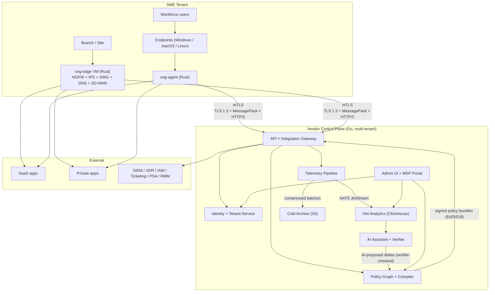
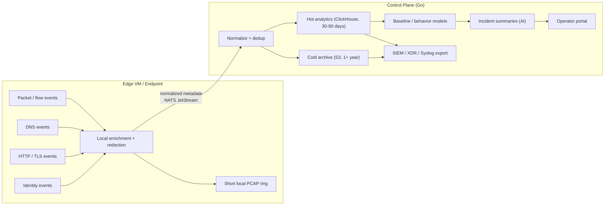

# ShieldNet Gateway — Architecture

> Detailed system architecture for SNG. Companion to
> [`PROPOSAL.md`](./PROPOSAL.md) (product / commercial / roadmap) and
> [`PROGRESS.md`](./PROGRESS.md) (phase status). Modeled after
> [`sn360-es/internal/docs/ARCHITECTURE.md`](https://github.com/kennguy3n/sn360-es/blob/main/internal/docs/ARCHITECTURE.md).

---

## 1. System Overview

ShieldNet Gateway (SNG) is a multi-tenant, software-first unified
security gateway. It has **three enforcement forms** that share a
single control plane, a single typed policy graph, and a single
telemetry fabric:

1. **Branch / site edge virtual appliance** (`sng-edge`, Rust) —
   carries NGFW + IDS/IPS, SWG, DNS security, and SD-WAN; enforces
   compiled policy locally.
2. **Lightweight endpoint client** (`sng-agent`, Rust, cross-platform
   Windows / macOS / Linux) — traffic steering, posture, ZTNA, VPN
   replacement, experience telemetry.
3. **Cloud-delivered inspection** in the control plane — SWG / DNS /
   ZTNA terminations for users not behind an edge VM, and signal
   enrichment / cross-tenant intelligence aggregation.

The control plane runs as a **regional, multi-tenant SaaS** with
**tenant-isolated data partitions** (Postgres RLS, NATS subject
hierarchy, S3 prefixes) — same posture as
[`sn360-security-platform`](https://github.com/kennguy3n/sn360-security-platform).
Each tenant is pinned to a region; hot + cold data stay in-region.

---

## 2. High-Level Topology

Solid lines are persistent connections; arrows denote the dominant
direction of data flow. Every wire between agent / edge and the
control plane is mTLS over the SN360 native protocol (TLS 1.3 +
MessagePack + HTTP/2), authenticated by device-bound Ed25519
identities.

---

## 3. Control Plane Architecture

The control plane is a set of Go services running in shared
multi-tenant cells (one logical cell per region). Services
communicate via NATS JetStream subjects (asynchronous) and
service-to-service mTLS gRPC (synchronous). Persistent state is
PostgreSQL (metadata, RLS-isolated per tenant) and ClickHouse +
S3 (telemetry).

### 3.1 Tenant Controller

- Owns the **multi-tenant model**: tenants, sites, users, roles,
  MSP hierarchy (MSP → tenant → site).
- Provides **hierarchical multi-tenant RBAC**: roles compose down
  the hierarchy with explicit overrides at each level.
- Owns **site templates**: branch / hub / cloud-only / home-office
  templates carrying NGFW baselines, SWG defaults, DNS upstreams,
  SD-WAN underlay knobs.
- **Lifecycle**: tenant create / suspend / delete with crypto-erase
  on delete.
- Same RLS-per-tenant pattern as the existing SN360 Access platform.

### 3.2 Policy Graph + Compiler

- **Typed policy model.** One graph spans NGFW, SWG, DNS, ZTNA,
  SD-WAN, and DLP. Vertices are subjects (user, device, app, site,
  network) and predicates; edges are policy verbs (allow, deny,
  inspect, steer, decrypt, log, suggest-only).
- **Change simulation.** Every proposed change runs through a
  deterministic simulator that diffs the compiled bundle against
  the previous version and replays recent telemetry to estimate
  user impact before any traffic is affected.
- **Compilation.** The compiler emits per-target bundles:
  - Per-edge VM bundle (compact, signed, dual-bank installable).
  - Per-endpoint bundle (smaller, only the slices `sng-agent`
    needs to evaluate locally).
  - Per-cloud-PoP bundle (for cloud-delivered SWG / DNS / ZTNA).
- **Signing.** Bundles are signed with Ed25519 (signing key in
  KMS); receivers refuse unsigned or non-current bundles.

### 3.3 Telemetry Pipeline

- **Ingestion** via NATS JetStream over the API + Integration
  Gateway. Subject hierarchy is tenant-scoped:
  `sng.<tenant>.telemetry.<class>` where class ∈ `{flow, dns, http,
  ips, ztna, sdwan, agent}`.
- **Normalization + dedup.** Events are normalized into a typed
  event schema (versioned), deduplicated against a rolling window,
  enriched with tenant + site + identity context.
- **Routing.**
  - Hot path → ClickHouse (Tier 2, 30-90 days).
  - Cold path → S3-compatible store (Tier 3, 1+ year, compressed,
    partitioned `tenant_id/yyyy=/mm=/dd=`).
  - Behavior models + summarizer subscribe directly off NATS for
    near-real-time signal.

### 3.4 Identity + Auth Service

- Issues short-lived mTLS device certificates against device-bound
  Ed25519 identities (TPM / TEE / Secure Enclave / Windows TPM).
- Validates claim tokens for enrollment (single-use, short TTL).
- Federates with tenant IdPs (OIDC + SAML) for human authentication
  to the admin UI / MSP portal.
- Owns SCIM 2.0 inbound provisioning of users and groups.

### 3.5 AI Service

- Provides **policy auto-suggest**, **baseline modeling**, **incident
  summarization**, and **troubleshooting assistance** as described in
  [`PROPOSAL.md` §8.1](./PROPOSAL.md#81-ai-use-cases).
- **All AI-proposed enforcement changes pass through the
  deterministic verifier** (the same code path as operator-authored
  changes) before they can be queued for canary rollout. The AI never
  ships a policy bundle that did not compile through the Policy
  Graph + Compiler.
- Refuses to assert facts outside the evidence already in the
  telemetry store; flags AI-generated artifacts explicitly.

### 3.6 API + Integration Gateway

- Public-facing **REST API** (versioned OpenAPI surface) and
  **webhooks** (HMAC-signed, retry-with-backoff).
- **Terraform provider** for tenant config as code (policies, sites,
  users, identity bindings).
- **Syslog export** (RFC 5424 / 5425) to per-tenant destinations.
- Terminates all agent / edge mTLS connections; routes to the right
  internal service over inter-service mTLS.

### 3.7 Integration Service

- First-party connectors to SIEM / XDR (Splunk, Sentinel, Elastic,
  Chronicle, SN360 Access), ticketing (Jira, ServiceNow, Zendesk,
  Freshdesk), IAM (Okta, Entra, Google Workspace), and RMM / PSA
  (ConnectWise, Datto, Kaseya, NinjaOne).
- Bidirectional where it makes sense (e.g. ticket sync, case status).

---

## 4. Edge VM Architecture (`sng-edge`, Rust)

The edge VM is a virtual appliance — VMware / KVM / Hyper-V / cloud
image — running a single hardened Linux base with the `sng-edge`
binary and a small set of dependencies (Suricata, Envoy, recursive
resolver). Dual-bank image install allows safe rollback.

### 4.1 Packet Path

- **nftables + conntrack** for the underlay; `sng-fw` programs
  rules from the compiled NGFW policy.
- **VPP / DPDK fast path opt-in** later (Phase 5+) once measured
  throughput demand justifies the operational cost.

### 4.2 NGFW Engine (`sng-fw`)

- L3-L7 policy, NAT, app awareness (signature + heuristics), TLS
  policy (decrypt vs. bypass), segmentation between site networks.
- Compiled policy bundle is loaded into `sng-policy-eval`; the
  packet path queries the evaluator for verdicts.

### 4.3 IDS/IPS (`sng-ips`)

- **Suricata inline** as the detection / prevention engine.
- `sng-ips` owns the wrapper: rule sync from the control plane (the
  rule bundle is signed; the wrapper rejects untrusted rule sets),
  alert normalization into the SNG event schema, performance
  telemetry, and graceful degradation if Suricata fails (fail-open
  vs. fail-closed configurable per policy).

### 4.4 Secure Web Gateway (`sng-swg`)

- **Envoy** as the L7 proxy (forward proxy on HTTP / HTTPS).
- URL categorization via a pluggable verdict provider (3rd-party
  feed at launch; revisit build-vs-partner in Phase 5).
- Malware verdict API for downloaded files.
- TLS interception with operator-controlled bypass lists for
  sensitive categories (healthcare, finance) — defaults match
  industry-standard "do not decrypt" lists.

### 4.4a Traffic Classification Engine (`sng-appdb`)

Every flow is classified into one of six **traffic classes** before
enforcement decides which subsystem(s) inspect it. The class is the
single dimension that drives "expensive vs. cheap path" — and is
the foundation for the cloud-only deployment mode's unit economics
(see PROPOSAL.md §9.4).

- **Six classes**: `TRUSTED_DIRECT`, `TRUSTED_MEDIA_BYPASS`,
  `INSPECT_LITE`, `INSPECT_FULL`, `TUNNEL_PRIVATE`, `BLOCK`.
- **Per-class action**: direct egress / media-bypass /
  SWG-lite (URL-cat only, no TLS MITM) / full SWG+TLS+IPS / SD-WAN
  overlay / drop.
- **App database** (`app_registry` + `app_registry_overrides`)
  is the source of truth. Global catalog is curated by SNG; tenants
  can promote/demote entries via per-tenant overrides (RLS-isolated).
- **Per-deployment-mode steering**: the same class compiles to
  different actions per bundle target. `edge` receives the full
  steering table; `cloud` only the classes that reach the cloud
  proxy (`INSPECT_FULL`, `TUNNEL_PRIVATE`, `BLOCK`); `endpoint` and
  `mobile` receive DNS verification + steering decisions.
- **Demotion engine** (`internal/service/appdb/demotion.go`)
  subscribes to runtime threat signals (threat feed, cert-pin
  mismatch, IP-range mismatch, anomaly detector) and installs
  short-TTL overrides on the affected tenants. Global signals
  (threat feed, cert mismatch) fan out across every active tenant.
- **Vendor sync** (`internal/service/appdb/sync.go`) periodically
  pulls Microsoft 365 endpoints JSON, Google IP ranges JSON, AWS IP
  ranges JSON, and any custom `{ domains, ip_ranges }` feed
  registered against an app's `metadata_url`.
- **Byte determinism**: the compiled steering rule set is sorted
  in canonical order (domains, IPs, pins, app refs) so two
  compilations of the same catalog produce identical bytes —
  signatures cache, bundle de-dup works, and the receiver-side
  verifier needs no schema reshuffle.
- **Telemetry dimension**: every event envelope carries the
  `traffic_class` it was matched against; ClickHouse stores it as a
  `LowCardinality(String)` column so per-class cost attribution is
  a single GROUP BY. See `internal/service/telemetry/clickhouse`.

See `docs/TRAFFIC_CLASSIFICATION.md` for the full design.

### 4.5 DNS Security (`sng-dns`)

- Recursive resolver layer (Unbound-class) wrapped by `sng-dns`.
- Per-tenant filter chain: reputation feed, category filter,
  sinkhole for known-bad domains.
- Logs queries (metadata first) to the telemetry pipeline.

### 4.6 SD-WAN (`sng-sdwan`)

- Overlay tunnels (WireGuard-class) between edge VMs and the cloud
  connector for inter-site and SaaS-bound traffic.
- Active health probes (latency, loss, jitter) per path.
- Path scoring + app-aware steering rules from the compiled policy.
- Failover with sub-second target on path loss.

### 4.7 Local Policy Evaluator (`sng-policy-eval`)

- Loads compiled policy bundles from `sng-comms`.
- Evaluates verdicts for every requesting subsystem (firewall, SWG,
  DNS, SD-WAN, IPS metadata).
- Hot-swap atomically on bundle rotation (Arc-swap pattern).
- Bundle versions are tracked; mismatch with control plane triggers
  re-pull.

### 4.8 Telemetry Collector (`sng-telemetry`)

- Collects normalized metadata events from every subsystem.
- Local enrichment: site, tenant, time, identity-binding.
- Redaction at source — payload only when policy explicitly opts
  in.
- Short **local PCAP ring** for forensic re-hydration on operator
  request (bounded size, fast eviction).
- Egress to the control plane over `sng-comms`.

### 4.9 Dual-Bank Image Upgrades

- Two image partitions: A and B. New image installs into the
  inactive bank, reboots into it, runs health checks; if any fail
  within a window, the bootloader fails back to the previous bank.
- Image manifests are Ed25519-signed; the installer refuses
  unsigned or downgrade-prevented images.

---

## 5. Endpoint Client Architecture (`sng-agent`, Rust)

The endpoint client follows the same cross-platform shape as
[`sn360-desktop-agent`](https://github.com/kennguy3n/sn360-desktop-agent).
Code structure, build system, packaging, and resource budgets all
mirror SDA.

### 5.1 Platform Coverage and PAL

- Targets: Windows, macOS, Linux (x86_64 + aarch64 where the OS
  ships ARM builds).
- `sng-pal` is the Platform Abstraction Layer — same pattern as
  `sda-pal`. Each OS implements:
  - Traffic capture / steering hooks (WFP on Windows, Network
    Extension on macOS, nftables / TPROXY on Linux).
  - Posture primitives (disk encryption, firewall, screen lock,
    OS patch level).
  - Tunnel primitives (WireGuard-class for VPN replacement).
  - Secure key storage (TPM / Secure Enclave / Windows TPM).

### 5.2 Traffic Steering

- Routes user-bound DNS / HTTP / HTTPS through the gateway when
  appropriate; allows direct egress for excluded categories (latency-
  sensitive, captive portal bootstrap, IT-allow-listed apps).
- Steering decisions are policy-driven and re-evaluated on network
  changes.

### 5.3 ZTNA Client (`sng-ztna`)

- mTLS device identity (bound to TPM / TEE).
- Per-app access — application identifier + policy predicate.
- Posture is bound to the access grant: if posture fails, the
  grant is revoked.
- Replaces classic SSL-VPN — no implicit "whole-network" access.

### 5.4 VPN Replacement Tunnel

- WireGuard-class tunnel to either the nearest cloud PoP or the
  tenant's edge VM (whichever the steering policy prefers).
- Tunnel keys are short-lived; rotation handled by the policy /
  identity service.

### 5.5 Posture Snapshots

- Disk encryption status (BitLocker / FileVault / LUKS).
- Host firewall state.
- Screen lock policy + last-locked timestamp.
- OS patch level (vs. tenant baseline policy).
- Snapshots streamed to the control plane; consumed by the policy
  evaluator and by ZTNA access decisions.

### 5.6 Experience Telemetry

- Latency, jitter, path quality, app-perceived performance —
  metadata only.
- Powers operator visibility into "is the gateway making things
  slower?" and feeds the SD-WAN path scorer.

### 5.7 Resource Budget

Targets match [`sn360-desktop-agent`](https://github.com/kennguy3n/sn360-desktop-agent):

- Sub-15 MB resident memory.
- Sub-0.1 % idle CPU.
- Adaptive scheduling: scans / heartbeats back off on battery and
  during user activity.

These are budgets, not aspirations — `sng-agent` is rejected from
release if it cannot meet them on the reference hardware tier.

---

## 6. Telemetry Pipeline

Key properties:

- **Metadata first.** Payload only when policy explicitly opts in;
  redaction happens at source.
- **At-least-once delivery** with deduplication on receive.
- **Backpressure-safe.** `sng-comms` spools to a bounded local
  buffer on egress failure; oldest dropped first if disk also full.
- **Audit-grade integrity.** Tier 3 archive batches are sealed with
  content-addressed hashes; tampering is detectable on re-hydration.

---

## 7. Data Architecture

### 7.1 Tier 1 — Local Ephemeral

- **Location**: Edge VM (`sng-edge`) and endpoint (`sng-agent`).
- **Retention**: Minutes to hours.
- **Contents**: Short PCAP ring buffer (rolling window),
  branch-level cache for hot lookups, last-N flow records, last-N
  policy verdicts for debugging.
- **Use case**: Local enforcement decisions, on-demand operator
  pull (e.g. "give me the last 10 minutes of packets for this
  endpoint").

### 7.2 Tier 2 — Centralized Searchable

- **Location**: ClickHouse in the control plane (per region).
- **Retention**: 30-90 days (per tenant tier).
- **Contents**: Normalized metadata indexed by tenant + time + key
  dimensions (subject, app, verdict, score).
- **Use case**: Operator portal, alerts, dashboards, AI baselining,
  incident triage.

### 7.3 Tier 3 — Cold Durable

- **Location**: S3-compatible object storage (per region).
- **Retention**: 1+ year (per tenant policy).
- **Contents**: Compressed event archive, partitioned
  `tenant_id/yyyy=/mm=/dd=`.
- **Use case**: Compliance audit, long-tail forensics, model
  retraining, regulatory retention.

### 7.4 Tenant Isolation

Same posture as `sn360-security-platform`:

- **Postgres**: Row-Level Security with a per-connection
  `tenant_id` GUC; every query is automatically scoped. No raw
  `SELECT *` without RLS context.
- **NATS subjects**: Hierarchical `sng.<tenant>.…` namespace; per-
  tenant credentials cannot subscribe outside their own subtree.
- **S3 prefixes**: `tenant_id/` is the top-level partition; per-
  tenant IAM policies (or bucket policies in customer-hosted KMS
  scenarios) enforce isolation.
- **ClickHouse**: tenant-scoped MV / table partitioning with
  per-tenant access tokens.

---

## 8. Security Model

- **Strong tenant isolation** — Postgres RLS, NATS subject ACLs,
  S3 prefix policies, ClickHouse partitioning, per-tenant
  encryption keys.
- **Device-bound identities** — every edge VM and endpoint binds
  an Ed25519 keypair to its TPM / TEE / secure store at enrollment;
  the public half is registered with the Identity service.
- **Signed artifacts + SBOM** — every binary, policy bundle,
  action job, edge image, endpoint installer is Ed25519-signed.
  SBOM published per release; supply-chain attestations (SLSA-class)
  on container images.
- **Rollback-safe upgrades** — dual-bank for `sng-edge` and
  `sng-agent`; blue-green for control-plane services.
- **Least-privilege service accounts** — each control-plane
  service has a scoped identity; no shared credentials; inter-
  service mTLS within the SaaS.
- **Immutable audit trail** — every operator action and every
  enforcement change lands in an append-only audit log; logs are
  exportable per tenant for compliance.
- **Short-lived credentials** — no long-lived tokens on edge or
  endpoints; certificate rotation is automatic and frequent.
- **Region-aware KMS** — keys live in the tenant's pinned region;
  cross-region replication is opt-in.
- **Customer-managed keys** — available on higher tiers (Data
  Guard); HSM / external KMS bindings supported.

---

## 9. SN360 Integration Points

SNG is not a silo. It plugs into the rest of the SN360 family.

| Component | Integration |
|---|---|
| [`sn360-security-platform`](https://github.com/kennguy3n/sn360-security-platform) | Shared **tenant identity**, **policy graph**, and **telemetry pipeline**. Alert forwarding from SNG into SN360 Access reuses the existing alert-forwarder service. The same RLS-per-tenant Postgres pattern and the same NATS subject discipline are used. |
| [`sn360-desktop-agent`](https://github.com/kennguy3n/sn360-desktop-agent) | **Posture data feed** — SDA already collects disk-encryption, firewall, screen-lock, and patch-level state; `sng-agent` consumes that posture rather than duplicating it. **ZTNA coordination** — SDA endpoints can be ZTNA subjects without re-enrolling. **Traffic steering integration** — SDA stays the EDR/MDM agent, `sng-agent` stays the network agent; they coexist on the same endpoint without overlapping the packet path. |
| [`sn360-agent-vm`](https://github.com/kennguy3n/sn360-agent-vm) | **Server-side enforcement coordination** — `vma` covers server / VM host posture and runtime detection; `sng-edge` covers network enforcement at the branch / cloud egress. **Telemetry correlation** — VMA events and SNG events join on shared host identifiers for east-west visibility. |
| [`sn360-agent-k8s`](https://github.com/kennguy3n/sn360-agent-k8s) | **Container workload telemetry** — SKA flow + DNS events from inside a cluster correlate with SNG north-south flow data at the cluster's edge. **East-west policy** — SKA NetworkPolicy coverage feeds SNG's view of inter-workload reachability. |
| [`sn360-es`](https://github.com/kennguy3n/sn360-es) | **Email security signal enrichment** — SN360 Defense feeds verdicts (URL reputation, sender-reputation, phishing categorization) to SNG so SWG / DNS can act on them in-flight. **DLP coordination** — SNG web/SaaS DLP policy templates align with the email DLP posture so customers do not maintain two policy worlds. |

---

## 10. Protocol and Wire Format

SNG speaks the **SN360 native protocol** end-to-end. This is the same
wire format used by SDA, VMA, and SKA, so a customer running multiple
SN360 agents on the same host pays the protocol cost once.

- **Transport**: TLS 1.3 (no fallback).
- **Application protocol**: HTTP/2 with persistent connections,
  flow-controlled streams.
- **Serialization**: MessagePack for compact, schema-versioned event
  envelopes.
- **Authentication**: mTLS with device-bound Ed25519 identities;
  certificates are short-lived and rotated automatically.
- **Authorization**: per-tenant scope is enforced at the gateway from
  the certificate subject; no client-supplied tenant header is
  trusted.
- **Signing**: policy bundles, action jobs, edge images, endpoint
  installers, and rule bundles are Ed25519-signed with keys held in
  KMS / HSM. Receivers refuse unsigned or non-current artifacts.
- **Replay protection**: every envelope carries a monotonic sequence
  number per stream; the gateway tracks the last seen sequence per
  tenant + device and rejects regressions.

The wire is intentionally boring. The interesting work happens in the
policy graph and the telemetry pipeline, not in the protocol.
