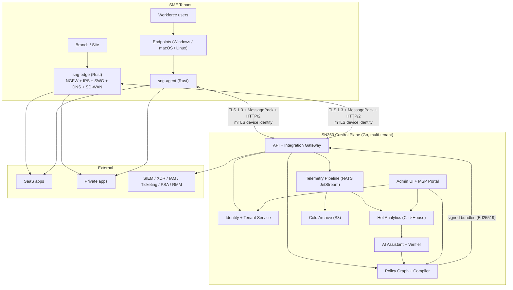
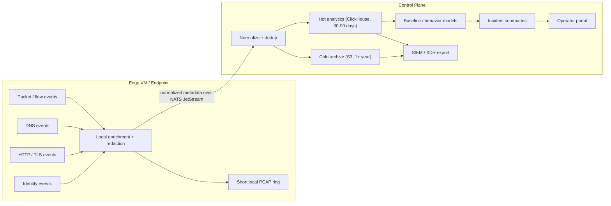

# ShieldNet Gateway — Design Proposal

> Product positioning, competitive baseline, capability scope,
> reference architecture, AI / data / security model, commercial
> model, phased roadmap, and risk register for the third product in
> the SN360 family. This is the planning equivalent of
> [`sn360-es/internal/docs/PROPOSAL.md`](https://github.com/kennguy3n/sn360-es/blob/main/internal/docs/PROPOSAL.md)
> for ShieldNet Defense.

---

## 1. Executive Summary

**ShieldNet Gateway (SNG)** is a software-first, SaaS-delivered, unified
security gateway built for small and medium enterprises. It is the
third product in the SN360 family — joining
[ShieldNet Access](https://github.com/kennguy3n/sn360-security-platform)
(multi-tenant access / posture / compliance control plane) and
[ShieldNet Defense](https://github.com/kennguy3n/sn360-es) (email
security) — and is the SN360 footprint on the **network** layer.

SNG is positioned as the **unified security operations and policy
fabric for distributed SMEs**: one console, one typed policy model,
one lightweight endpoint client, one branch edge image, one telemetry
fabric, one support path. Where legacy vendors force operators to
stitch together a NGFW box, a separate SWG SaaS, a separate ZTNA SaaS,
a separate SD-WAN orchestrator, and a separate SIEM, SNG collapses the
operating surface into a single policy graph and a single telemetry
pipeline.

Positioning shorthand: **"Fortinet economics + Zscaler simplicity +
Palo Alto-grade management discipline."**

Three deployment forms share the same control plane and policy model:

1. A **SaaS multi-tenant control plane** (Go) running in the vendor's
   regional cells.
2. A **branch / site edge VM** (Rust) — virtual appliance carrying
   NGFW, IPS, SWG, DNS, SD-WAN.
3. A **lightweight endpoint client** (Rust, Windows / macOS / Linux)
   — traffic steering, posture, ZTNA, VPN replacement.

This proposal is grounded in (a) a competitive read of Palo Alto,
Fortinet, Cisco, Zscaler, and Check Point; (b) the operating reality
of SMEs without dedicated network or security staff; (c) the
architectural and operational conventions already established by the
two shipping SN360 products.

---

## 2. Competitive Baseline

The four legacy / cloud SSE vendors below set the operational ceiling
SNG is benchmarked against. The point is not to match their feature
sprawl — it is to understand which capabilities are load-bearing for
SMEs and which are vendor-only complexity.

| Vendor | Core Strength | Coverage | Operational Lessons |
|---|---|---|---|
| **Palo Alto Networks** | Strata NGFW + Prisma SASE; mature App-ID, User-ID, Decryption; Cortex XDR / XSIAM tie-in | Strongest single-policy story across NGFW + SASE + XDR; consistent typed policy model; rich app-awareness | Single policy model with strong typing wins for operators; *do this*. Per-feature licensing complexity and management surface area scare SMEs; *avoid that*. |
| **Fortinet** | FortiGate price/perf, FortiOS depth, Fortinet Security Fabric | Broad SKU shelf, strong hardware story, integrated SD-WAN | Hardware-first economics work for tight-margin SMEs but lock customers into refresh cycles; *use the price discipline, drop the hardware lock-in*. Fabric integrations are useful when consistent, painful when versions diverge. |
| **Cisco** | Catalyst SD-WAN, Umbrella DNS, Duo (identity), legacy Talos intel | Largest install-base, strongest networking heritage | Multiple consoles per product is the canonical anti-pattern; *single console is the unlock for SMEs*. Identity (Duo) + DNS (Umbrella) are the right primitives to lean on; *imitate the simplicity of those two products specifically*. |
| **Zscaler** | Cloud-delivered SWG / ZTNA, large global PoP footprint, mature inline inspection | True cloud-first SSE; minimal customer-managed edge | Cloud-first dramatically reduces SME ops burden; *adopt*. But pure cloud forces all traffic through the vendor and is expensive at the SME tier; *hybrid edge + cloud is the right SME shape*. |
| **Check Point** | Quantum NGFW, Harmony endpoint / SASE, threat-prevention research depth | Long-standing enterprise NGFW; strong research / sandboxing | Threat-research depth matters for credibility, not for SME daily ops; *partner / consume intel rather than rebuild*. UX is the perennial weakness; *do not repeat that mistake*. |

Synthesised operational lessons for SNG:

- **One policy model across NGFW / SWG / ZTNA / DNS / SD-WAN.** No
  per-feature policy silo. (Palo Alto-grade discipline.)
- **One console, not a federation of consoles.** (Anti-Cisco.)
- **Cloud-delivered control plane with a small, well-defined edge.**
  (Zscaler simplicity; Fortinet economics.)
- **Consume intel; do not rebuild the threat research lab.** (Reject
  vendor-research-as-product.)
- **Default to safe; defer complexity to the operator only when
  unavoidable.** (Anti Check Point UX baggage.)

---

## 3. SME Constraints

SNG's design criteria fall out of how SMEs actually operate.

- **Default-safe policy.** A fresh tenant must be operationally
  useful within an hour, with sensible defaults that protect without
  human tuning. Operators tune *down* (allow what they need) rather
  than *up* (block what they fear).
- **Few moving parts.** One control plane URL. One endpoint client.
  One edge image. One telemetry fabric. Each additional moving part
  is a tax SMEs cannot afford.
- **Guided workflows.** Site-onboarding, ZTNA app onboarding,
  SD-WAN underlay setup, policy change review — all wizard-driven
  with sensible suggestions, not freeform admin pages.
- **MSP co-management.** MSPs own most SMEs' security operations.
  The control plane must support hierarchical multi-tenant RBAC,
  per-MSP branding, per-tenant policy templates, and bulk operations
  on day one. (See [`sn360-security-platform`](https://github.com/kennguy3n/sn360-security-platform)
  for the existing SN360 multi-tenant baseline.)
- **Progressive adoption without forklift replacement.** SMEs
  cannot rip-and-replace. SNG must coexist with an incumbent NGFW or
  VPN, gradually take over slices of traffic, and never demand a "do
  it all at once" cutover.

These constraints are non-negotiable. Any feature that violates them
is either redesigned or deferred.

---

## 4. Product Scope and Positioning

SNG's capability matrix at launch and through the phased roadmap.
"Launch" means Phase 2 (Secure Edge MVP); later capabilities ship in
Phase 4+ (see [`PROGRESS.md`](./PROGRESS.md)).

| Capability | Scope at Launch | Design Choice | Cost / Op Tradeoff | Recommended Stack | Complexity |
|---|---|---|---|---|---|
| **NGFW + IDS/IPS** | L3-L7 policy, NAT, app awareness, TLS policy, Suricata inline, basic decryption with bypass lists | Rust packet path (`sng-fw`); Suricata wrapped by `sng-ips`; nftables / conntrack on the underlay; VPP / DPDK fast path opt-in later | Software-only path is cheaper per Mbps than appliances but caps at branch-class throughput at launch | Rust + Suricata + nftables; Envoy for L7 | High |
| **SWG + DNS Security** | URL categorization, malware verdict API, resolver-layer reputation / category filtering / sinkhole | Envoy-based forward proxy in `sng-swg`; pluggable verdict / categorization providers; recursive resolver in `sng-dns` | Cuts SaaS phishing exposure significantly; requires URL/cat feed (build vs. partner) | Envoy + 3rd-party URL/cat feed + DNS reputation feed | Medium |
| **ZTNA + VPN Replacement** | mTLS device identity, posture binding, per-app access, replaces legacy IPsec / SSL-VPN | mTLS via SN360 native protocol (TLS 1.3 + MessagePack + HTTP/2); posture from `sng-agent`; access enforced at edge + cloud connector | Halves the "VPN is the only way in" attack surface; requires identity provider integration | Rust agent + Go connector + OIDC / SAML IdP | Medium |
| **SD-WAN** | Overlay tunnels, health probes, path scoring, app-aware steering, failover | `sng-sdwan` overlay between edge VMs and the cloud connector; per-app classes routed by score | Reduces MPLS / backup-circuit cost; demands honest path telemetry to be trustworthy | Rust overlay + iperf-style probes | Medium-High |
| **CASB (partial)** | SaaS discovery, top SaaS API connectors (M365, Google Workspace, Slack, Salesforce), config posture | API-mode CASB only at launch; no inline-CASB | Inline CASB is high cost / high false-positive risk; defer until policy signal is reliable | Go connectors over SaaS APIs | Medium |
| **DLP (partial)** | Web + SaaS DLP (regex, MIP labels, document fingerprints), browser protections | Inspect in `sng-swg` and in API-mode CASB; no endpoint DLP at launch (defer to SDA later) | High false-positive risk; pre-baked policy templates are mandatory | Envoy + classifier service | Medium |
| **XDR Integration** | Signal export to SN360 Access + third-party SIEM / XDR / IAM / ticketing | Reuse SN360 Access alert-forwarding; webhook + syslog out; Terraform provider for config-as-code | Customers and MSPs demand it; bridges build trust during migration | Go integration service | Low-Medium |
| **Telemetry + Policy Orchestration** | Single typed policy model, change simulation, NATS JetStream pipeline, ClickHouse hot analytics, S3 cold archive | One policy graph spanning all enforcement points; deterministic compiler producing per-edge / per-endpoint bundles | Single largest engineering investment; also the largest competitive moat | Go control plane + NATS + ClickHouse + S3 | High |

Out of scope at launch (called out explicitly so we do not drift):

- Inline-CASB.
- Endpoint DLP (defer to SDA integration in Phase 4+).
- Hardware appliance SKUs (Phase 6+, only if economics demand).
- Vendor-built threat-research lab.
- Customer-hosted control plane (managed SaaS only).

---

## 5. Reference Architecture

### 5.1 Tenant-to-Cloud Topology

### 5.2 Telemetry Pipeline

### 5.3 Architecture-Dimension Decisions

| Dimension | Options Considered | Pros / Cons | Recommendation |
|---|---|---|---|
| **Control plane location** | (a) Vendor-hosted SaaS, (b) customer-hosted, (c) hybrid | SaaS minimizes SME ops; customer-hosted blocks several deal types but is operationally hostile to MSPs | **Vendor-hosted SaaS** (multi-tenant by default; dedicated cell for higher tiers) |
| **Edge enforcement form** | (a) Virtual appliance VM, (b) container per service, (c) hardware appliance | VM is the lowest-friction install across hypervisors and clouds; containers are operationally heavier for branch staff; hardware is high CapEx | **Virtual appliance** at launch; container packaging in Phase 5; hardware SKU in Phase 6 only if economics demand |
| **Endpoint strategy** | (a) Lightweight always-on client, (b) browser-only proxy, (c) no client (cloud-only steering) | Client gives posture + always-on steering; browser-only misses non-browser traffic; cloud-only fails on captive portals | **Lightweight always-on client** (cross-platform Rust, mirrors `sn360-desktop-agent` budgets) |
| **Data plane** | (a) Rust user-space, (b) eBPF / XDP, (c) DPDK / VPP | Rust user-space ships fastest and meets branch-class throughput; eBPF / VPP unlock higher throughput but slow Phase 2 | **Rust user-space at launch**; eBPF / VPP fast path in Phase 5+ when justified by measured throughput need |
| **Deployment model** | (a) Per-tenant stack, (b) shared multi-tenant cells with tenant isolation | Per-tenant burns unit economics; shared cells are the SaaS norm and match `sn360-security-platform` | **Shared multi-tenant cells** with strong tenant isolation; dedicated cell as paid upsell |
| **Upgrade model** | (a) In-place upgrades, (b) blue-green, (c) dual-bank with rollback | In-place leaves operators stranded on failed upgrades; blue-green is good for control plane; dual-bank wins for edge | **Blue-green** for control plane; **dual-bank** for edge VM and endpoint client (signed manifests, Ed25519, rollback on health-check failure) |

---

## 6. Recommended Stack by Layer

Choices align with SN360 family conventions: Go for control plane,
Rust for agents and performance-sensitive edge components, TypeScript
+ React for admin UI, NATS JetStream for eventing, Postgres for
metadata, ClickHouse for analytics, S3 for cold storage.

| Layer | Choice | Why |
|---|---|---|
| Control plane services | **Go** | Matches `sn360-security-platform` (Gateway, TRDS, IOCFS, SIS) and the `sn360-es` single-binary control surface. Strong ecosystem for HTTP / gRPC / multi-tenant SaaS. |
| Edge enforcement | **Rust** | Matches `sn360-agent-vm` and `sn360-agent-k8s` performance budgets. Memory safety + predictable latency for the packet path. |
| Endpoint client | **Rust**, cross-platform | Same shape as [`sn360-desktop-agent`](https://github.com/kennguy3n/sn360-desktop-agent) — sub-15 MB resident, sub-0.1 % idle CPU targets; `sng-pal` follows the `sda-pal` PAL pattern. |
| Admin UI / MSP portal | **TypeScript + React** | Matches the SN360 Access web admin. |
| Policy / metadata storage | **PostgreSQL** | Tenant-isolated via row-level security, same pattern as SN360 Access. |
| Hot analytics | **ClickHouse** | Bounded retention (30-90 days), column-store performance, cost-efficient at SNG telemetry volume. |
| Cold retention | **S3-compatible object storage** | Compressed, 1+ year, partitioned by tenant + day. |
| Event bus | **NATS JetStream** | Same bus as `sn360-es` and `sn360-security-platform`. Durable, dedup, DLQ, replay. |
| L7 proxy (SWG) | **Envoy** | Mature, pluggable, observable; we own the verdict / categorization integration. |
| IDS/IPS | **Suricata** (inline) | Open, well-understood, broad rule coverage. Wrapped by `sng-ips` rather than forked. |
| Container platform | Managed **Kubernetes** / **k3s** | EKS / AKS / GKE for cloud cells; k3s for self-hosted reference deployments. |
| IaC | **Terraform** | Tenant Terraform provider for MSP / DevOps customers. |
| Wire protocol | **TLS 1.3 + MessagePack + HTTP/2** | SN360 native protocol — same as SDA / VMA / SKA. |
| Artifact signing | **Ed25519** | Policy bundles, action jobs, edge images, endpoint installers. |

---

## 7. Zero-Touch Operations

SNG is operationally usable for an SME with no dedicated network
engineer. The bootstrapping path is the same across edge VMs and
endpoints:

- **Claim-token enrollment.** Operator generates a short-lived
  claim token from the admin UI; edge / endpoint redeems it once on
  first boot. No copy-paste of long-lived secrets.
- **Device-bound identity.** Enrollment binds an Ed25519 keypair to
  the device's TPM / TEE / secure store and registers the public key
  with Identity + Tenant Service. All subsequent mTLS uses that
  identity.
- **Profile-based bootstrap.** The new device pulls a signed
  bootstrap profile (role, site, posture profile, allow / deny
  defaults) — no per-device hand-configuration.
- **Automatic certificate issuance.** Short-lived certificates are
  re-issued on a tight rotation; no operator action.
- **Template-based site configuration.** New branch = pick a site
  template + answer a short wizard; SD-WAN underlay, NGFW policy
  baseline, DNS upstream, and SWG defaults are filled in.
- **Progressive policy rollout.** Policy changes ship to a dry-run
  shadow first, then a canary cohort, then the full fleet — with
  one-click rollback at any stage. Dry-run results feed the change
  simulator before any enforcement happens.

The cumulative effect: a brand-new tenant is enforcing default-safe
policy with telemetry visibility within an hour of OAuth consent.

---

## 8. AI, Data, Security, and Operations Model

### 8.1 AI Use Cases

The AI Assistant is a *suggester and explainer*, not an autonomous
enforcer. Every AI-proposed enforcement change passes through a
deterministic verifier before any traffic is affected — same pattern
as the SN360 family's "AI proposes, deterministic systems enforce"
posture.

| Use Case | Design Options | Rationale | Guardrails |
|---|---|---|---|
| **Policy auto-suggest** | (a) Hand-written rules, (b) supervised classifier, (c) LLM with policy schema | LLM + schema = best UX, but unsafe without verifier | All AI suggestions compile through the deterministic policy compiler; only valid bundles ship; operator approves; canary first |
| **Baseline modeling** | (a) Statistical (z-score, EWMA), (b) ML (isolation forest), (c) LLM-based summarization | Statistical baselines explain themselves; ML is harder to debug | Statistical baselines as primary signal; ML only as a second pass; LLM only for human-readable summaries |
| **False-positive reduction** | (a) Tunable thresholds, (b) supervised feedback loop, (c) LLM categorizer | Feedback loop is highest leverage when telemetry volume is high | Operator feedback flows back into per-tenant tuning; AI never silently changes enforcement; suppressions are typed and auditable |
| **Incident summarization** | (a) Templates, (b) extractive summarizer, (c) LLM | LLM produces best operator-facing prose | LLM strictly summarizes evidence the system has already collected; refuses to assert facts outside that evidence; flagged "AI-generated" |
| **Troubleshooting assistant** | (a) Static decision trees, (b) retrieval-augmented LLM | RAG LLM scales coverage; decision trees miss long-tail | RAG over operator docs + tenant config; cannot apply changes — only suggests them |
| **Response orchestration** | (a) Operator-only, (b) AI-suggested with approval gates, (c) AI-autonomous | Autonomous response is unsafe for SMEs at launch | AI may *suggest* response actions; execution requires operator (or pre-approved playbook) sign-off; every action lands in the immutable audit trail |

### 8.2 Three-Tier Data Architecture

| Tier | Location | Retention | Purpose |
|---|---|---|---|
| **Tier 1: Local ephemeral** | Edge VM / endpoint | Minutes to hours | Short PCAP ring buffer, branch cache, last-N flow records — used for local enforcement + on-demand pull |
| **Tier 2: Centralized searchable** | ClickHouse in control plane | 30-90 days | Normalized metadata, indexed by tenant + time + key dimensions; powers operator portal, alerts, and dashboards |
| **Tier 3: Cold durable** | S3-compatible object storage | 1+ year | Compressed event archive, partitioned by tenant + day; for compliance / forensic re-hydration |

### 8.3 Privacy Posture

- **Metadata first.** Default telemetry is metadata only — 5-tuples,
  app identifiers, verdicts, scores, sizes, durations. Headers and
  payloads are excluded unless an enabled policy explicitly opts in.
- **Content only when policy requires.** If a DLP rule, malware
  verdict, or SWG inspection requires payload, the policy must opt
  in and the data is redacted / classified at the edge before
  egress.
- **Per-tenant encryption.** All data at rest is encrypted with
  per-tenant keys derived from the control plane KMS; higher tiers
  may bind customer-managed keys.
- **Region-aware residency.** Each tenant is pinned to a region;
  hot + cold storage stays in-region; cross-region replication is
  opt-in.
- **Crypto-erasure on tenant deletion.** Tenant-scoped key
  destruction renders Tier 2 and Tier 3 data unrecoverable without
  per-row deletion.

### 8.4 Security Hardening

- Signed artifacts for every binary, policy bundle, action job,
  edge image, and endpoint installer (Ed25519, signing keys held in
  KMS / HSM).
- SBOM published per release; supply-chain attestations (SLSA-class)
  on every container image.
- Dual-bank edge images for rollback safety; blue-green control
  plane.
- Least-privilege service accounts on every control-plane service;
  inter-service mTLS within the SaaS.
- Strong tenant isolation: tenant-scoped DB rows (Postgres RLS),
  tenant-scoped stream subjects (NATS), tenant-scoped S3 prefixes.
- Immutable audit trail for every operator action and every
  enforcement change.
- Short-lived credentials everywhere; no long-lived service tokens
  on edge or endpoints.

### 8.5 Integration & MSP Requirements

| Surface | Mechanism |
|---|---|
| External REST APIs | Versioned OpenAPI surface on the API + Integration Gateway |
| Webhooks | Outbound event delivery with HMAC signatures and retry-with-backoff |
| Infra-as-code | Terraform provider for tenant config (policies, sites, identity bindings) |
| Syslog export | RFC 5424 / 5425 with TLS, per-tenant destination config |
| Case sync | Bidirectional ticket sync with Jira / ServiceNow / Zendesk / Freshdesk |
| Identity | OIDC + SAML, SCIM 2.0 for user / group provisioning |
| RMM / PSA | First-party hooks for ConnectWise, Datto, Kaseya, NinjaOne |
| RBAC | Hierarchical multi-tenant RBAC: MSP → tenant → site → role; per-MSP branding; bulk operations |

---

## 9. Commercial Model

### 9.1 Pricing Options Considered

| Option | Pros | Cons | Verdict |
|---|---|---|---|
| **Per-user flat** | Predictable for SME; matches Zscaler / Cloudflare | Penalizes branch-heavy customers with few users | Use as the *base*, but pair with a site / throughput add-on |
| **Per-Mbps / per-site** | Matches legacy NGFW economics; predictable for branch-heavy customers | Penalizes user-heavy customers; complex to quote | Add-on only |
| **Per-feature SKUs** | Maximizes ARPU on heavy adopters | Mirrors Palo Alto / Fortinet SKU sprawl that SMEs hate | Avoid as primary; use only for clearly-scoped premium SKUs |
| **All-inclusive flat** | Simplest to sell | Crushes margin on heavy users | Reject for SNG |

### 9.2 Recommended Hybrid Base Model

- **Per-user subscription** as the base unit ("Workforce Access").
- **Per-site subscription** for branch / SD-WAN ("Core Branch").
- **Premium SKUs** for the heavier data-protection capabilities
  ("Data Guard") and MSP automation ("Partner Edition").

### 9.3 SKU Model

| SKU | What it Includes |
|---|---|
| **Core Branch** | NGFW + IDS/IPS, SD-WAN, DNS security, edge VM image, telemetry to Tier 2 + Tier 3, base operator portal |
| **Workforce Access** | Endpoint client (`sng-agent`), ZTNA, VPN replacement, posture, SWG steering, per-user policy |
| **Data Guard** | CASB connectors, web + SaaS DLP, browser protections, longer retention tier, customer-managed keys |
| **Partner Edition** | MSP hierarchy, per-MSP branding, bulk operations, Terraform automation, PSA / RMM hooks, white-label option |

### 9.4 Unit Economics Estimates

> Indicative ranges only. To be refined against actual cloud + bandwidth
> bills once Phase 1 is in production.

#### Micro SME (1-25 users, 1 site)

| Line Item | Estimate |
|---|---|
| List price | Workforce Access $5-8 / user / month + Core Branch $50-100 / site / month |
| Direct infra cost | $0.30-0.80 / user / month + $10-25 / site / month |
| Target gross margin | 75%+ |
| Notes | Most price-sensitive cohort; bundled tightly with SN360 Access for cross-sell |

#### Core SME (25-250 users, 1-5 sites)

| Line Item | Estimate |
|---|---|
| List price | Workforce Access $6-10 / user / month + Core Branch $75-150 / site / month |
| Direct infra cost | $0.40-1.00 / user / month + $15-40 / site / month |
| Target gross margin | 75%+ |
| Notes | Most common cohort; Data Guard attach rate target 25-40 % |

#### Upper SME (250-1000 users, 5-25 sites)

| Line Item | Estimate |
|---|---|
| List price | Workforce Access $8-12 / user / month + Core Branch $100-200 / site / month + Data Guard $4-7 / user / month |
| Direct infra cost | $0.60-1.20 / user / month + $25-60 / site / month + $0.50-1.50 / user / month for Data Guard |
| Target gross margin | 70%+ |
| Notes | Margin pressure from heavier telemetry; longer retention + CMK opt-ins |

---

## 10. Phased Roadmap

| Phase | Deliverables | Rationale | Exit Criteria |
|---|---|---|---|
| **Phase 1: Foundation** | Multi-tenant control plane (Go), tenant RBAC + site templates, endpoint client skeleton (`sng-agent`, Rust, cross-platform), event schema + NATS JetStream setup, REST API base + webhooks, policy graph data model (PostgreSQL), CI pipeline (fast PR gate + full suite on main) | Establish the bones; everything else depends on this | Pilot tenants enrolled, policy + log visibility working end-to-end |
| **Phase 2: Secure Edge MVP** | NGFW + IDS/IPS (Rust + Suricata), DNS security, SWG (Envoy-based), ZTNA + VPN replacement, SD-WAN basics (overlay tunnels, health probes, path scoring), edge VM image (Rust, dual-bank upgrades), endpoint client (`sng-agent`) — traffic steering + posture + ZTNA | Land the core "gateway" product surface | Stable branch + remote-access replacement in 10-20 design-partner tenants |
| **Phase 3: Unified Operations** | Policy graph + change simulation, baseline alerts + behavior models, AI-assisted incident summaries, ticketing integrations, MSP hierarchy + co-management | Convert raw capability into operator UX leverage | Support-ticket rate per tenant trends down, MSP onboarding repeatable |
| **Phase 4: Data Protection Expansion** | CASB discovery + top SaaS API connectors, web + SaaS DLP, browser protections | Move up the security-value stack | Controlled false-positive rate, usable policy templates published |
| **Phase 5: Advanced Automation** | Guided remediation, policy-tightening suggestions, autonomous troubleshooting with approval gates | Reduce operator overhead at scale | Measurable support-time reduction; every AI action verified against the deterministic compiler |
| **Phase 6: Hardware Packaging** | Reference whitebox + OEM appliance SKUs, secure boot + TPM identity for hardware path | Capture customers who require physical appliances | Software attach + renewal economics demonstrate stronger margin than hardware revenue alone |

---

## 11. Risk and Mitigation

| Risk | Impact | Mitigation |
|---|---|---|
| **Feature sprawl** — chasing parity with Palo Alto / Fortinet feature lists | Death-by-roadmap; engineering velocity collapses; product loses SME focus | Strict capability matrix in this proposal; every scope addition requires explicit phase placement; "out of scope" list is load-bearing |
| **DLP / CASB connector drag** | Connector maintenance overwhelms engineering; SaaS API changes break customers | Limit Phase 4 to a small explicit connector list; build a hardened connector SDK first; sunset unused connectors aggressively |
| **Cloud log cost blowout** | ClickHouse + S3 bills exceed unit-economics targets | Bounded Tier 2 retention (30-90 days), aggressive cold-tier compression, per-tenant budget guardrails, sampling for high-cardinality fields |
| **AI trust failure** | A bad AI suggestion enforces incorrectly and damages a tenant | Deterministic verifier on every AI-proposed change; canary + dry-run mandatory; operator approval on all enforcement deltas; rollback on health-check failure |
| **Performance gaps** | Rust user-space packet path can't meet a customer's throughput need | Honest published throughput numbers per edge SKU; eBPF / VPP fast-path roadmap (Phase 5+); document where SNG is *not* the right fit |
| **MSP misfit** | MSPs find the console worse than what they have today | MSP-first design partner cohort from Phase 3; hierarchical RBAC + bulk ops + Terraform on day one; per-MSP branding |
| **Migration friction** | Customers refuse to switch off incumbent NGFW / VPN | Coexistence mode from Phase 2 — slice-by-slice cutover (DNS first, then SWG, then ZTNA, then NGFW), never forklift |
| **Control-plane blast radius** | A bad release in shared control plane impacts all tenants | Blue-green control plane, canary release cohorts, per-tenant feature flags, dedicated-cell upsell for customers who require it |

---

## 12. Open Questions

The biggest unresolved strategic choice is **go-to-market shape**:

- **Direct-to-SME.** Fastest revenue per won customer, but requires
  SNG to build SME sales / support muscle from scratch.
- **MSP-first.** Slower per-customer ramp but multiplies reach via
  partner channels; matches how most SMEs actually buy security.
- **Hybrid.** Direct for the upper SME tier (more sales-led) and
  MSP-first for micro / core SMEs (channel-led).

The hybrid path is the working assumption (it matches how `sn360-security-platform`
and `sn360-es` are already being positioned), but the proposal does
not pretend this is settled. Phase 3 (Unified Operations) is the
natural decision point — MSP UX investments in Phase 3 only pay off
if MSP-first is part of the GTM, so the call must be made before
Phase 3 design.

Other open questions, lower priority but worth flagging:

- **URL categorization feed**: build vs. partner. Likely partner at
  launch, revisit in Phase 5.
- **Hardware OEM relationships** (Phase 6): which OEM(s) match the
  SME margin profile.
- **Customer-managed keys**: which tier (Workforce Access vs. Data
  Guard) carries CMK as a baseline.

These do not block Phase 1 or Phase 2; they sit on the Phase 3+ design
docket.
