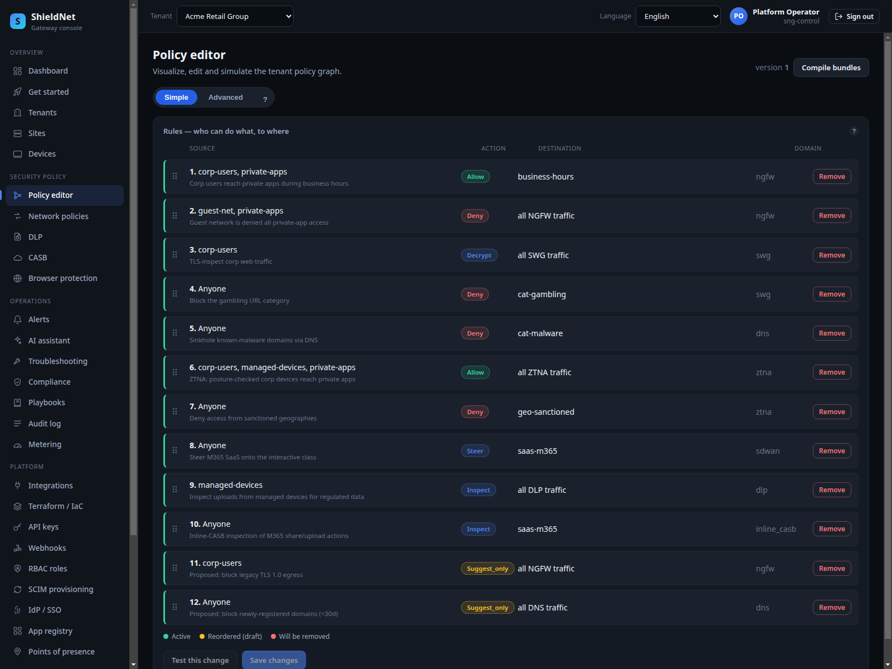
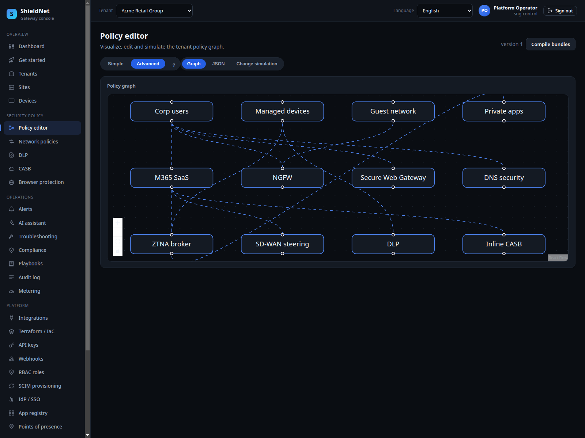
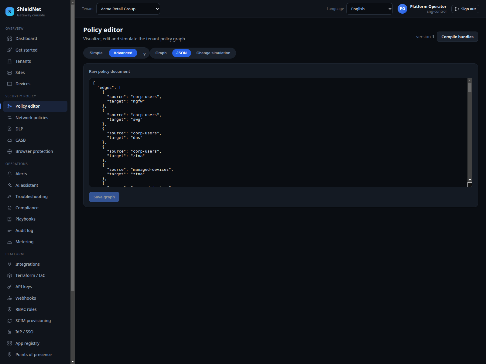

# One typed policy graph lights up a branch (S2)

> **Post 1 of 8.** Persona: **Devraj**, the one-person IT shop at a 180-seat
> firm. Outcome: one policy model — not five consoles — drives NGFW, IPS, SWG,
> DNS security, and SD-WAN steering at once.

## The problem with five consoles

In a traditional stack, a "branch turn-up" means touching a firewall ruleset, an
IPS profile, a web-filtering policy, a DNS policy, and an SD-WAN steering config
— five products, five mental models, five places to make a mistake. SNG's
differentiated design is that all of these are *projections of a single typed
policy graph*. You author intent once; the control plane compiles it into a
signed bundle the edge enforces.

## Walking it in the console

The policy editor renders the graph two ways. The **simple** view is a guided
form for Devraj; the **advanced** view is a React-Flow node graph for someone who
wants to see the whole decision flow.





The same graph is also editable as canonical JSON, which is what gets compiled
and signed — this is the policy-as-code surface that the Terraform/IaC provider
targets:



## The real graph behind the screenshots

This isn't a mock. Here is the shape of Acme's live policy graph, captured
verbatim from `GET /api/v1/tenants/{id}/policy`
([`s2-acme-policy-graph.json`](../artifacts/payloads/s2-acme-policy-graph.json)):

```json
{
  "id": "...",
  "tenant_id": "92112770-7c0a-410b-b0f4-09dde70e063a",
  "version": 1,
  "is_draft": false,
  "graph": { "...": "typed nodes + edges across fw/ips/swg/dns/ztna domains" }
}
```

The graph carries a monotonic `version` and an `is_draft` flag — drafts compile
and simulate but don't sign, so an operator can model a change before it touches
the canonical state. The compiler's verdict for a given flow is one of
`allow` / `inspect` / `deny`, and that verdict is exactly what the AI assistant
re-derives deterministically in Post 6.

## How it works under the hood

- **Author once, project many.** The graph has typed nodes per enforcement
  domain (`fw`, `ips`, `swg`, `dns`, `ztna`) plus SD-WAN steering classes. The
  compiler (`sng-policy-eval`) lowers the graph to a single decision pipeline so
  the *same* match logic backs every projection.
- **Compile → sign → distribute.** The control plane compiles the graph to a
  bundle, signs it with the tenant's rotating signing key, and ships it over
  NATS JetStream. The edge verifies the signature before loading — a tenant
  can't be served another tenant's bundle, and an unsigned bundle is refused.
- **Six-class SD-WAN steering.** Steering is part of the same graph, classifying
  flows into six service classes (see
  [`docs/TRAFFIC_CLASSIFICATION.md`](../../docs/TRAFFIC_CLASSIFICATION.md)) rather
  than living in a separate appliance.

## The edge fast path (eBPF/XDP)

The compiled bundle is enforced in userspace, but the same firewall and
classification verdicts now also lower to an optional **in-kernel eBPF/XDP fast
path** ([PR #129](https://github.com/kennguy3n/visible-fishbone/pull/129)) that
intercepts packets at the driver, before they reach the network stack:

- **LRU verdict cache.** The XDP entry program (`sng_xdp_classify`) parses the
  packet and serves a cached verdict for a known flow immediately, so repeat
  traffic never re-runs the rule walk. The cache is flushed when the ruleset or
  DDoS state changes, so a policy update can't be served a stale verdict.
- **Tail-call split pipeline.** The single program is broken into a chain reached
  through a `BPF_MAP_TYPE_PROG_ARRAY` jump table — classification in 2 chunks,
  the firewall in 8 — so each sub-program stays under the kernel's 8192-jump
  verifier ceiling while preserving the full 1024-rule firewall + 1024-rule
  classification capacity on a stock Linux 5.15 kernel.
- **Bounded IPv6 extension-header walk.** `resolve_ipv6_l4` walks up to 8
  extension headers (Hop-by-Hop / Routing / Dest-Options / Mobility / Fragment)
  to find the real L4 header, so port-keyed rules and SYN/UDP rate limiting now
  apply to extension-header-bearing IPv6 packets that used to bypass the fast
  path.
- **Fail-open by construction.** Anything the fast path can't read authoritatively
  — ESP/AH, a non-first fragment, an over-long header chain, a truncated read —
  returns `XDP_PASS`, and nftables in the slow path enforces the verdict. The
  fast path can only ever be an accelerator, never the sole arbiter.

The throughput evidence for this layer comes from the **WS3 forwarding
benchmarks** ([PR #136](https://github.com/kennguy3n/visible-fishbone/pull/136)),
which add per-SKU forwarding profiles and a regression gate to the `bench/`
harness; their numbers feed the datasheet table below.

## Performance: what we can and can't measure here

Policy **compile latency** is real and measured — it's pure Go and runs
unprivileged. Edge **throughput** is the number we are most careful about, and
we now report it two ways in the
[edge performance datasheet](../artifacts/edge-performance-datasheet.md):

- **dry-run** — the `bench/` harness crafts and measures frames in-process with
  no NIC in the loop. This is a synthetic *ceiling*; the tell is that the
  headline throughput is ~76–100 Gbps largely independent of SKU vCPU count and
  CPU utilisation reads ~0%. Useful for catching datapath regressions, useless
  as a wire number.
- **wire** — real `AF_PACKET` frames transmitted over a veth pair with
  `sng-edge` enforcing in-path under `CAP_NET_RAW` on the self-hosted
  `sng-bench-wire` runner (provisioned by
  [`deploy/terraform/modules/bench-runner`](../../deploy/terraform/modules/bench-runner)).
  This is the measured *floor*.

For the `large` SKU (16 vCPU), the real-wire firewall throughput is **5.37 Gbps
at 1500B** and **18.39 Gbps at 9000B** — versus the ~76 Gbps dry-run ceiling at
1500B. The wire rig is a single-stream egress path, so these are a conservative
floor, not a multi-queue NIC's line-rate; the honest gap between the two columns
is exactly the point of publishing both.

The **per-packet latency distribution** remains the sharpest signal, because the
craft→inspect→measure path exercises the real inspection code in both passes
(`large`, full-TLS inspection):

| packet size | p50 | p95 | p99 |
| --- | ---: | ---: | ---: |
| 64B | 70 ns | 141 ns | 160 ns |
| 512B | 101 ns | 180 ns | 200 ns |
| 1500B | 180 ns | 260 ns | 270 ns |
| 9000B | 731 ns | 811 ns | 832 ns |

Sub-microsecond per-packet inspection latency at p99 for sub-jumbo frames,
backed by a real-wire Gbps floor, is the honest, defensible performance story.

## Where we fall short

- **Wire numbers are a single-stream floor.** The `sng-bench-wire` rig transmits
  over a veth pair, not a multi-queue physical NIC, so the real-wire Gbps is a
  conservative lower bound rather than a head-to-head line-rate. We publish it as
  a floor next to the dry-run ceiling and label both — we still refuse to quote
  the dry-run number as a competitive figure.
- **One graph is a single blast radius.** The flip side of "author once" is that
  a bad compile is a bad compile everywhere. This is why drafts, simulation, and
  the verifier (Post 6) exist — but it's a real design tension worth naming.
- **The advanced graph view has a learning curve.** It's powerful for Lena; it's
  more than Devraj needs day-to-day, which is why the simple view is the default.

Next: the operations story — standing up a new tenant under an MSP, and the RLS
isolation that makes multi-tenancy safe.
