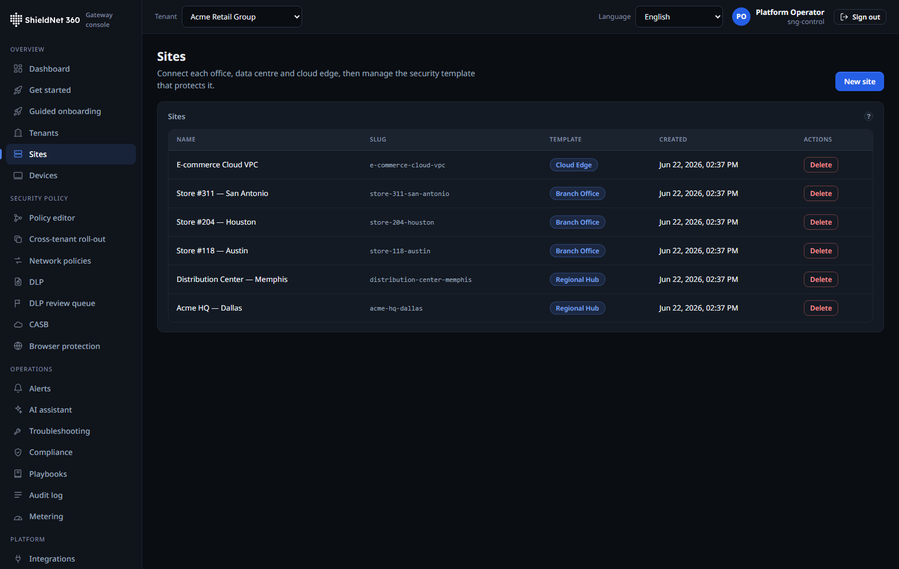

# One typed policy graph lights up a branch

> **Post 1 of 11 — the design centerpiece (Scenario S2).** Persona: Devraj, the
> one-person SME IT team. Evidence: [`s2-acme-policy-graph.json`](../artifacts/payloads/s2-acme-policy-graph.json),
> [`s2-acme-sites.json`](../artifacts/payloads/s2-acme-sites.json),
> [`s2-acme-devices.json`](../artifacts/payloads/s2-acme-devices.json),
> [`appid-acme-catalog-current.json`](../artifacts/payloads/appid-acme-catalog-current.json),
> [`policyrec-acme-generate-response.json`](../artifacts/payloads/policyrec-acme-generate-response.json); screenshots
> [`s2-policy-graph.png`](../artifacts/screenshots/s2-policy-graph.png),
> [`s2-sites.png`](../artifacts/screenshots/s2-sites.png).

Most SASE products are a pile of independent feature toggles: a firewall tab, a
web-filter tab, a DLP tab, a ZTNA tab — each with its own model, its own
precedence rules, its own way to be wrong. SNG's central design decision is the
opposite: **one typed policy graph per tenant** that every enforcement surface
compiles from. NGFW, SWG, DNS, IPS, ZTNA, DLP, SD-WAN steering, and CASB are all
*nodes and edges* in the same graph, type-checked at compile time, signed, and
distributed to the edge as one bundle.

## Why a graph, not a rule list

A rule list answers "what happens to this packet?" in document order. A graph
answers "what is this tenant's intent?" and lets the compiler reject
contradictions before they ship. The node types are the SASE primitives —
`site`, `device`, `identity`, `app`, `network-policy`, `dlp-policy`,
`threat-policy`, `steering-policy` — and edges express scope and precedence. The
compiler walks the graph, resolves precedence deterministically, and emits a
signed bundle with a content hash the edge verifies before loading.

The captured graph for Acme is verbatim from
[`GET /api/v1/tenants/{id}/policy`](../artifacts/payloads/s2-acme-policy-graph.json):
typed nodes, explicit edges, and the compiled bundle metadata. Nothing in that
payload is hand-authored — it is what the control plane returns for the seeded
tenant.

## The six operator intents

Everything an operator wants to express collapses to six verbs, and the graph
models each as a typed policy that compiles to the right enforcement surface:

| Intent | Verb | Compiles to |
| --- | --- | --- |
| Send this traffic out that link | **route** | SD-WAN steering policy |
| Let this identity reach this app | **allow** | ZTNA broker grant + NGFW allow |
| Stop this category / signature / match | **block** | NGFW deny / SWG / IPS / DLP |
| Give this app the good queue | **prioritise** | QoS / steering class |
| Cap this noisy thing | **throttle** | rate-limit policy |
| Catch the bad thing | **threat-protection** | IPS + malware + DNS-intel |

Post 10 walks all six end to end as real typed policies on this VM. The point
here is that they are *the same graph* — a `block` and a `prioritise` are not two
subsystems, they are two edge types the compiler understands together, so it can
tell you when they conflict.

## Sites and devices are first-class nodes

A branch isn't configured by typing in IP ranges; it's a `site` node with
`device` children, and policies attach by scope. Acme's six sites and four
devices ([`s2-acme-sites.json`](../artifacts/payloads/s2-acme-sites.json),
[`s2-acme-devices.json`](../artifacts/payloads/s2-acme-devices.json)) carry
posture, tier, and location, and a policy scoped to "retail-pos devices in the
US" resolves against the graph, not a hand-maintained address group.

## The `app` node is identified, not guessed

An `app` node is only as good as the engine that recognizes the traffic behind
it. A lot of products bake application recognition into a closed set of
hand-coded protocol parsers — useful until the app you care about isn't one of
the handful someone compiled in. SNG resolves `app` against a **signed,
versioned application-identification catalog**: **215 applications across 17
categories** in the captured payload
([`appid-acme-catalog-current.json`](../artifacts/payloads/appid-acme-catalog-current.json)),
each with a monotonic serial so the edge can tell when its copy is stale. The
matcher walks host suffixes most-specific-first and only awards an exact-match
bonus when the catalog entry equals the whole observed host, so
`api.internal.example.com` and `example.com` don't collide. Adding an app is a
catalog update, not a recompile of the data plane.

## The graph can propose its own edges

The same typed model that makes contradictions into compile errors also makes
the graph *suggestible*. The policy-recommendation engine reads observed traffic
and proposes graph deltas — "these identities keep reaching this app; here is
the `allow` edge that would codify it" — and every proposal is run through the
same compiler/verifier before it can be applied, so a recommendation can never
introduce a contradiction a hand-drawn edge couldn't. It is honest about its
inputs: on a deployment without the telemetry hot tier configured it returns
`503 unavailable`
([`policyrec-acme-generate-response.json`](../artifacts/payloads/policyrec-acme-generate-response.json))
rather than inventing suggestions from no data.

## What the typing buys you

- **Contradictions are compile errors.** A grant that an upstream deny would
  shadow is rejected at compile time with the conflicting edge named, not
  discovered in production by a confused user.
- **The bundle is signed and hashed.** The edge verifies the content hash before
  loading; a torn or tampered bundle fails closed to the last-good bundle.
- **Audit is structural.** Every compile is an audit event with the graph diff,
  so "who changed what, and what did it compile to" is answerable from the audit
  log (Post 2 shows Acme's audit trail).

## Where it falls short

- **The graph is powerful, which means it has a learning curve.** A first-time
  operator is better served by the smart-default templates (Post 9 / Post 10)
  that render a jurisdiction-correct baseline graph from `(industry, country)`
  than by drawing nodes from scratch. We lean on templates for onboarding and
  reserve the raw graph editor for the cases that need it.
- **Cross-tenant policy reuse is still template-shaped, not graph-shaped.** An
  MSP that wants "this exact subgraph on 200 tenants" uses the cross-tenant
  roll-out surface (Post 2), which is template + diff, not a live shared graph.
  A genuinely shared, inherited subgraph is future work.
