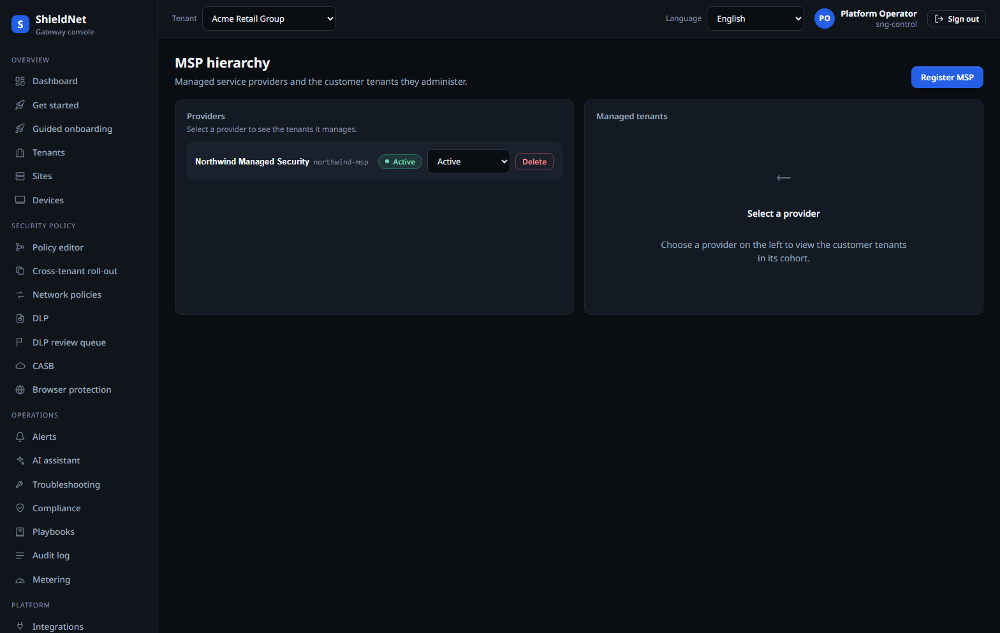
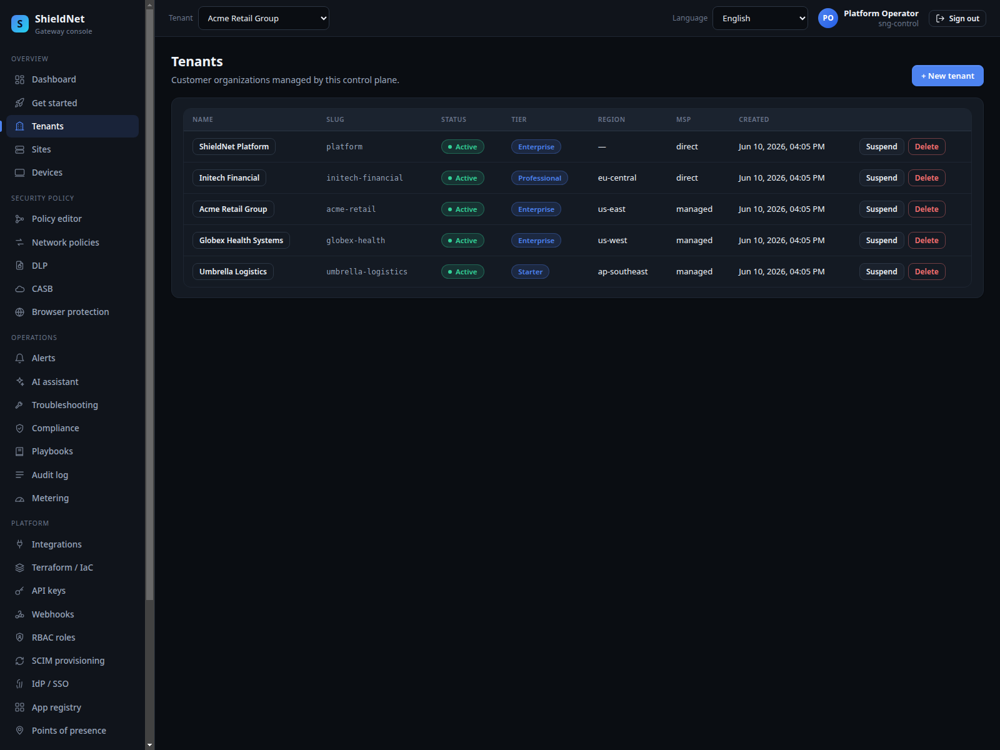
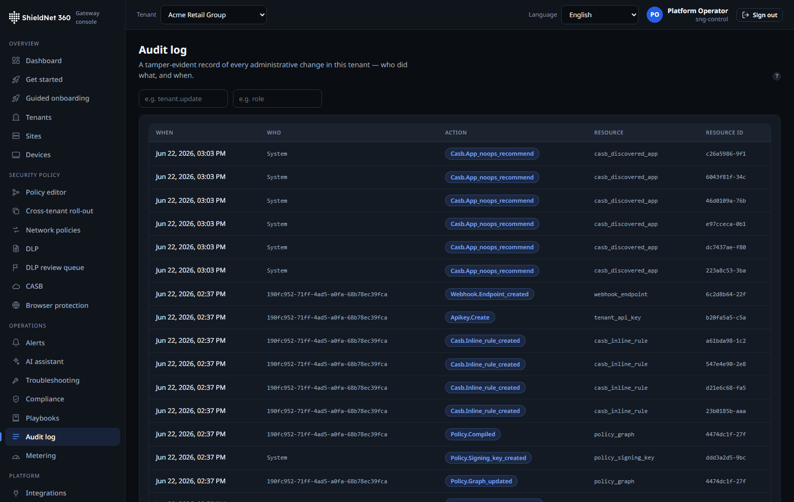

# Stand up a new tenant before the kickoff call ends (S1)

> **Post 2 of 8.** Persona: **Maya**, MSP platform lead. Outcome: repeatable,
> isolated multi-tenant onboarding with a blast radius of exactly one tenant.

## The MSP's real fear

Maya manages dozens of SME tenants from one console. Her nightmare isn't a slow
onboarding — it's a *leak*: tenant A seeing tenant B's policies, devices, or
audit log. So the operations story and the isolation story are the same story.

## Walking it in the console

One MSP, **Northwind Managed Security**, owns the hierarchy. The MSP portal
shows the managed tenants and the management relationship (owner vs. co-manager):



The tenant list is the per-tenant control surface. Nine managed tenants across
three tiers and seven countries, each with its own region, plan, and status:



And every privileged action lands in an immutable audit log — typed action
badges, and a clear distinction between operator-initiated and system-initiated
rows:



## The real data behind it

From `GET /api/v1/msps` ([`s1-msps.json`](../artifacts/payloads/s1-msps.json)):

```json
{ "items": [ {
  "id": "b47fb518-f336-4449-82b0-bd33a1f36833",
  "name": "Northwind Managed Security",
  "slug": "northwind-msp",
  "status": "active"
} ] }
```

`GET /api/v1/tenants` returns the ten tenants visible to the platform operator
(nine managed + the platform tenant itself). The audit log
([`s1-acme-audit-log.json`](../artifacts/payloads/s1-acme-audit-log.json)) carries
the real provisioning trail, from the `tenant.created` event that anchors each
tenant's history through `policy.compiled`, `policy.signing_key_created`,
`casb.inline_rule_created`, and so on — each with a resource reference and a
timestamp.

## How isolation actually works

This is the part that matters, and it's enforced in Postgres, not in application
code that "remembers" to filter by tenant:

- **Row-level security, per transaction.** Every tenant-scoped query runs inside
  a transaction that first issues `SET LOCAL app.tenant_id = '<uuid>'`. RLS
  policies on every tenant table compare against that GUC. The runtime DB role
  (`sng_app`) is **not** a superuser and does **not** have `BYPASSRLS`, so even a
  bug that forgets the `WHERE tenant_id = …` clause cannot cross tenants — the
  database refuses the rows.
- **Global rows have an explicit, audited bypass.** Some rows are legitimately
  tenant-less (global app-registry mutations, platform audit). Before
  [PR #116](https://github.com/kennguy3n/visible-fishbone/pull/116) these were
  silently dropped on every boot (`audit append failed`). The fix added
  migration 052: `audit_log.tenant_id` is nullable, and a dedicated
  `sng.system_role` RLS bypass writes the tenant-less rows — with a new RLS
  integration test that runs as the **non-superuser** role to prove tenant
  isolation still holds. We fixed the audit gap *without* weakening isolation.

## Onboarding gets smart defaults + a dormancy dividend

Two additions this cycle target Maya's actual day: standing up *many* SME tenants
fast, and not paying for the ones that go quiet.

**Smart-default policy templates ([#157](https://github.com/kennguy3n/visible-fishbone/pull/157)).**
Onboarding no longer starts from an empty policy graph. An SME picks an *industry*
and a *country / compliance regime* and gets a deny-by-default `policy.Graph`
baseline — safe-browsing DNS+SWG, per-regime DLP detectors, an NGFW posture — as a
starting point. The catalog is **14 templates**
(`internal/service/policytemplates`, migration 062), captured verbatim from the
API at
[`policy-templates-catalog.json`](../artifacts/payloads/policy-templates-catalog.json):

- **1 baseline** — `baseline/global`, the universal security baseline
- **8 industries** — retail, healthcare, finance, technology, education, legal,
  professional-services, general
- **5 compliance regimes** — EU GDPR, UK DPA, US baseline, Canada PIPEDA,
  Australia Privacy Act

The buyer-facing walk-through is [business Post B4](business/11-compliance-templates.md).

**Activity-tiered dormancy ([#154](https://github.com/kennguy3n/visible-fishbone/pull/154)).**
An MSP managing dozens of trials carries a long tail of tenants that are
provisioned but idle. The new `SweepPlanner`
(`internal/service/tenancy/planner.go`) tiers every periodic sweep by a tenant's
dormancy: **active** tenants are processed every cycle, **idle** every 10th
(`DefaultIdleEvery = 10`), **dormant** every 100th (`DefaultDormantEvery = 100`).
The signal is the new `last_active_at` column (migration 063), bumped via
`GREATEST(last_active_at, now)` on tenant writes so it only ever moves forward. A
quiet trial therefore costs on the order of 1/100th of an active tenant's periodic
work — without turning the tenant off. The cost angle is
[business Post B1](business/08-noops-dormant-trials.md).

*Integration status: the planner is wired into the IdP `SyncService` and covered
by `tenancy` + `identity` unit tests (green on `main`), but that sync loop isn't
started in `cmd/sng-control` yet — so the tiering is proven by tests, not yet
shaping a live production sweep. Flagged, not hidden.*

## Where we fall short (and what closed this cycle)

Three of last cycle's caveats here closed; one narrowed. Honestly, in order:

- **Templates now *have* a roll-out UI — closed.** The previous draft said the
  cross-tenant "apply this baseline to these N tenants" flow was "an API
  capability more than a guided operator surface." That's no longer true: C3
  ([#207](https://github.com/kennguy3n/visible-fishbone/pull/207)) shipped a
  cross-tenant roll-out console (`ui/src/routes/PolicyRollout.tsx`) with
  per-tenant **diff → execute → rollback**, captured at
  `new-msp-cross-tenant-templates.png`.
- **Onboarding now has a guided wizard — closed.** Alongside the API-fast seed
  path, C3 added a guided click-through onboarding wizard
  (`ui/src/routes/GuidedOnboarding.tsx`), so the wizard is no longer thinner than
  the API.
- **Cross-region tenant migration ships — closed.** "A tenant's region is set at
  creation; moving it is not a one-click operation" is stale —
  `internal/service/tenant/migrate_region.go` performs a guarded region move.
- **SCIM hardened, but live IGA depth still narrows.** C5
  ([#206](https://github.com/kennguy3n/visible-fishbone/pull/206)) fixed **three
  real SCIM bugs** (filter-pushdown returning empty pages, Okta `valuePath`
  de-provisioning silently dropped, case-sensitive URN prefix) and added a
  conformance suite. The honest residual: we ran the conformance suite in-repo,
  not a *live* Okta/Entra certification — so SCIM is hardened and tested, not
  vendor-certified. Still scaffolding-plus, not a finished IGA product.

## Control-plane comparison

The directly-comparable competitor figure here is cloud-native: Zscaler's
published admin-API latency. Per
[`competitors.json`](../../bench/business-report/competitors.json), Zscaler's
admin API tenant-CRUD p99 sits in the **100–300 ms** range, caveated as "cloud
native, directly comparable." SNG's control plane is the right thing to bench
against that (Go API latency is measurable unprivileged) — and unlike a hardware
appliance comparison, this one *is* apples-to-apples.

Next: the security proof — the detection efficacy matrix.
