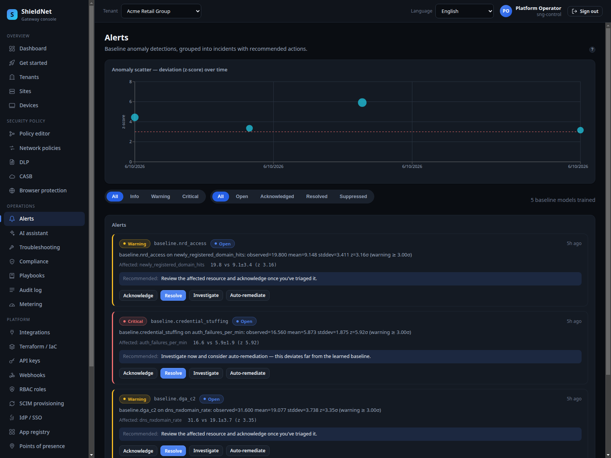

# Detection efficacy: the catch-rate matrix (S3)

> **Post 3 of 8.** Persona: **Lena**, MSP SOC analyst. Outcome: high catch-rate,
> low false-positive load — and, crucially, *numbers that come from the real
> enforcement code*, not a slide.

## What "efficacy" means here (read this first)

This is the post where it's easiest to lie with statistics, so here's exactly
what the numbers are and aren't:

- The efficacy harness ([`bench/efficacy`](../../bench/efficacy)) drives the
  **real crate APIs** — `YaraEngine::scan`, `ZtnaService::evaluate`, the SWG
  `ExtAuthzHandler` categorize→deny-list path, the DNS `ThreatIntelSinkhole`
  Bloom matcher, the `sng-dlp` `ContentClassifier`, and Suricata via SNG's
  rendered config. These are not re-implementations for the benchmark.
- The **corpora are curated** — generated national-ID strings with valid/invalid
  check digits, EICAR/PE/ELF/macro/ransomware malware samples, known-bad threat
  feed domains, labelled PII sentences. They are designed to exercise the
  decision boundary, **not** sampled from wild production traffic. So a 100%
  catch-rate means "the real code classified every curated case correctly," not
  "SNG catches 100% of all real-world threats." Wild-traffic FPR is a different,
  harder measurement we don't claim here.

With that contract stated, here is the full matrix, captured verbatim from
[`efficacy-report.json`](../artifacts/efficacy-report.json) (suite verdict:
**PASS**, commit `6c6406b`):

| function | crate | kind | cases | bad | good | TP | FN | TN | FP | catch | FPR |
| --- | --- | --- | ---: | ---: | ---: | ---: | ---: | ---: | ---: | ---: | ---: |
| firewall | sng-fw | enforcement | 12 | 7 | 5 | 7 | 0 | 5 | 0 | 1.00 | 0.00 |
| swg | sng-swg | enforcement | 11 | 6 | 5 | 6 | 0 | 5 | 0 | 1.00 | 0.00 |
| ztna | sng-ztna | enforcement | 12 | 8 | 4 | 8 | 0 | 4 | 0 | 1.00 | 0.00 |
| dlp | sng-dlp | detection | 1100 | 550 | 550 | 550 | 0 | 550 | 0 | 1.00 | 0.00 |
| dlp_ml_ner | sng-dlp | detection | 31 | 23 | 8 | 23 | 0 | 8 | 0 | 1.00 | 0.00 |
| malware | sng-swg | detection | 14 | 8 | 6 | 8 | 0 | 6 | 0 | 1.00 | 0.00 |
| dns | sng-dns | detection | 23 | 10 | 13 | 10 | 0 | 13 | 0 | 1.00 | 0.00 |
| ips | sng-ips | detection | 13 | 7 | 6 | 7 | 0 | 6 | 0 | 1.00 | 0.00 |

The two interesting cells are the **DLP** rows (1100 + 31 cases) — that's the one
with enough volume to be more than a smoke test, and it's the on-device ML story
we go deep on in Post 5. That post also covers the new **edge-driven wake**
([PR #135](https://github.com/kennguy3n/visible-fishbone/pull/135)) that fires the
classifier the instant a file is written or the clipboard changes, rather than on
a fixed poll — the detection-*trigger* counterpart to this catch-rate matrix.

## What each row actually verified (the honest notes)

The report carries a `notes` field per function. These are the caveats that keep
the matrix honest:

- **firewall:** verified the **fail-closed default** (no ruleset → Deny). The
  in-kernel nftables render couldn't run here — `nft: command not found` — so the
  kernel-enforcement leg is methodology-only on this VM, and we say so.
- **swg:** real categorize→deny-list path; malware/phishing/gambling/adult
  blocked, sanctioned + uncategorized permitted.
- **ztna:** real brokering denies unknown app/device/identity, stale posture,
  stale MFA, missing entitlement, and **cross-tenant requests**; admits
  authorized engineers on compliant devices.
- **dns:** real Bloom sinkhole + tunneling detector; known-bad domains *and their
  subdomains* sinkholed with allowlist override; encoded-QNAME / query-volume /
  TXT-abuse tunneling flagged.
- **malware:** real `YaraEngine::scan` over the **signed** built-in rule set;
  benign text/scripts/macro-free docs pass clean.
- **ips:** real **Suricata 6.0.4** driven by SNG's `ConfigGenerator`-rendered
  `suricata.yaml`, offline PCAP replay in IDS mode, EVE alerts normalised through
  `sng_ips::EveAlert::to_ips_event`.

## Walking it in the console

Detection lands in the Alerts surface. The anomaly view plots z-score outliers;
the table below carries the per-alert evidence:



These alerts are real anomaly-detector output. From
[`s3-acme-alerts.json`](../artifacts/payloads/s3-acme-alerts.json), one row on the
`newly_registered_domain_hits` dimension carries a full EWMA evidence envelope:

```json
{
  "dimension": "newly_registered_domain_hits",
  "baseline_mean": 9.148, "baseline_stddev": 3.411,
  "evidence": { "alpha": 0.1, "baseline_ewma": 8.883, "...": "..." }
}
```

The detector is an EWMA z-score model: it keeps an exponentially-weighted moving
baseline per dimension and flags deviations, so the "evidence" is the actual
statistical state that produced the alert — not an opaque score.

## Where we fall short

- **Curated corpora, not wild traffic.** Stated above and worth repeating: 100%
  on a decision-boundary corpus is a correctness proof of the enforcement code,
  not a real-world catch-rate. The honest next step is a larger, noisier corpus
  and a published FPR under load.
- **IPS needs Suricata present.** The IPS row is real here because Suricata 6.0.4
  was installed; on a host without it, that row is methodology-only.
- **Firewall kernel leg unverified here.** We proved fail-closed semantics and
  ruleset rendering, but not in-kernel nftables enforcement on this VM.
- **No adversarial / evasion corpus yet.** The malware set is known-bad
  signatures (EICAR/PE/ELF/macro). Packed/polymorphic evasion is exactly where
  signature engines struggle, and we don't yet measure it.

## Competitive note

Catch-rate marketing is universal in this space and almost never reproducible.
What's defensible about SNG's number is that the harness is in-repo, drives the
real code, and ships its corpora — so the claim is *auditable*. That's a
different (and rarer) thing than a vendor's "99.x% efficacy" footnote.

Next: retiring the VPN with zero-trust access.
