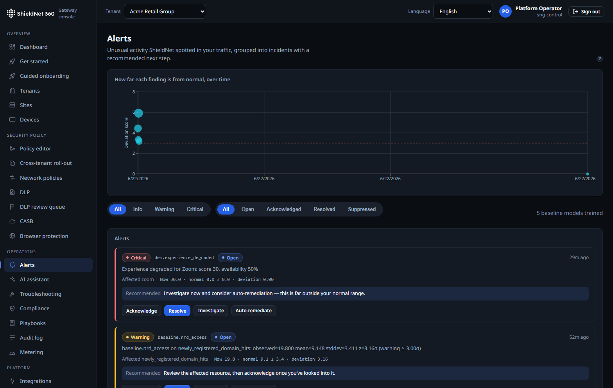

# Detection efficacy: the catch-rate matrix, plus threat-intel depth

> **Post 4 of 11 — efficacy + threat-intel (Scenario S3 + WS-10b).** Persona:
> Lena, MSP SOC analyst. Evidence: [`efficacy-report.json`](../artifacts/efficacy-report.json)
> (re-run on `main` `65824c75`, `git`-stamped), [`s3-acme-alerts.json`](../artifacts/payloads/s3-acme-alerts.json);
> screenshot [`s3-alerts.png`](../artifacts/screenshots/s3-alerts.png). PRs
> [#213](https://github.com/kennguy3n/visible-fishbone/pull/213),
> [#224](https://github.com/kennguy3n/visible-fishbone/pull/224)–[#236](https://github.com/kennguy3n/visible-fishbone/pull/236).

A catch-rate number is only worth printing if it comes from running the real
enforcement code over real corpora, and if the false-positive rate is printed
right next to it. The efficacy harness (`bench/efficacy`) drives the actual Rust
crates — `sng-fw`, `sng-ips` (real Suricata), `sng-swg` (real yara-x),
`sng-dlp` (real ONNX ML-NER), `sng-dns` — over known-bad/known-good, adversarial,
and noisy "wild" corpora, and emits one signed report.

## The matrix (re-run on the merged code)

This is the verbatim verdict table from
[`efficacy-report.json`](../artifacts/efficacy-report.json), re-run on `main`
`65824c75` with `--firewall --firewall-kernel --swg --ztna --ips --dlp --malware
--dns --adversarial --wild`, ONNX Runtime 1.22 for the ML-NER leg, Suricata for
IPS, and nftables for the kernel leg:

| Function | Kind | bad | good | catch % | fp % | verdict |
| --- | --- | ---: | ---: | ---: | ---: | --- |
| firewall | block-rate | 7 | 5 | 100.0 | 0.0 | PASS |
| firewall_kernel | block-rate | 7 | 5 | 100.0 | 0.0 | PASS |
| swg | block-rate | 6 | 5 | 100.0 | 0.0 | PASS |
| ztna | block-rate | 13 | 7 | 100.0 | 0.0 | PASS |
| dlp | detect-rate | 3,800 | 3,800 | 100.0 | 0.0 | PASS |
| dlp_ml_ner | detect-rate | 39 | 8 | 97.4 | 0.0 | PASS |
| malware | detect-rate | 8 | 6 | 100.0 | 0.0 | PASS |
| dns | detect-rate | 10 | 13 | 100.0 | 0.0 | PASS |
| ips | detect-rate | 7 | 6 | 100.0 | 0.0 | PASS |
| malware_adversarial | detect-rate | 42 | 19 | 100.0 | 0.0 | PASS |
| ips_adversarial | detect-rate | 8 | 6 | 100.0 | 0.0 | PASS |
| **overall** | | | | | | **PASS** |

The DLP corpus is the one that grew most this cycle — **3,800 known-bad /
3,800 known-good**, reflecting the broader detector catalog (Post 6) — and it
holds 100% catch at 0% FP. The kernel firewall leg (`firewall_kernel`) is real:
the compiled nftables ruleset is accepted by `nft -c` before it's scored, so the
"the kernel path is unverified" caveat from earlier cycles is closed.

## The honest part: wild traffic

Curated corpora prove the engine recognises what it's designed to recognise. They
do *not* prove how it behaves under noisy, blended, real-ish traffic — so the
harness also runs a **wild** corpus that never gates the suite but is always
published:

| Function | bad | good | catch % | fp % | verdict |
| --- | ---: | ---: | ---: | ---: | --- |
| malware_wild | 302 | 1,040 | 90.1 | 9.6 | WARN |
| dlp_wild | 155 | 590 | 100.0 | 0.0 | PASS |
| ips_wild | 7 | 6 | 100.0 | 0.0 | PASS |

`malware_wild` **WARNs at 90.1% catch / 9.6% FPR** — honest misses on packed and
novel samples, and a false-positive rate that would annoy an analyst at volume.
We print it because hiding it would make the 100% curated rows dishonest. The DLP
classifier, by contrast, holds up under noise (100% / 0%), which matches its
job: structured PII patterns are more separable than "is this binary malicious."

## Hot-path throughput (not the same as Gbps)

Detection cost per decision, measured on the same VM:

- **ZTNA evaluate: 1,812,307 decisions/s (552 ns/op)** — policy evaluation is
  effectively free relative to the network round-trip.
- **DLP ML-NER: 20,373 scans/s**; **DLP classify under wild load: 830,540
  scans/s (180 MiB/s)** across 8 threads.

These are per-decision rates, deliberately reported separately from the headline
forwarding Gbps (Post 2) so nobody conflates "how fast can the policy engine
decide" with "how fast can the box forward."

## Threat-intel depth (WS-10b)

Catch-rate is a function of *what you know about*. WS-10b broadened the
threat-intel surface to close the gap with appliance vendors:

- **JA3 / JA3S TLS fingerprinting** — fingerprint-based detection of known-bad
  client/server TLS stacks, not just IP/domain reputation.
- **A real Suricata rule bundle** behind the IPS leg, so `ips` and
  `ips_adversarial` score against actual signatures, not toy patterns.
- **Retro-hunt** (`THREAT_INTEL_RETROHUNT`, default-OFF) — when a new indicator
  lands, re-scan historical telemetry within a lookback window to find prior
  exposure, rather than only catching the *next* occurrence. This is the feature
  that turns "we just learned domain X is bad" into "and here are the three
  tenants that talked to it last week."

The alerts surface ([`s3-acme-alerts.json`](../artifacts/payloads/s3-acme-alerts.json))
is where these land for the analyst, with severity and the evidence that fired
the rule:

## Where it falls short

- **`malware_wild` at 90.1%/9.6% is not good enough to run in pure-block mode**
  on real traffic. It's an honest "monitor-first, tune, then enforce" posture —
  exactly what the auto-promotion guardrails (Post 8) are designed to gate.
- **Curated corpora are small for several functions** (firewall 7/5, ips 7/6).
  They prove correctness of the engine, not statistical confidence at scale; the
  wild corpus is the volume signal, and only DLP/IPS have meaningful wild
  coverage so far. Malware wild coverage is the weakest spot.
- **Retro-hunt is default-OFF and lookback-bounded.** It re-scans within a
  window (720h by default), not all of history, and on a hibernated tenant whose
  hot telemetry has aged out (Post 3), retro-hunt sees the archive tier, not the
  full hot set.
