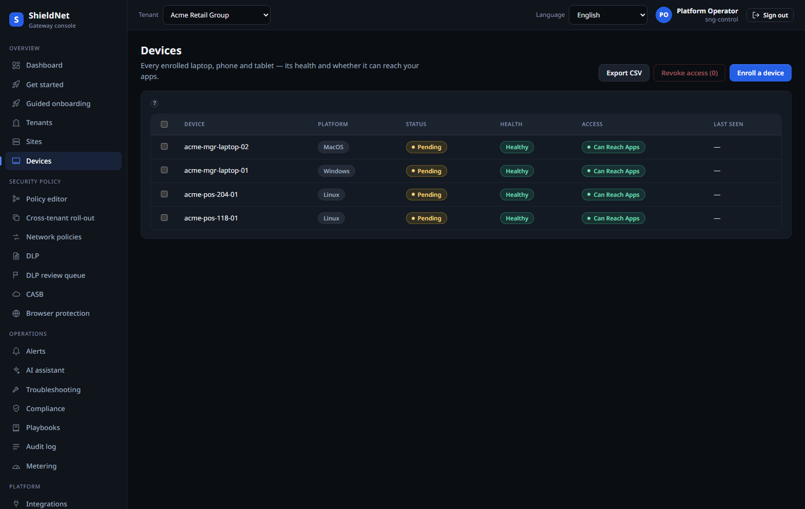

# Retire the VPN: zero-trust access to private apps (S4)

> **Post 4 of 8.** Persona: **Devraj**, SME IT. Outcome: least-privilege access
> to private apps, with device posture in the decision — not a flat VPN that
> trusts anything that completed a handshake.

## The VPN problem

A VPN authenticates *once*, at the tunnel edge, and then the user is "inside."
Zero-trust inverts that: every access decision re-evaluates identity, device,
app, and posture. SNG's `sng-ztna` crate is the broker that makes that decision.

## Walking it in the console

Device posture is a first-class column. Here are Acme's enrolled endpoints across
macOS, Windows, and Linux, each with a platform, enrollment status, posture
verdict, and last-seen:



The ZTNA rules themselves live in the same policy graph from Post 1 — access to
`private-apps` is a typed node with device/identity/posture conditions, not a
separate appliance config.

## The real decision behind it

From the efficacy matrix (Post 3), the `ztna` row is the proof: 12 cases, all
correct, driving the **real** `ZtnaService::evaluate`. Its notes spell out
exactly what gets denied:

> Denies unknown app/device/identity, stale posture, insufficient posture, stale
> MFA, missing entitlement, and **cross-tenant requests**; admits authorized
> engineers on compliant devices.

We can also show a live access verdict. The AI assistant (Post 6) re-derives the
policy decision deterministically against the compiled bundle. Asking *"Can user
finance access app private-apps from a managed device?"* returns, verbatim from
[`s6-acme-nl-policy-query-response.json`](../artifacts/payloads/s6-acme-nl-policy-query-response.json):

```json
{
  "verdict": "inspect",
  "evaluation_mode": "compiled-bundle",
  "matched_rules": ["policy-graph:b70aebd7-...@v1"],
  "ai_generated": false,
  "explanation": "Verdict \"inspect\" ... user-subject rules were not evaluated
    — user identity is not represented in the synthesized access envelope, so
    this verdict reflects only app/device and default-action matching."
}
```

That `explanation` is the honesty contract in the product itself: the engine
*tells you* it only matched on app/device/default-action because the synthesized
envelope had no real user identity. It doesn't pretend to a user-identity verdict
it can't actually make.

## How it works under the hood

- **Multi-factor decision.** `evaluate` takes the access envelope (identity,
  device, app, posture, MFA freshness) and walks the compiled ZTNA rules. Any
  failing dimension denies; the verdict is `allow` / `inspect` / `deny`.
- **Posture is an input, not an afterthought.** A device that's enrolled but
  fails a posture check (disk-encryption off, stale signal) doesn't get the same
  verdict as a healthy one — the Devices screenshot above is the data feeding
  that decision.
- **Tenant isolation in the broker.** Cross-tenant access requests are denied at
  the broker, consistent with the Postgres-RLS story from Post 2 — isolation is
  enforced at every layer, not just the database.

## Where we fall short

- **Identity depth.** As the live verdict shows, when the envelope lacks a real
  user identity, the engine matches on app/device only — and says so. Full
  user-subject evaluation needs a populated identity from the IdP integration,
  which is scaffolding-level today (Post 2).
- **Posture signal breadth.** We check core signals (encryption, firewall,
  screen-lock, MDM enrollment, signal freshness). A mature ZTNA agent gathers far
  more (EDR health, patch level, certificate posture). Ours is a credible core,
  not a full UEM.
- **No continuous in-session re-evaluation yet.** Decisions are made at access
  time; continuous adaptive trust (re-scoring mid-session on signal change) is a
  roadmap item, not a shipped feature.

## Competitive note

VPN-retirement / ZTNA is the most crowded part of SASE — Zscaler Private Access,
Palo Alto Prisma Access, Cloudflare Access, Netskope Private Access all play
here. SNG's honest differentiator is *not* breadth of identity integrations
(where the incumbents are far ahead); it's that the access decision is a
projection of the *same* typed policy graph that drives NGFW/SWG/DNS, so there's
no second policy model to keep in sync. The cost of that elegance is the identity
depth gap above.

Next: keeping regulated data from leaving — DLP, CASB, and browser isolation.
