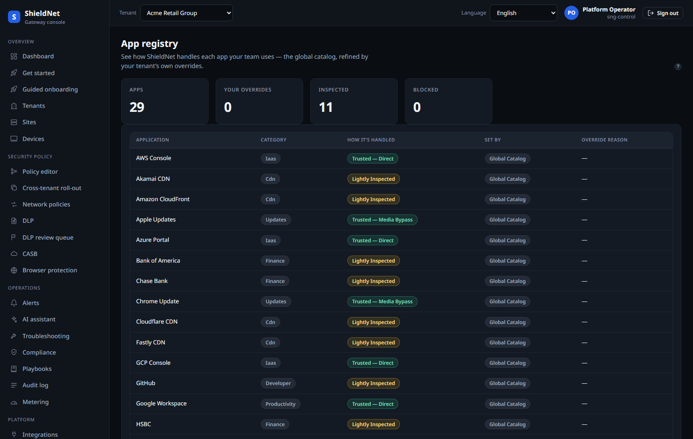
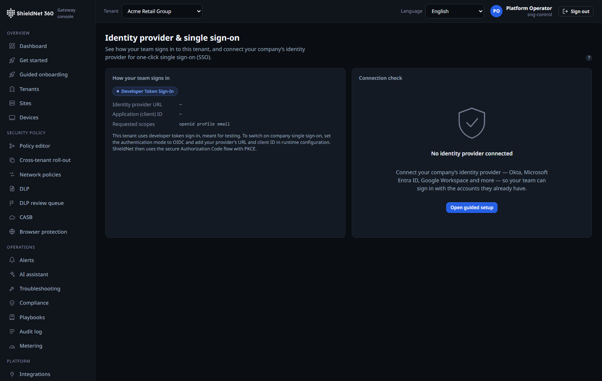
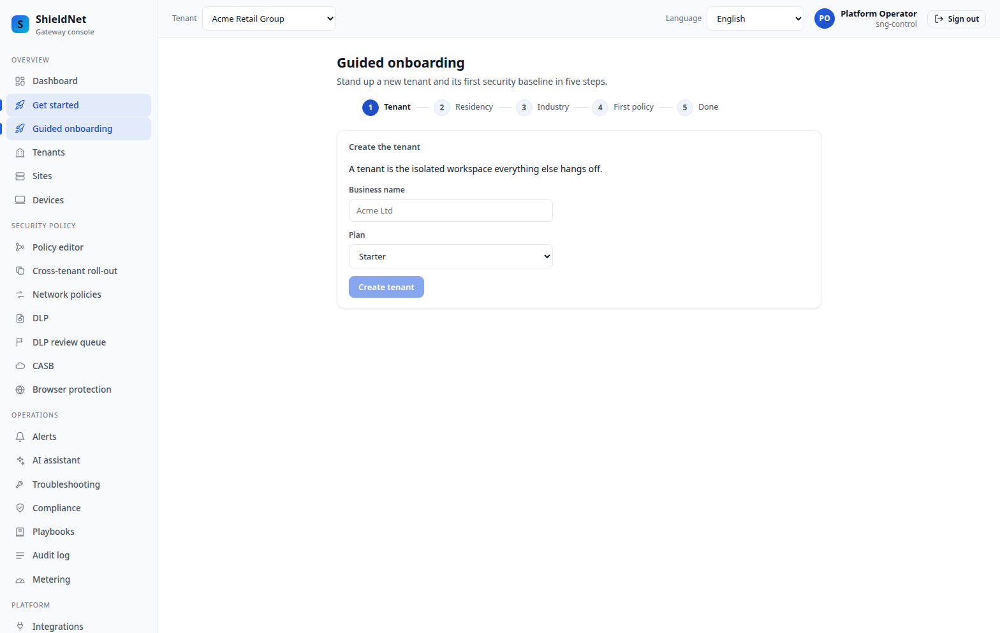

# Retire the VPN: zero-trust access, now with directory breadth

> **Post 5 of 11 — zero-trust access + identity (Scenario S4).**
> Persona: Devraj, SME IT. Evidence: [`efficacy-report.json`](../artifacts/efficacy-report.json)
> (`ztna` row), [`dem-acme-targets.json`](../artifacts/payloads/dem-acme-targets.json),
> [`dem-acme-scores.json`](../artifacts/payloads/dem-acme-scores.json),
> [`dem-acme-alerts.json`](../artifacts/payloads/dem-acme-alerts.json); screenshots
> [`ws10a-idp-directory.png`](../artifacts/screenshots/ws10a-idp-directory.png),
> [`ws10a-app-registry.png`](../artifacts/screenshots/ws10a-app-registry.png),
> [`new-guided-onboarding-wizard.png`](../artifacts/screenshots/new-guided-onboarding-wizard.png).

A VPN grants network access; zero-trust grants *application* access to an
*identity* on a *posture-checked device*, re-evaluated continuously. SNG's ZTNA
broker is a node type in the same policy graph (Post 1): an `allow` edge from an
identity to an app, scoped by device posture, compiles to a broker grant the edge
enforces per-connection.

## The decision is the graph

There's no separate "ZTNA policy language." A grant is `identity → app` with
posture predicates, and the broker evaluates it on every connection attempt. The
efficacy harness drives the real `sng-ztna` crate over a known-bad/known-good
access corpus and scores it in [`efficacy-report.json`](../artifacts/efficacy-report.json):

> **ztna — block-rate, 13 bad / 7 good, 100.0% catch, 0.0% fp, PASS.**

The bad set (13 cases) is the access requests
that *should* be denied — wrong identity, failed posture, revoked session — and
the broker denies all of them while admitting the 7 legitimate ones. Evaluation
is cheap: the same crate clocks **1,812,307 decisions/s (552 ns/op)** on this VM
(Post 4), so continuous re-evaluation is not a performance excuse.

## Continuous re-evaluation, and revocation that bites

The dangerous failure mode for zero-trust is a session that was legitimately
granted and then *should* be killed — the user was deprovisioned, the device fell
out of posture, the risk score spiked. SNG's broker re-evaluates live sessions,
not just new connections, so a deprovisioning event revokes access on
in-flight sessions, not at the next login.

That is where identity breadth matters. A revocation is only as fast as the
signal that the user is gone.

## Identity / IGA breadth

SNG broadens how it learns about identities and their lifecycle on several axes:

- **IdP directory sync** (`IDP_DIRECTORY_SYNC_ENABLED`, default-OFF) — pull users
  and groups from the directory so policy can be written against real groups
  ("finance," "contractors") instead of hand-maintained lists, and so a
  *deprovision* in the IdP propagates to SNG and revokes ZTNA sessions.
- **App registry** — the catalog of private apps ZTNA brokers to, as typed app
  nodes:

- **SCIM provisioning / de-provisioning** — the standards-based path for the IdP
  to push lifecycle events, hardened so a deactivation actually revokes live
  sessions rather than just blocking the next login.

The directory surface in the console:

Directory sync is, notably, one of the capabilities the **auto-promotion
autopilot** (Post 8) manages: it's a default-OFF gate that can escalate
off→monitor→enforce on its own once monitor-mode guardrails hold. An MSP
doesn't flip it per tenant; the platform does, when it's safe.

## Is the app actually fast? Digital-experience monitoring

Granting access is half the promise; the other half is the app being *usable*
once you're in. When a SaaS app feels slow, the SME's first instinct is to blame
the network — and without data, nobody can say otherwise. SNG ships a
lightweight, ZDX-style **digital-experience monitor** that answers the question
with numbers. Every tenant gets **six experience targets auto-provisioned** —
GitHub, Google Workspace, Microsoft 365, Salesforce, Slack, and Zoom
([`dem-acme-targets.json`](../artifacts/payloads/dem-acme-targets.json)) — and
the engine turns probe samples into a 0–100 experience score per target.

The scoring is deliberately simple and explainable: a blended
**availability (60%) + latency (40%)** score, smoothed with an EWMA, where
latency maps linearly from "good" (100 ms) to "bad" (2,000 ms). A score below
the **degrade floor of 70** — or a statistically significant drop against the
tenant's own rolling baseline — raises an alert. On the seeded stack, five
targets score a clean **100** while Zoom is deliberately driven into the floor
([`dem-acme-scores.json`](../artifacts/payloads/dem-acme-scores.json)):

> **zoom — score 30**, availability 50%, latency p50/p95 3,100 ms over 12
> samples, `below_floor: true`.

That one degraded target produces exactly one alert
([`dem-acme-alerts.json`](../artifacts/payloads/dem-acme-alerts.json)):

> **`dem.experience_degraded`**, severity **critical**, dimension `zoom`,
> observed value 30 — *"Experience degraded for Zoom: score 30,
> availability 50%."*

This is the real end-to-end path: probe samples ingested over the API, scored by
the engine, and an alert emitted with a cooldown so a flapping target doesn't
spam the analyst. It gives the one-person IT team the one sentence they need on
the call — "it's not your laptop, the path to Zoom is degraded" — without
standing up a separate monitoring product.

## Onboarding the SME

For Devraj — the one-person IT team — the guided onboarding wizard renders a
jurisdiction-correct baseline (including sensible ZTNA defaults) without making
him draw a graph:

## Where it falls short

- **IdP directory sync is default-OFF and tier-cadenced.** On a dormant tenant
  it syncs on the tiered cadence (Post 2), so directory changes for an idle trial
  can be stale until the tenant wakes — fine for a trial, not for a busy tenant,
  which is why active tenants sync every cycle.
- **Continuous re-evaluation costs connection state.** Re-evaluating live
  sessions means tracking them; at very high session counts that state is real
  memory, and the honest knob is the re-eval interval, not "free."
- **Breadth ≠ every connector.** SNG covers the standards-based path (SCIM +
  generic directory sync); a long tail of vendor-specific IGA integrations is
  still backlog, and we don't claim parity with a dedicated IGA suite.
- **DEM is synthetic, not real-user, monitoring.** The scores below come from
  active probes to reference targets, not from instrumenting every user's actual
  session. It tells you "the path to Zoom is degraded," not "this specific
  user's call dropped." Real-user monitoring is a deeper integration we don't
  claim yet.
