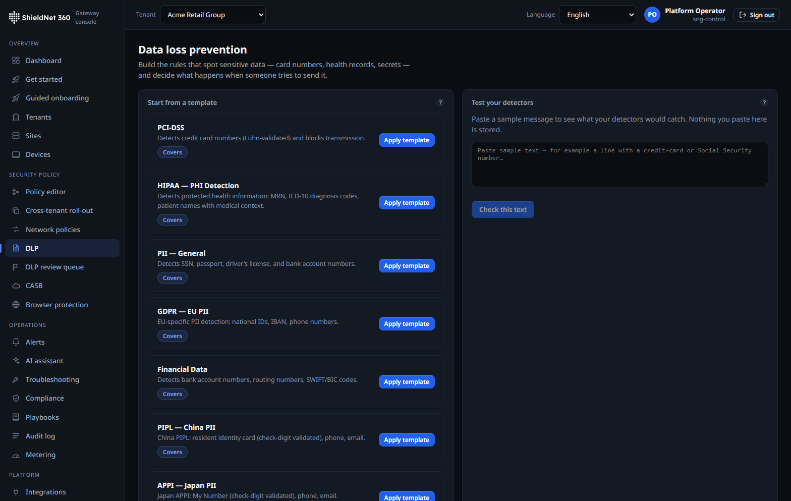
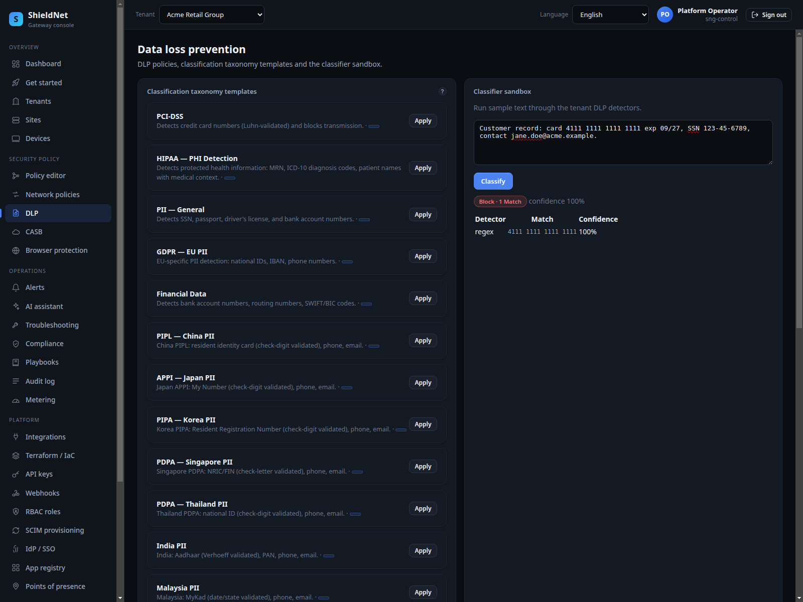
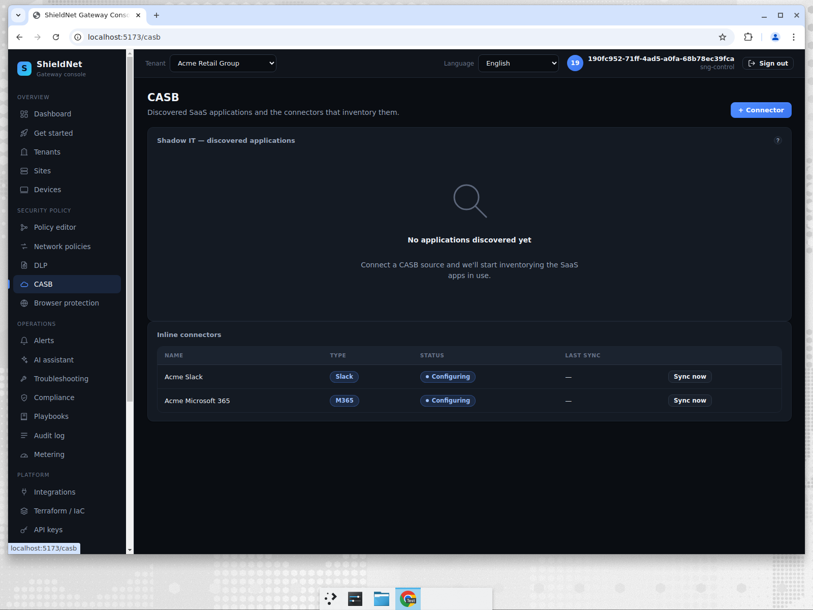
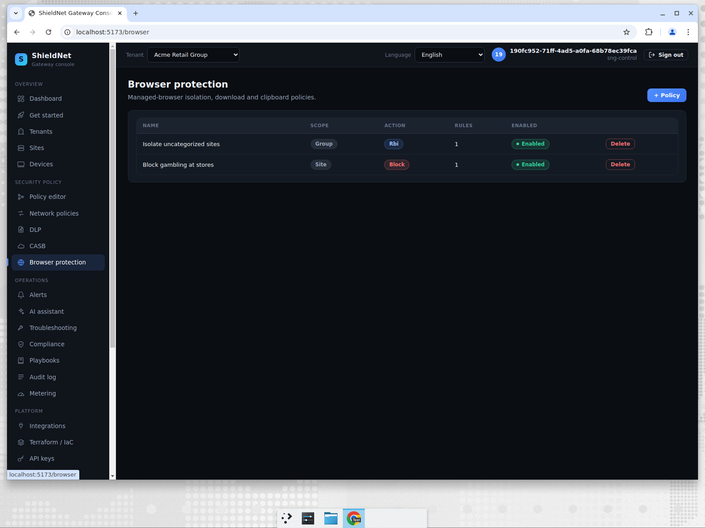
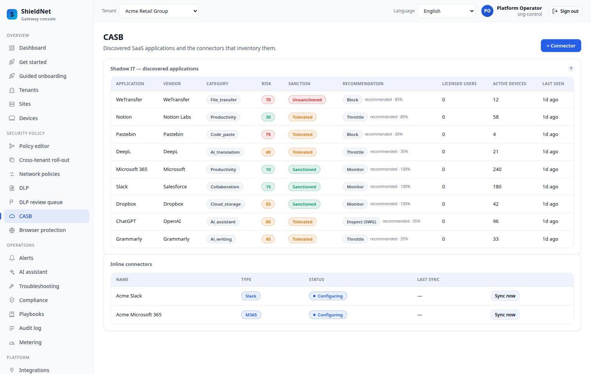
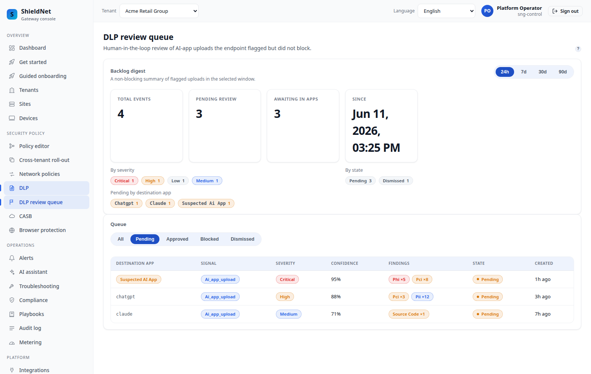

# Keep regulated data from leaving: DLP, CASB, browser isolation (S5)

> **Post 5 of 8.** Personas: **Lena** (SOC) and **Tom** (compliance). Outcome:
> stop regulated data exfiltration with on-device ML classification, CASB
> visibility, and remote browser isolation — now wired live (default-OFF), with a
> human-in-the-loop review queue you can actually open in the console.

## The "broken routes" backstory

This scenario's three surfaces — DLP, CASB/Browser protection — were the most
honest finding of the whole audit. Walking all 31 console routes, three rendered
**"Could not load data (HTTP 404)"**: DLP, Browser protection, and Terraform/IaC.

The root cause wasn't a UI bug. These features had DB schema, services, HTTP
handlers, and full UI — but **no Postgres repository implementations** (only
in-memory ones used by tests), so they were never constructed or wired into the
router. `deps.DLP/Browser/Terraform` were nil and their routes were never
registered → stdlib 404.

We fixed it properly in [PR #116](https://github.com/kennguy3n/visible-fishbone/pull/116):
implemented the six missing Postgres repos (DLP policy/fingerprint/match/model,
Browser policy, Data classification) following the existing RLS repo pattern,
wired the three services into `main.go`, and added migration 054 so the `rbi`
browser-isolation action persists. We did **not** screenshot around the bug.

## Walking it in the console

DLP templates — compliance-pack starting points (PCI-DSS, HIPAA):

The classifier sandbox — paste content, see the live classification:

CASB connectors — the seeded SaaS connectors (M365, Slack, Google, Salesforce):

Browser protection policies — category actions including remote isolation (`rbi`):

## The real classification behind it

The DLP classifier sandbox is backed by a real endpoint. The captured
request/response pair
([`s5-dlp-classify-request.json`](../artifacts/payloads/s5-dlp-classify-request.json)
→ [`s5-dlp-classify-response.json`](../artifacts/payloads/s5-dlp-classify-response.json))
shows content going in and labels coming out.

The efficacy matrix (Post 3) is where DLP earns its keep — it's the highest-volume
row by far:

- **`dlp` (4,800 cases):** the `ContentClassifier` over generated national-ID
  corpora spanning the expanded jurisdiction set. Valid identifiers (correct
  check digit) must be detected; same-length identifiers with a *wrong* check
  digit must be suppressed by the validators. 2,400 bad / 2,400 good, **zero
  false positives**. This is the check-digit validation doing real work — it's
  not a regex that fires on anything that looks like a number. (The corpus grew
  4× from the previous 1,100-case run as the detector set expanded.)
- **`dlp_ml_ner` (47 cases):** real on-device **ONNX NER** (`ner_v1.onnx`, via
  ONNX Runtime 1.22) over a labelled PII corpus, with benign and
  capitalised-non-name controls. Measured **97.4% catch / 97.9% accuracy** —
  reported as-is, not rounded to 100%. Spec targets were precision > 0.90 and
  recall > 0.85; the run cleared them.

The national-ID detector set also grew materially this cycle: from the earlier
handful to **21 jurisdiction detectors**
([#209](https://github.com/kennguy3n/visible-fishbone/pull/209),
`crates/sng-dlp/src/detectors/`), each with check-digit/format validation. That
is the breadth gap the previous draft named, narrowed.

## How it works under the hood

- **On-device ML, not a cloud round-trip.** The NER model runs locally via ONNX
  Runtime. (It needs `libonnxruntime.so` present — the environment blueprint
  provisions it; without it, those tests are labeled and skipped rather than
  faked.)
- **Validators, not just matchers.** National-ID detection validates check
  digits, which is why the 2,400 invalid controls produce zero false positives.
- **RBI as a policy action.** Remote browser isolation is a first-class action in
  the browser-policy model (migration 054), so "isolate uncategorized sites" is a
  policy verdict, not a bolt-on.
- **Tier differentiation is real.** Nordic EduCloud (starter) has **zero** DLP
  policies — a freshly-onboarded tenant that has sites, devices and a baseline
  AUP browser policy but hasn't configured DLP yet — captured deliberately as
  [`s5-nordic-dlp-policies-emptystate.json`](../artifacts/payloads/s5-nordic-dlp-policies-emptystate.json)
  — so the empty state in the UI is an honest tier/onboarding difference, not a
  load failure. By contrast Umbrella (APAC) carries a single `pdpa-singapore`
  policy ([`s5-umbrella-dlp-policies.json`](../artifacts/payloads/s5-umbrella-dlp-policies.json)),
  the Singapore-residency example. (These per-tenant captures are only honest
  because the control plane runs as the non-superuser `sng_app` role, so
  Postgres RLS scopes each list to its tenant — see the per-tenant-isolation
  note in [`scenarios.md`](../artifacts/scenarios.md).)

## Edge-driven wake: classify on-write, not on a timer

On-device DLP only matters if it catches an exfiltration *as it happens*. The
endpoint monitors used to busy-poll — a fixed 50 ms async poll per channel — which
both burned CPU on idle endpoints and added up to 50 ms of detection latency.
[PR #135](https://github.com/kennguy3n/visible-fishbone/pull/135) replaces that
with an **edge-driven wake** in `sng-pal`:

- **inotify file-write monitor + X11 clipboard monitor** now pulse a
  `tokio::sync::Notify` the moment the kernel reports a write or the X selection
  changes, mirroring the existing udev wake on the USB-transfer monitor. The
  classifier consumer parks on `notified()` instead of spinning, with a defensive
  shutdown-poll fallback only.
- Because `Notify` stores a permit when no waiter is parked, an event that races
  the await is **never lost** — correctness doesn't depend on the timing of the
  wake.
- The result: the fixed ~20 wakeups/sec/channel idle busy-poll is gone, and
  write-to-detection latency drops from up-to-50 ms to ~0. The same release adds
  native macOS (FSEvents / Pasteboard / IOKit) and Windows (RDCW / clipboard /
  WMI / spooler / WFP) endpoint-DLP backends so the on-write trigger is uniform
  across platforms.

This is a *trigger* change, not a detection-quality change: the same
`ContentClassifier` and ONNX NER from the matrix above run on the woken content —
they just run sooner and without the idle tax.

## What shipped this cycle: malware, safe-browsing, NoOps shadow-IT

The audit above closed the *broken-route* gap. This cycle added four new
data-protection capabilities to these same surfaces — and, unlike the previous
draft, they are now **wired into the running control plane behind default-OFF
gates**, not merely "code-complete on `main`." The honest framing has moved from
*wired vs. not-wired* to *wired vs. default-ON*: an upgrade is behaviourally
inert until an operator opts in, which is the production-correct posture (no
surprise enforcement on upgrade). Integration status is flagged per capability
below.

### Content scanning at the gateway: ClamAV INSTREAM

`sng-swg` gains a `ContentScanner` trait (`crates/sng-swg/src/malware.rs`) with a
`ClamdScanner` implementation (`crates/sng-swg/src/clamd.rs`) that streams a
download's bytes to a local `clamd` daemon over the **INSTREAM** protocol:

- **Bounded connection pool, per-scan timeout, SHA-256 verdict cache** — a repeat
  artifact isn't re-scanned.
- **Fail-open by default** (a scanner outage must never block an employee), with
  an opt-in **fail-closed** posture for high-assurance tenants. The fail-open
  outage verdict is deliberately *never* cached.

It complements — doesn't replace — the existing in-process `yara-x` signature
scan: yara-x is the always-on cheap pre-filter; ClamAV is the opt-in deep content
scan. *Integration status: **wired** via the ext-authz listener, default-OFF and
constructor-gated, fail-open when off.*
([#156](https://github.com/kennguy3n/visible-fishbone/pull/156),
[#178](https://github.com/kennguy3n/visible-fishbone/pull/178))

### Safe-browsing and category filtering

The new categoriser (`crates/sng-swg/src/categorizer.rs`) maps `(host, path)` to a
category string the verdict layer reads as allow/deny, hot-reloaded via an
`ArcSwap` snapshot so the operator deny-list and the vendor category feed update
without a restart. Smart defaults deny the obviously-bad category groups out of
the box, layered over the existing DNS threat-intel sinkhole. *Integration
status: **wired** via the same ext-authz listener, default-OFF.*
([#156](https://github.com/kennguy3n/visible-fishbone/pull/156),
[#178](https://github.com/kennguy3n/visible-fishbone/pull/178))

### Shadow-IT, handled NoOps: discover → classify → recommend

This is the capability that pairs with the CASB connectors above. The shadow-IT
discoverer feeds an `AppNoOpsEngine` (`internal/service/casb/app_engine.go`) that
classifies each newly-seen app, scores its risk, and either *recommends* or (only
when explicitly enabled) auto-enforces a verdict — every decision written to the
audit log and rolled into a per-tenant digest.

The numbers are the **real engine's output**, not fixtures: `blog/harness/casb`
seeds an inventory then runs the production `Reconcile()` / `RunDigests()`. From a
single clean pass over Acme
([`casb-noops-actions-acme.json`](../artifacts/payloads/casb-noops-actions-acme.json)),
six apps draw an action:

| app | category | risk | recommended verdict |
| --- | --- | ---: | --- |
| Pastebin | code_paste | 75 | `block` — *auto-block withheld as destructive* |
| WeTransfer | file_transfer | 70 | `block` — auto-block withheld |
| ChatGPT | ai_assistant | 60 | `inspect_full` |
| Grammarly | ai_writing | 47 | `inspect_lite` |
| DeepL | ai_translation | 44 | `inspect_lite` |
| Notion | productivity | 36 | `inspect_lite` |

This is the live `/casb` surface showing those per-app NoOps verdicts against
Acme's shadow-IT inventory:

The three sanctioned suites (Dropbox, Microsoft 365, Slack) correctly draw **no**
action. Every row above is `mode: recommend`, `applied: false` — that field *is*
the NoOps thesis: the engine recommends the destructive verdict and withholds the
enforcement unless the operator opted in (`CASB_NOOPS_AUTO_ENFORCE`), so a risk-75
paste site is never silently blocked on a classifier's say-so. The reason string
is generated by the engine verbatim:
`"high-risk code_paste app (risk 75): recommend blocking — auto-block withheld as
destructive"` (`app_engine.go:381`). Multi-replica correctness is handled by
leader-gating the discovery hook so only the elected leader appends an action
([#172](https://github.com/kennguy3n/visible-fishbone/pull/172)); apps a
non-leader observes are caught by the leader-only reconcile sweep. The
buyer-facing walk-through is [business Post B2](business/09-shadow-it-noops.md).
(#159, #172)

### PII at the AI edge — coach, don't block — with human review

`crates/sng-dlp/src/ai_app.rs` adds a long-tail **AI-app** exfiltration signal:
`classify_destination` recognises AI/LLM destinations (`AiAppKind` /
`AiAppCategory`), and a `SecretScanner` + confidential-marker pass run alongside
the national-ID/NER detectors above. The design is **coach-first** — it only
hard-blocks on a *known* AI app **and** *high* confidence **and** an *explicit*
opt-in, to avoid the false-positive backlash that makes users route around DLP.
24 unit tests on `main`.

Events that aren't auto-resolved land in a **human-in-the-loop review queue**
(`internal/service/dlpreview`, migration 060): `pending → approved / blocked /
dismissed`, with RLS and redacted-evidence-only storage. *Integration status:
**the operator console surface now exists** — the queue is reachable at
`/dlp/review-queue` with a per-tenant digest and triage actions, backed by the
operator API.* Here it is live against Acme:

The captured queue + a dismiss action are at
[`s5-acme-dlp-review-queue.json`](../artifacts/payloads/s5-acme-dlp-review-queue.json)
and
[`s5-acme-dlp-review-dismiss-action.json`](../artifacts/payloads/s5-acme-dlp-review-dismiss-action.json).
(#158, [#176](https://github.com/kennguy3n/visible-fishbone/pull/176),
[#179](https://github.com/kennguy3n/visible-fishbone/pull/179))

### Exact-Data-Match + fingerprinting at scale

Beyond pattern detectors, `sng-dlp` gained **Exact-Data-Match**
(`crates/sng-dlp/src/edm.rs`, migration 067): an operator registers a sensitive
record set (customer PANs, employee records) and the engine matches on it via
**salted HMAC-SHA256** — the plaintext is never stored, only the keyed hash.
Document **fingerprinting** uses multi-index-hashing SimHash, tested at **5,000
fingerprints** for near-duplicate detection at scale.
([#209](https://github.com/kennguy3n/visible-fishbone/pull/209))

## Where we fall short

Four of the five caveats this post used to carry are now closed — they were the
staged-but-not-wired and no-console-API gaps, and this cycle wired and surfaced
them. What honestly remains is breadth, not plumbing:

- **Wild-corpus catch-rate is below the gating number.** The gating `dlp` row is
  100% on a decision-boundary corpus; the *wild* DLP rows (Post 3,
  `dlp_wild` / `dlp_fpr_load`) are the honest signal that real exfiltration
  detection is a harder, noisier problem than the curated corpus implies.
- **Detector breadth is much wider, still not Netskope-wide.** 21 jurisdiction
  detectors + EDM + at-scale fingerprinting is a credible on-device core and a
  big step up from the six-class draft — but a mature DLP suite still ships more
  jurisdiction-specific detectors and managed corpora than we do.
- **CASB is connector-shaped, not full inline-CASB-at-scale.** We model
  connectors and inline rules; we don't claim the SaaS-API coverage of a
  dedicated CASB vendor. Unchanged, and stated.
- **The new capabilities are wired but default-OFF.** ClamAV scanning,
  safe-browsing/category filtering, the NoOps engine, and the DLP review queue
  are now wired into the running control plane — but behind default-OFF gates, so
  an out-of-the-box install isn't enforcing them until an operator opts in. That
  is the production-correct posture; it is *not* the same as "on for every tenant
  today."

## Competitive note

On-device ML DLP is genuinely differentiated against appliance-era DLP that
backhauls content to a scanner. The honest comparison target is Netskope and
Zscaler's data-protection tiers — both deep, both cloud-scanning-heavy. SNG's
on-device inference is a latency and privacy story (content doesn't leave the
endpoint to be classified); the gap is detector breadth and managed-corpus
maturity.

Two of this cycle's additions sharpen that story in SNG's favour for the SME/MSP
buyer specifically: the **NoOps shadow-IT engine** turns CASB discovery into a
recommend-first audit trail an under-staffed team can actually act on (vs. a raw
discovery dashboard nobody triages), and **coach-first AI-app DLP** is a
deliberately narrower-than-Netskope claim that trades detector-catalog breadth
for a low false-positive bar that won't get the control switched off. We still
lose to Netskope/Zscaler on detector depth and SaaS-API coverage — that part of
the assessment hasn't changed.

Next: the AI assistant — and why it has a verifier, not a vibe.
