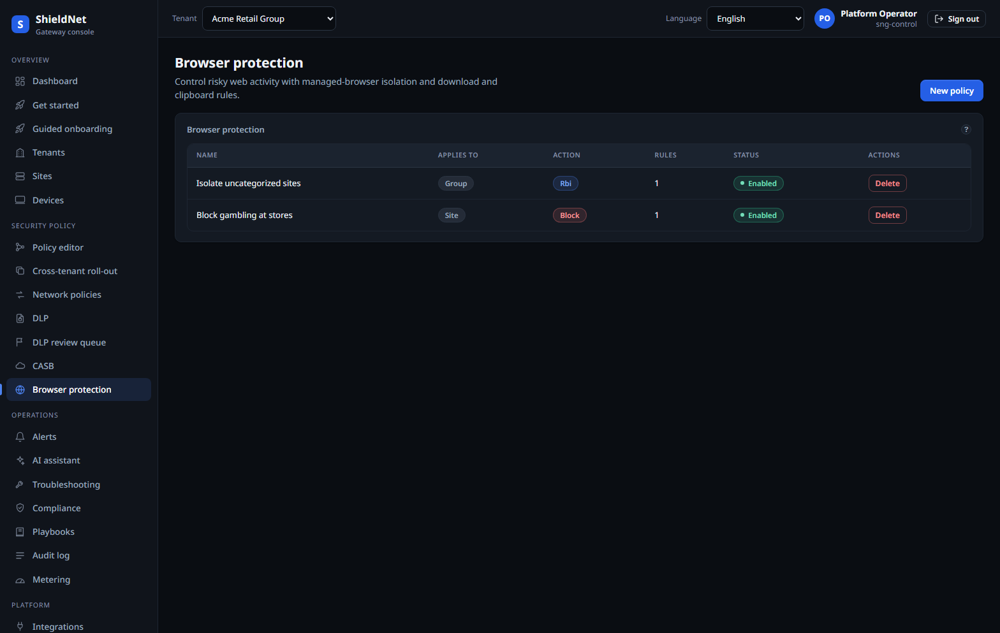

# Keep regulated data from leaving: DLP + CASB + browser isolation

> **Post 6 of 11 — data protection (Scenario S5 + WS-10c).** Personas: Lena
> (analyst), Tom (CFO). Evidence: [`s5-acme-dlp-policies.json`](../artifacts/payloads/s5-acme-dlp-policies.json),
> [`s5-acme-casb-connectors.json`](../artifacts/payloads/s5-acme-casb-connectors.json),
> [`s5-acme-casb-inline-rules.json`](../artifacts/payloads/s5-acme-casb-inline-rules.json),
> [`s5-acme-browser-policies.json`](../artifacts/payloads/s5-acme-browser-policies.json),
> [`s5-nordic-dlp-policies-emptystate.json`](../artifacts/payloads/s5-nordic-dlp-policies-emptystate.json);
> screenshots [`s5-dlp-policies.png`](../artifacts/screenshots/s5-dlp-policies.png),
> [`new-dlp-review-queue.png`](../artifacts/screenshots/new-dlp-review-queue.png),
> [`new-casb-noops-shadow-it.png`](../artifacts/screenshots/new-casb-noops-shadow-it.png),
> [`s5-browser-isolation.png`](../artifacts/screenshots/s5-browser-isolation.png). PRs
> [#223](https://github.com/kennguy3n/visible-fishbone/pull/223),
> [#227](https://github.com/kennguy3n/visible-fishbone/pull/227),
> [#230](https://github.com/kennguy3n/visible-fishbone/pull/230),
> [#231](https://github.com/kennguy3n/visible-fishbone/pull/231).

Three surfaces keep regulated data where it belongs: **DLP** (what's in the
content), **CASB** (which SaaS apps it's flowing to), and **browser isolation**
(rendering risky web content away from the endpoint). All three are policy-graph
nodes; this cycle (WS-10c) broadened the detector and SaaS-API catalogs.

## DLP: structured detection + an on-device ML classifier

DLP runs two complementary engines. A **structured detector** matches the things
that have shape — PANs (PCI), national IDs, IBANs — across a broad jurisdiction
catalog, and an **on-device ML-NER classifier** (`sng-dlp`, ONNX) catches the
unstructured stuff. The efficacy report (Post 4) scores both on the merged code:

- **`dlp` — 3,800 bad / 3,800 good, 100% catch, 0% FP.** The corpus grew to 3,800
  each this cycle, reflecting the broader detector catalog.
- **`dlp_ml_ner` — 39 bad / 8 good, 97.4% catch, 97.9% accuracy, 0% FP.**

WS-10c broadens the catalog: **more jurisdictions, exact-data-match (EDM)** for
"this specific customer database," and **document fingerprinting** for "this
specific file and its derivatives." Acme's DLP policy set is captured verbatim
([`s5-acme-dlp-policies.json`](../artifacts/payloads/s5-acme-dlp-policies.json)):

Nordic (the starter tenant) shows the honest **empty state** — a tenant that
hasn't configured DLP genuinely has none, and we screenshot that rather than
pretend every tenant is fully built out
([`s5-nordic-dlp-policies-emptystate.json`](../artifacts/payloads/s5-nordic-dlp-policies-emptystate.json)).

## Coach-first, with a human-in-the-loop queue

Blocking a user mid-task is expensive and often wrong. SNG's DLP can **coach**
(warn + allow + log) rather than hard-block, and the borderline signals land in a
review queue an analyst triages:

The queue holds redacted finding aggregates — the analyst sees *that* a match
fired and its confidence, not the sensitive content itself.

## CASB: shadow-IT discovery with NoOps recommendations

The CASB engine inventories the SaaS apps a tenant's traffic actually touches,
scores each for risk, and — this is the NoOps part — **recommends an action with
a confidence**, rather than silently enforcing. The live shadow-IT table for Acme
(real engine output, produced by running the production `Reconcile()` via
`blog/harness/casb`):

Read across a row: Microsoft 365 → risk 10 → *Sanctioned* → recommend **Monitor**
(100%); WeTransfer → risk 70 → *Unsanctioned* → recommend **Block** (85%);
ChatGPT → risk 60 → recommend **Inspect (SWG)** (35%); Pastebin → risk 75 →
recommend **Block** (30%). The recommendation carries a confidence so an operator
(or the auto-enforce gate, Post 8) can act on the high-confidence ones and review
the rest. WS-10c adds **SaaS-API connectors** (the inline connectors at the
bottom of that page — Slack, M365) so CASB sees API-side activity, not just
inline traffic. Acme's connectors and inline rules are captured in
[`s5-acme-casb-connectors.json`](../artifacts/payloads/s5-acme-casb-connectors.json)
and [`s5-acme-casb-inline-rules.json`](../artifacts/payloads/s5-acme-casb-inline-rules.json).

CASB reconcile is, like IdP sync, a tiered periodic job (Post 2): a dormant
tenant's shadow-IT inventory refreshes on the slow cadence, an active one's every
cycle.

## Browser isolation (RBI)

For the genuinely risky click, remote browser isolation renders the page away
from the endpoint and streams pixels, so active content never executes locally.
It's a browser-policy node ([`s5-acme-browser-policies.json`](../artifacts/payloads/s5-acme-browser-policies.json)):

## Where it falls short

- **`dlp_ml_ner` is 97.4%, not 100%** — the unstructured classifier misses ~1 in
  40 on the curated set. That's why coach-first and the review queue exist:
  high-confidence structured matches can hard-block; the ML classifier's
  borderline calls go to a human.
- **CASB recommendations are recommend-only by default** (`NOOPS_AUTO_ENFORCE=false`).
  The confidence scores on low-risk rows (30–35%) are deliberately not
  auto-actioned; only the auto-enforce gate (Post 8), once its guardrails hold,
  promotes any of this to enforcement.
- **EDM/fingerprinting need the source data registered.** Exact-data-match is
  only as good as the dataset you load; it's a powerful tool that requires setup,
  not a zero-config detector.
