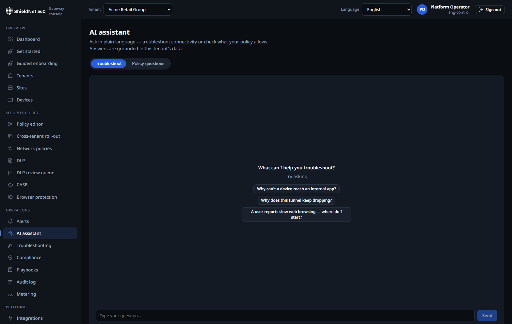
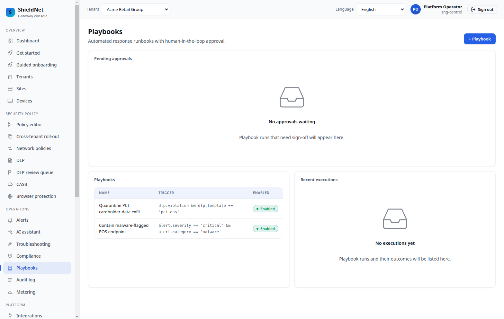

# AI-assisted operations — with a verifier, and one model for the whole fleet

> **Post 7 of 11 — AI ops + shared inference (Scenario S6).** Personas:
> Lena (analyst), Devraj (SME IT). Evidence: [`s6-acme-posture-report.json`](../artifacts/payloads/s6-acme-posture-report.json),
> [`s6-acme-playbooks.json`](../artifacts/payloads/s6-acme-playbooks.json),
> [`s6-acme-nl-policy-query-response.json`](../artifacts/payloads/s6-acme-nl-policy-query-response.json),
> [`policyrec-acme-generate-response.json`](../artifacts/payloads/policyrec-acme-generate-response.json),
> [`policyrec-acme-list.json`](../artifacts/payloads/policyrec-acme-list.json),
> [`llm_validation/quality_report.md`](../artifacts/llm_validation/quality_report.md),
> [`capacity-plan-5000/report.md`](../artifacts/capacity-plan-5000/report.md),
> [`noops-metrics-snapshot.txt`](../artifacts/noops-metrics-snapshot.txt); screenshots
> [`s6-assistant.png`](../artifacts/screenshots/s6-assistant.png),
> [`s6-playbooks.png`](../artifacts/screenshots/s6-playbooks.png).

AI in a security product is dangerous if it's a vibe. SNG's posture is: the model
*proposes*, a deterministic verifier *checks*, and only checked output reaches an
operator. SNG also changes *how* the model runs — from a per-tenant
fantasy that doesn't scale to one pooled model serving the whole fleet.

## The model proposes, the verifier disposes

The AI assistant answers natural-language questions about a tenant's policy
("Can user finance access app private-apps from a managed device?") by translating
to a structured query, running it against the *real* compiled policy graph, and
returning a verdict grounded in that evaluation — not a free-text guess. The
captured request/response pair
([`s6-acme-nl-policy-query-response.json`](../artifacts/payloads/s6-acme-nl-policy-query-response.json))
is a deterministic verdict: the model's job is translation, the graph engine's
job is truth.



The posture report ([`s6-acme-posture-report.json`](../artifacts/payloads/s6-acme-posture-report.json))
and remediation playbooks ([`s6-acme-playbooks.json`](../artifacts/payloads/s6-acme-playbooks.json))
are the same pattern: AI-drafted, verifier-checked, operator-approved.



## Suggestions that compile before you ever see them

The same "propose → verify" contract powers the **policy-recommendation
engine**: it reads observed traffic and synthesizes candidate policy edges —
"these identities keep reaching this app; here's the `allow` rule that would
codify it" — and every candidate is run through the real policy compiler and
verifier *before* it is ever offered, so a suggestion can never introduce a
contradiction. It is also honest about its inputs: a deployment without the
telemetry hot tier configured returns `503 unavailable`
([`policyrec-acme-generate-response.json`](../artifacts/payloads/policyrec-acme-generate-response.json)),
and the recommendations list is simply empty
([`policyrec-acme-list.json`](../artifacts/payloads/policyrec-acme-list.json))
rather than fabricating advice from no data. When the hot tier *is* present, the
same verifier-checked pipeline turns real traffic into reviewable graph deltas
the operator approves — the data-plane analogue of the natural-language
assistant above.

## The model is real, and measured

The self-hosted model is **Ternary-Bonsai-8B Q2_0** (custom AVX2-repack kernels),
validated by `blog/harness/llm_validation`
([`quality_report.md`](../artifacts/llm_validation/quality_report.md)). On this
8-vCPU EPYC profile: parse 100%, verifier 100%, classification 100%,
fallback-agreement 100%; latency **p50 ≈8.9 s / p95 ≈10.8 s**. It's a CPU-only
model on a generic VM — not a GPU farm — and the latency table says so plainly.
The verifier is what makes a multi-second, sometimes-wrong model *safe* to put in
front of an operator: a wrong translation fails the check and falls back to the
deterministic path rather than misleading anyone.

## One pooled model for 5,000 tenants

Here's the scaling problem the per-tenant mental model hides. If every tenant
"has a model," 5,000 tenants implies 5,000 model residencies. That is absurd on
cost. SNG uses a **single shared inference pool** with fair
per-tenant scheduling, and the [capacity plan](../artifacts/capacity-plan-5000/report.md)
quantifies why that's the only sane design:

> **AI inference footprint (shared pool):** 250 active tenants → 0.42 avg
> calls/s, 1.25 peak (burst). Offered concurrency (Little's law) 4.38 vs pool
> slots 4 → 109% utilization (recommended slots 7). **Shared pool 4.6 GB vs
> per-tenant residency 17,000 GB → ~3,696× less memory.**

That **3,696× memory reduction** is the headline: the whole fleet's AI demand is
a handful of concurrent calls because most tenants are idle, so one pooled model
with ~4–7 slots serves everyone, and bursts above the cap queue *fairly* (up to
MaxWait) then degrade to the deterministic template path rather than starving a
tenant or OOMing the box. The pool's live gauges are exported on the seeded stack
([`noops-metrics-snapshot.txt`](../artifacts/noops-metrics-snapshot.txt)):

```
sng_ai_inference_pool_inflight 0
sng_ai_inference_pool_queued 0
sng_ai_inference_pool_completed_total 0
sng_ai_inference_pool_rejected_queue_full_total 0
```

Zero in-flight because nothing is querying the seeded fleet right now; the gauges
being registered is the evidence the pool is wired. The capacity model is what
turns "one model for everyone" from a hope into a sized recommendation (raise
`AI_INFERENCE_POOL_MAX_CONCURRENT` to 7 for this offered load).

Dormant tenants get **offline inference**: their AI work (posture summaries,
nightly analysis) runs out-of-band on the shared pool when it's idle, not on a
hot per-tenant path — which dovetails with hibernation (Post 3).

## Where it falls short

- **p50 ≈9 s is not interactive-chat fast.** It's fine for posture reports and
  drafting playbooks; it is not a real-time copilot, and we don't market it as
  one. The verifier + deterministic fallback is what keeps the latency acceptable
  for the *operator* workflow.
- **Fair scheduling means bursts queue or degrade.** At 109% modelled
  utilization the pool is deliberately near its cap; a genuine fleet-wide spike
  queues up to MaxWait and then falls back to templates. That's the correct
  failure mode, but it *is* a degradation, not infinite capacity.
- **Shared-pool fairness is per-tenant scheduling, not isolation.** One tenant
  can't starve another (fair queueing), but they share the same model instance;
  a tenant that needs a *different* model is not served by this design.
