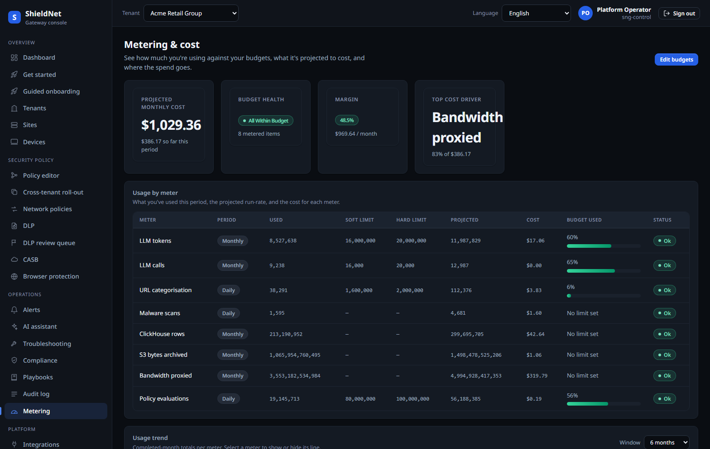
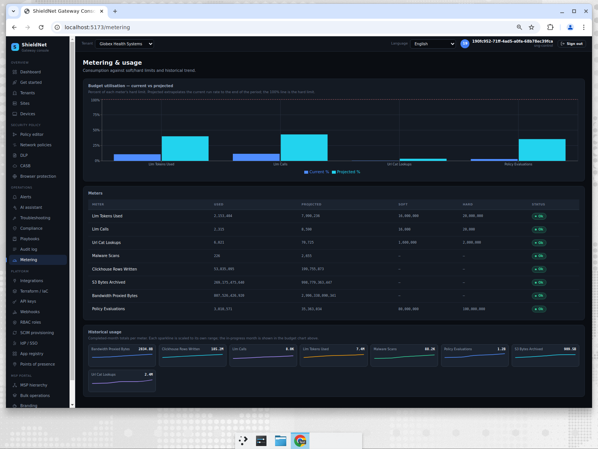
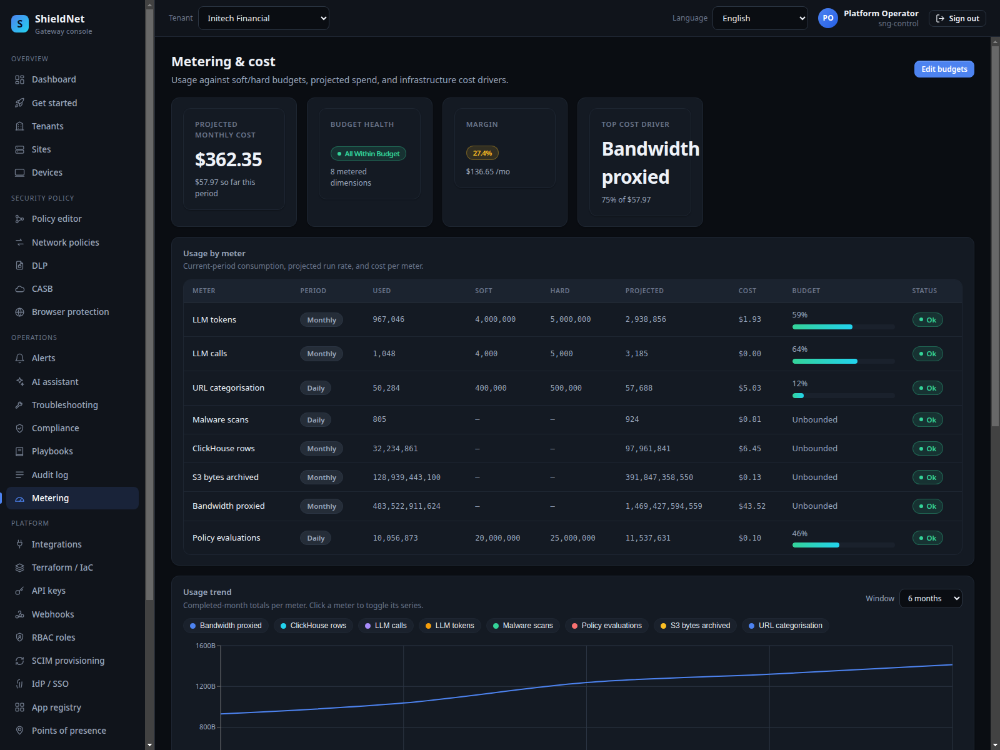
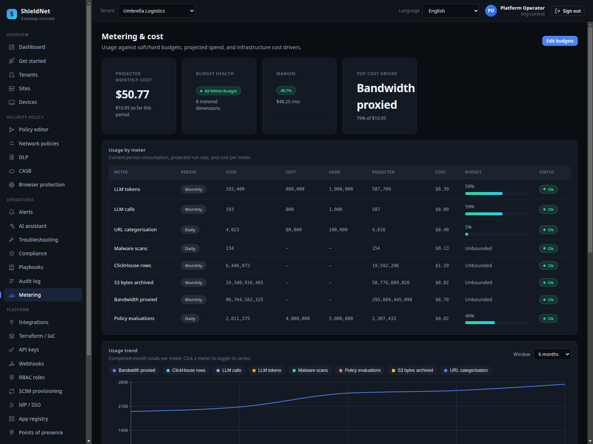

# Prove the spend and the posture — and the competitive critique (S7)

> **Post 7 of 8.** Persona: **Tom**, CFO / buyer. Outcome: predictable spend,
> consolidation savings, compliance evidence — plus the consolidated,
> evidence-based critique against the top SASE vendors.

## What the buyer actually needs

Tom isn't buying packets per second. He's buying *predictability*: a bill he can
forecast, a consolidation story he can defend, and compliance evidence he can
hand an auditor. SNG's metering engine is built for that.

## Walking it in the console

The metering surface is the new **WS8 cost metering UI**
([PR #130](https://github.com/kennguy3n/visible-fishbone/pull/130)) — a
purpose-built spend dashboard that turns the raw usage meters into a buyer-facing
view. It shows eight meters per tenant, each with current usage, a **projected**
end-of-period total, and a budget utilisation bar, and the fleet cost report
refreshes when a tenant's budgets change. Here it is across all four tiers — the
meter limits and projections differ by tier:






## The real numbers

Eight meters, captured live from `GET /usage`
([`s7-acme-usage.json`](../artifacts/payloads/s7-acme-usage.json)). The
**projected** column is the engine extrapolating the partial-period run rate to a
steady-state period-end total:

| meter | used | projected (period-end) |
| --- | ---: | ---: |
| llm_tokens_used | 3,868,183 | 11,999,899 |
| llm_calls | 4,191 | 13,002 |
| url_cat_lookups | 80,455 | 119,986 |
| malware_scans | 3,352 | 4,999 |
| clickhouse_rows_written | 96,704,582 | 299,997,478 |
| s3_bytes_archived | 483.5 GB | ~1.50 TB |
| bandwidth_proxied_bytes | 1.61 TB | ~5.00 TB |
| policy_evaluations | 40,227,494 | 59,992,728 |

### Projection is the feature

`ProjectToPeriodEnd` is the inverse of the elapsed fraction: 27% through the
month, a value of 100 projects to ~370. That's what powers "on-track to breach"
visibility *before* the breach — the UI flags `projected_soft_exceeded` /
`projected_hard_exceeded` so Tom sees the overage coming, not after the invoice.

### The one credible anomaly

We seeded realistic data, which means most things look normal — and they do. The
cost-anomaly model surfaces exactly **one** credible anomaly across all tenants,
Initech's URL-category lookups, captured at
[`s7-initech-cost-anomalies.json`](../artifacts/payloads/s7-initech-cost-anomalies.json):

```json
{ "meter": "url_cat_lookups", "baseline_monthly_usd": 72.31,
  "projected_monthly_usd": 224.97, "ratio": 3.111,
  "baseline_months": 5, "severity": "warning" }
```

A 3.1× run-rate over a 5-month baseline — flagged `warning`, not screamed as
critical. Acme's anomalies file, by contrast, is quiet. That restraint is the
point: an anomaly detector that flags everything is noise.

### The margin story (for the MSP)

The admin cost-report rolls up a **projected $2,216.43/mo** across the four
tenants. Per-tenant gross margins (`margin_pct` from
[`s7-admin-cost-report.json`](../artifacts/payloads/s7-admin-cost-report.json)):

| tenant | tier | margin |
| --- | --- | ---: |
| Globex | enterprise | 66.5% |
| Acme | enterprise | 46.8% |
| Umbrella | starter | 42.3% |
| Initech | professional | 14.4% |

Initech's thinner margin is *because* of its url_cat surge — the anomaly and the
margin compression are the same story, and an MSP can see it before renewal.

## Compliance + audit evidence

The compliance surface carries seeded posture reports
([`s7-acme-compliance-reports.json`](../artifacts/payloads/s7-acme-compliance-reports.json)),
and the audit log (Post 2) is the immutable trail. The global-audit fix from
[PR #116](https://github.com/kennguy3n/visible-fishbone/pull/116) means even
tenant-less platform actions are now recorded — audit completeness was a real gap
we closed.

## The cost-efficiency argument (honestly bounded)

From the [edge performance datasheet](../artifacts/edge-performance-datasheet.md),
SNG cloud opex at a representative **$0.0416/vCPU-hour** over 730 h/mo:

| SKU | vCPU | est. $/mo |
| --- | ---: | ---: |
| branch-large | 8 | $243 |
| branch-medium | 4 | $121 |
| branch-small | 2 | $61 |

We deliberately **do not** publish a `$/Gbps` headline, because the Gbps
denominator is dry-run (Post 1). Appliance capex/support TCO is vendor-quote
territory and we don't invent it. The defensible cost claim is the *opex side*:
software-only, no appliance refresh cycle, scales with cloud vCPU.

---

# The consolidated competitive critique

Comparing SNG to the incumbents requires separating two claims: the *throughput*
comparison (which is informative-but-not-fair) and the *architecture* comparison
(which is the real story).

## The throughput table, with the caveat in bold

All competitor numbers are **published datasheet figures** from
[`competitors.json`](../../bench/business-report/competitors.json), each with a
`source_url`. **Every hardware row is an ASIC-accelerated fixed appliance; SNG is
software-only on a generic x86 VM, and SNG's own numbers are dry-run.** This table
is informative context, **not** a head-to-head result:

| Box (class) | firewall | IPS/threat | source |
| --- | ---: | ---: | --- |
| SNG branch-small (dry-run, VM) | ~74 Gbps | ~74 Gbps | sng-bench |
| Fortinet FortiGate 40F (2-core) | 5.0 Gbps | 0.8 Gbps | FortiGate 40F datasheet |
| Palo Alto PA-440 (2-core) | 3.1 Gbps | 0.7 Gbps | PA-400 series datasheet |
| Fortinet FortiGate 60F (4-core) | 10.0 Gbps | 1.4 Gbps | FortiGate 60F datasheet |
| Palo Alto PA-450 (4-core) | 5.2 Gbps | 1.6 Gbps | PA-400 series datasheet |
| Check Point 3600 | 3.4 Gbps | 0.65 Gbps | Check Point 3600 datasheet |

The honest reading: appliance IPS/threat throughput collapses to a fraction of
its firewall throughput once inspection is on — that's the ASIC hitting software
inspection paths. SNG's inspection cost is comparatively flat (Post 1's latency
table), which is the genuinely interesting architectural signal *even before* a
real wire benchmark.

## The one apples-to-apples comparison

The only directly-comparable competitor row is cloud-native: **Zscaler's admin
API**, p99 **100–300 ms** for tenant CRUD (caveated "directly comparable" in our
dataset). SNG's Go control plane is the right thing to bench against that, and
that comparison *is* fair because both are software services, not silicon.

## Per-vendor honest critique

- **Zscaler** — the cloud-native incumbent; massive PoP footprint and identity
  integration depth SNG doesn't match. SNG's counter is architectural unification
  (one policy graph) and on-device DLP. *We lose on scale and ecosystem; we win
  on policy-model coherence and auditability.*
- **Palo Alto Prisma Access** — deepest threat-prevention research and signature
  pipeline in the industry. SNG's IPS is real Suricata, which is credible but not
  a match for PAN's threat research org. *We lose on threat-intel depth.*
- **Cloudflare** — unmatched edge network and DDoS scale. SNG isn't a global
  network; it's software you run. *Different category for raw network scale.*
- **Netskope** — the DLP/CASB depth leader. SNG's on-device ML DLP is a real
  latency/privacy differentiator, but Netskope's detector and SaaS-API breadth is
  far ahead. *We win on on-device inference; we lose on detector catalog.*
- **Cato Networks** — the closest philosophical sibling (single-pass,
  cloud-native, converged). The honest comparison is converged-architecture vs.
  converged-architecture; Cato has the operational maturity and PoP footprint SNG
  lacks. *Closest competitor; they're further along the same road.*
- **Fortinet** — price/performance king via custom ASIC. SNG can't beat silicon
  on $/Gbps for a fixed appliance. *We lose on appliance price/performance; we
  win on not being an appliance (no refresh cycle, cloud-elastic).*

## Where SNG genuinely differentiates

1. **One typed policy graph** drives every enforcement domain — no five-console
   drift (Post 1).
2. **Auditable AI**: verdicts cite compiled rules, carry `ai_generated: false`
   when deterministic, and degrade safely (Post 6).
3. **On-device ML DLP** keeps content on the endpoint (Post 5).
4. **In-repo, reproducible efficacy harness** that drives the real code and ships
   its corpora (Post 3).

## Where SNG genuinely falls short

1. **No real wire throughput measured** — dry-run only on this rig.
2. **Identity/IAM depth** is scaffolding, not a finished IGA suite (Posts 2, 4).
3. **No global PoP network** — it's software you operate, not a network you rent.
4. **Threat-intel and DLP-detector breadth** trail the specialist incumbents.
5. **Curated efficacy corpora**, not wild-traffic catch-rates.

Next, the closing post: methodology, reproducibility, and how to run all of this
yourself.
