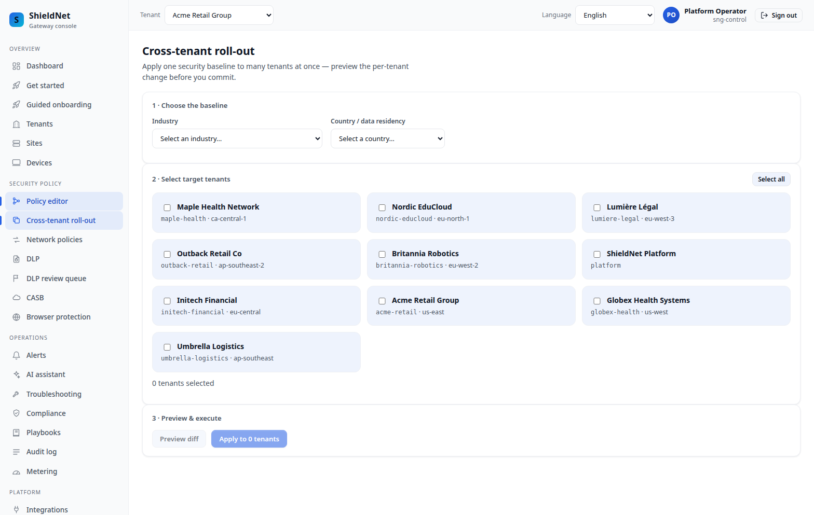
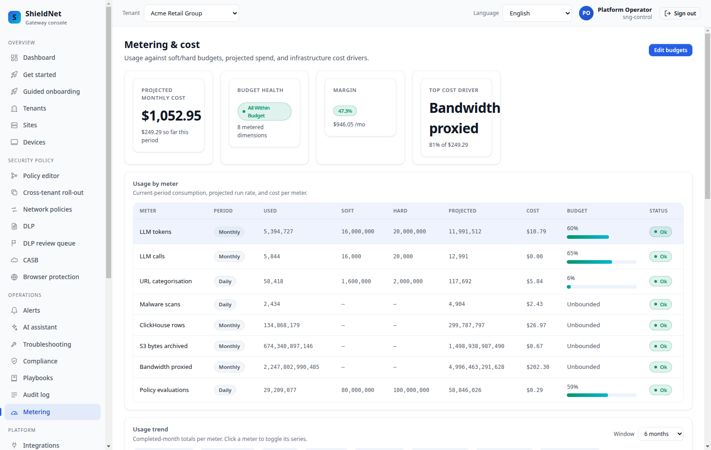
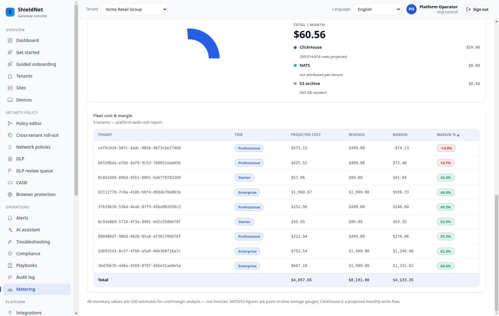

# NoOps self-operation: the control plane that operates itself

> **Post 8 of 11 — self-operation.** Personas: Maya (MSP),
> Tom (CFO). Evidence: [`ws5-acme-rollout-capabilities.json`](../artifacts/payloads/ws5-acme-rollout-capabilities.json),
> [`ws5-acme-rollout-margin-autopilot.json`](../artifacts/payloads/ws5-acme-rollout-margin-autopilot.json),
> [`ws7-acme-cost.json`](../artifacts/payloads/ws7-acme-cost.json),
> [`ws7-maple-cost-report-underwater.json`](../artifacts/payloads/ws7-maple-cost-report-underwater.json),
> [`noops-metrics-snapshot.txt`](../artifacts/noops-metrics-snapshot.txt),
> [`capacity-plan-5000/report.md`](../artifacts/capacity-plan-5000/report.md);
> screenshots [`new-cross-tenant-rollout.png`](../artifacts/screenshots/new-cross-tenant-rollout.png),
> [`new-metering-fleet-top.png`](../artifacts/screenshots/new-metering-fleet-top.png),
> [`new-metering-fleet-table.png`](../artifacts/screenshots/new-metering-fleet-table.png).

"NoOps" is an easy word to abuse. What we mean by it is concrete: the work an SRE
team would otherwise do for 5,000 tenants — turning capabilities on safely,
right-sizing infrastructure, and acting on tenants that lose money — is done by
three guardrailed autopilots, each default-OFF, each leaving an audit trail, each
with a kill switch. This is the post that ties the operations story together.

## Autopilot 1 — auto-promotion of default-OFF capabilities

Every new enforcement surface ships **default-OFF** so upgrades are inert (the
honesty contract, Post 0). The same default-off discipline applies to optional
features: **DEM** (`sng-dem`) is inert when disabled, so a trial that isn't
using it pays nothing for it. The cost of that safety is toil: someone has to
decide *when* each tenant is ready to move a capability off→monitor→enforce. SNG
automates that decision with guardrails.

Each capability is a state machine — `off → monitor → enforce` — and the
auto-promotion controller advances a tenant **only when monitor-mode guardrails
hold for a dwell window** (24h default). On the seeded Acme tenant the autopilot
has already taken the first safe rung — `off → monitor` — for every capability:
each is now observing (`evaluates: true`) but **not enforcing**
(`enforces: false`), so the upgrade stays inert for live traffic while the
evidence accrues. The per-tenant ladder is a real RLS-scoped read
([`ws5-acme-rollout-capabilities.json`](../artifacts/payloads/ws5-acme-rollout-capabilities.json)):

```json
[ { "capability": "clamav_swg", "state": "monitor", "enforces": false, "evaluates": true,
    "reason": "autopilot: auto-enrolled off->monitor (dry-run; no enforcement)", "updated_by": "autopilot" },
  { "capability": "noops_autoenforce", "state": "monitor", "enforces": false, ... },
  { "capability": "idp_directory_sync", "state": "monitor", "enforces": false, ... } ]
```

A dedicated evidence table backs the promotion gate: a capability can't be
promoted to **enforce** on a hunch, it's promoted because the monitor mode
*recorded* that it would have been safe (no
false-positive storm, no enforcement that would have broken legitimate traffic)
for the full dwell window. The cross-tenant view:



This is why the efficacy honesty (Post 4) matters: a capability like malware
enforcement that WARNs at 90.1%/9.6% on wild traffic *won't* auto-promote to
enforce, because the monitor-mode false-positive guardrail won't clear. The
autopilot is structurally conservative.

## Autopilot 2 — capacity autopilot

A human capacity planner reads dashboards and edits config. SNG's capacity
autopilot reads the *live fleet metrics* and reconciles infrastructure sizing
toward what the load actually needs. It's running on the seeded stack
([`noops-metrics-snapshot.txt`](../artifacts/noops-metrics-snapshot.txt)):

```
sng_capacity_fleet_tenants 10
sng_capacity_reconcile_total{outcome="ok"} 3
sng_capacity_setting{axis="clickhouse",kind="current",knob="batch_size"} 1024
sng_capacity_setting{axis="clickhouse",kind="recommended",knob="batch_size"} ...
```

The `current` vs `recommended` gauge pairs are the autopilot's whole point: it
continuously publishes the gap between how the system is sized and how it *should*
be sized for the observed load, and (when enabled) closes it. The
[capacity plan](../artifacts/capacity-plan-5000/report.md) is the same engine run
at 5,000 tenants, and its recommendations are exactly what the autopilot acts on:

- ClickHouse: 12.94 inserts/s/shard exceeds the ~1/s target → **raise
  `CLICKHOUSE_BATCH_SIZE` to 13,250** (more rows per part, same shard count).
- AI pool: offered concurrency 4.38 vs 4 slots → **raise
  `AI_INFERENCE_POOL_MAX_CONCURRENT` to 7**.
- NATS: 35,000 subjects / 16 partitions = 2,187 avg → **`NATS_PARTITIONS: 16`**
  is within the healthy envelope, no change.
- Postgres: peak concurrent queries 10 → **pool/replica 5**, comfortably within
  the 200 `max_connections` budget.

A human would compute those from dashboards once a quarter; the autopilot
computes them continuously from live metrics.

## Autopilot 3 — margin autopilot

The third toil sink is *money*. On a 5,000-tenant fleet of mostly trials, some
tenants lose money — and finding them by hand is a monthly spreadsheet exercise.
The margin autopilot consumes the metering/cost signal and acts on
underwater tenants. The fleet metering view leads with the blended number:



…and the per-tenant table surfaces the outliers:



**Maple Health is the deliberate underwater tenant** — a professional-tier
($499) tenant consuming enterprise-scale bandwidth and ClickHouse, projected
≈$568/mo, **≈−13.9% margin**
([`ws7-maple-cost-report-underwater.json`](../artifacts/payloads/ws7-maple-cost-report-underwater.json)).
That is the exact signal the autopilot is built to surface: it can recommend an
upsell, enforce a trial budget cap, or throttle the loss-making usage — gated, by
default, behind the same off→monitor→enforce ladder
([`ws5-acme-rollout-margin-autopilot.json`](../artifacts/payloads/ws5-acme-rollout-margin-autopilot.json)
shows `margin_autopilot` auto-enrolled to `monitor` — observing the cost signal
with `enforces: false`, so it surfaces the recommendation but doesn't yet act).
Acme, by contrast, is healthy at ≈+47%
([`ws7-acme-cost.json`](../artifacts/payloads/ws7-acme-cost.json)).

## The three together

| Autopilot | Replaces the toil of | Guardrail | Default |
| --- | --- | --- | --- |
| Auto-promotion | deciding when each tenant is ready to enforce | monitor-mode evidence + 24h dwell | OFF |
| Capacity | quarterly infra right-sizing | current-vs-recommended, reconcile loop | OFF |
| Margin | the monthly money spreadsheet | off→monitor→enforce ladder | OFF |

That is what "NoOps for 5,000 tenants" actually means here: not "no operators
ever," but "the repetitive, fleet-scale operator decisions are automated,
guardrailed, audited, and reversible."

## Where it falls short

- **All three are default-OFF, and that's deliberate** — but it means out of the
  box the platform is *capable* of self-operation, not *self-operating*. An MSP
  opts a fleet in. We consider auto-enabling these the next honesty milestone.
- **The autopilots are wired and exporting metrics, but the seeded fleet hasn't
  triggered an enforcement action.** `reconcile_total{ok}=3` proves the capacity
  loop runs; the auto-promotion and margin actions are demonstrated by their
  *state* (the ladders, the underwater tenant), not by a captured enforcement
  event on this all-active fleet. A long-lived fleet is needed to publish real
  promotion/throttle events.
- **Margin actions are policy, not magic.** Throttling a paying tenant is a
  business decision with churn risk; the autopilot surfaces and (optionally)
  enforces it, but the *thresholds* are an operator's call, not a default we'd
  presume to set.
