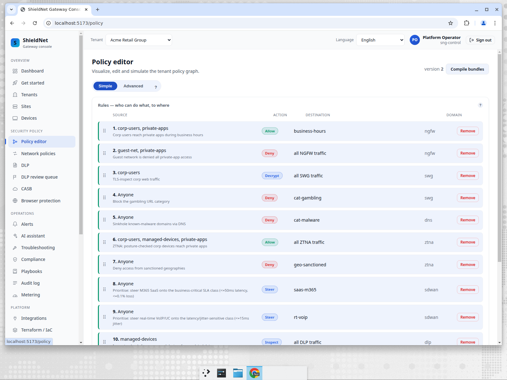
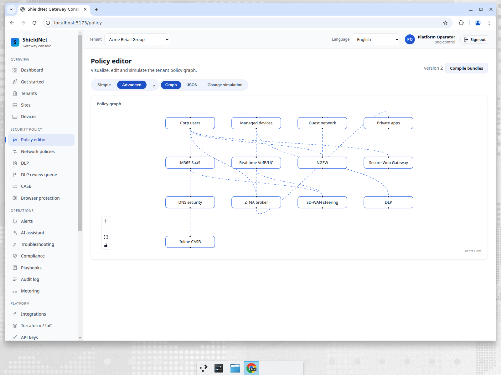
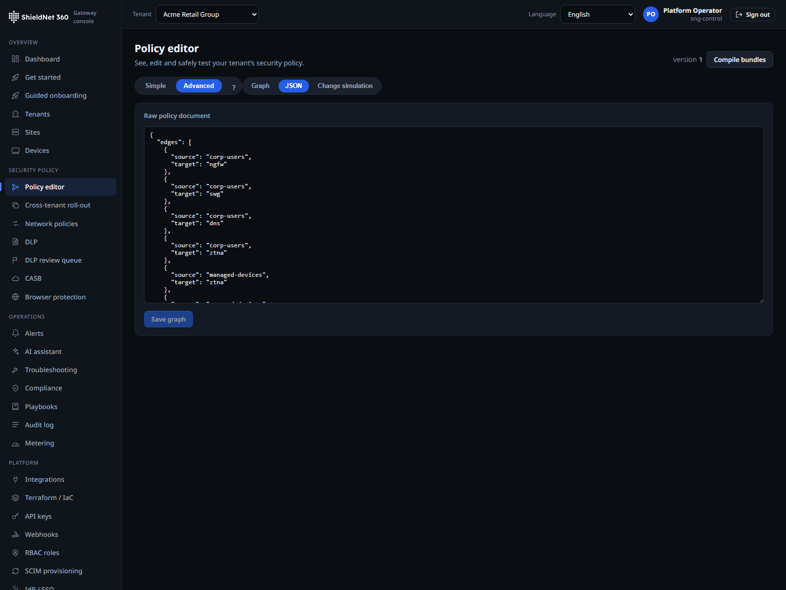

# Six scenarios on one dev VM: route, allow, block, prioritise, throttle, protect

> **Post 8 of 9 — the evidence-refresh capstone.**
>
> Posts 1–7 walked SNG by *capability*. This post walks it by *operator intent*.
> An operator does not think "I want to exercise the SD-WAN steering domain" —
> they think "I want M365 to take the fast path, gambling to be blocked, and the
> bulk-backup service not to drown everyone else." So here we take the six verbs
> an operator actually reaches for — **route, allow, block, prioritise, throttle,
> protect** — express each as a *real typed policy rule* in one tenant's graph,
> and show the evidence: the typed rule, the console surface, and (for the
> enforcement-heavy ones) the measured edge behaviour. Everything in this post
> was re-captured on this dev VM; the provenance index is
> [`../artifacts/scenarios.md`](../artifacts/scenarios.md).

## The one graph that expresses all six

SNG compiles **one typed policy graph per tenant** into the bundle the edge
enforces. The six intents are not six subsystems bolted together — they are six
*verbs* in that one graph. Acme Retail's graph carries 13 rules across seven
policy domains; the six operator intents map onto them like this:

| Intent | Verb | Domain(s) | Acme rule(s) |
| --- | --- | --- | --- |
| **Route** | `steer` | sdwan | `sdwan-steer-saas`, `sdwan-steer-voip` |
| **Allow** | `allow` | ngfw, ztna | `ngfw-allow-corp-apps`, `ztna-allow-posture` |
| **Block** | `deny` | ngfw, swg, dns, ztna | `ngfw-deny-guest-apps`, `swg-deny-gambling`, `dns-deny-malware`, `ztna-deny-geo` |
| **Prioritise** | `steer` (+ SLA params) | sdwan | `sdwan-steer-saas` (≤50 ms / ≤0.1% loss), `sdwan-steer-voip` (≤15 ms jitter) |
| **Throttle** | `Action::RateLimit` | swg | runtime limiter (HTTP 429 + `Retry-After`) |
| **Protect** | `deny` / `inspect` | dns, swg, ztna, dlp, inline_casb | `dns-deny-malware`, `swg-deny-gambling`, `dlp-inspect-uploads`, `casb-inspect-m365` |

The console renders that graph two ways. The **Simple** view is the
who-can-do-what-to-where table an operator edits:



The **Advanced → Graph** view is the same graph as a node-edge diagram (subjects
on the left, the seven policy domains as the enforcement fabric):



And the **Advanced → JSON** view is the typed document itself — this is the
source of truth the compiler consumes. The full graph is captured verbatim at
[`../artifacts/payloads/s2-acme-policy-graph.json`](../artifacts/payloads/s2-acme-policy-graph.json).

## 1. Route — `steer`

```jsonc
{ "id": "sdwan-steer-saas", "verb": "steer", "domain": "sdwan",
  "predicate_refs": ["saas-m365"], "params": { "sla_class": "business-critical", ... } }
```

`steer` is how an operator expresses *which path traffic should take*. Acme
steers M365 SaaS and real-time VoIP onto distinct SD-WAN classes. The verb is a
first-class member of the policy graph's enum — not a free-text tag — so the
compiler type-checks it and the edge knows it as a routing decision, not an
allow/deny.

## 2. Allow — `allow`

```jsonc
{ "id": "ngfw-allow-corp-apps", "verb": "allow", "domain": "ngfw",
  "subject_refs": ["corp-users", "private-apps"], "predicate_refs": ["business-hours"] }
```

Positive enforcement. Corp users reach private apps **during business hours**
(the `business-hours` predicate is a real time guard, not decoration), and
ZTNA's `ztna-allow-posture` rule lets posture-checked managed devices reach
private apps. The graph's `default_action` is `deny`, so every `allow` is an
explicit, audited exception to a default-deny posture — the zero-trust default.

## 3. Block — `deny`

```jsonc
{ "id": "swg-deny-gambling", "verb": "deny", "domain": "swg", "predicate_refs": ["cat-gambling"] }
{ "id": "dns-deny-malware",  "verb": "deny", "domain": "dns", "predicate_refs": ["cat-malware"] }
```

`deny` shows up across four domains in Acme's graph: NGFW (guest network can't
reach private apps), SWG (gambling URL category), DNS (sinkhole known-malware
domains), and ZTNA (sanctioned-geography lockout). One verb, four enforcement
points — the operator writes intent once and the compiler fans it out to the
right edge crate.

## 4. Prioritise — `steer` with SLA params

This is `route` with teeth. The two `steer` rules carry explicit QoS/SLA targets
in their typed `params`, and those parameters survive the round-trip through the
typed graph (you can see them in the JSON view):



```jsonc
"sdwan-steer-saas": { "sla_class": "business-critical", "max_latency_ms": 50, "max_loss_pct": 0.1 }
"sdwan-steer-voip": { "sla_class": "real-time",         "max_jitter_ms": 15 }
```

**Honest scope note.** The SLA *targets* are carried as typed schema-extension
fields on the rule and are preserved end-to-end through the graph compiler. The
SD-WAN SLA *measurement/failover* service exists in the codebase but is not yet
exposed through a runtime API on this VM, so we are not claiming a measured
failover event here — we are showing that the operator's QoS intent is
expressible and type-checked, not inventing a latency-triggered path-switch we
didn't run.

## 5. Throttle — `Action::RateLimit`

Throttle is the one intent that isn't a graph verb — it's a runtime verdict from
the SWG. SNG's `sng-swg` crate has a real token-bucket `RateLimiter`, and we
drove the **actual limiter** (not a fixture) to produce the evidence:
[`../artifacts/payloads/s-throttle-swg-ratelimit.json`](../artifacts/payloads/s-throttle-swg-ratelimit.json),
generated by the committed example
[`crates/sng-swg/examples/throttle_evidence.rs`](../../crates/sng-swg/examples/throttle_evidence.rs).

A 5-token bucket refilling at 1/s, hit 8 times by a bulk-backup service
principal: requests 1–5 are permitted, 6–8 are shed with `retry_after_secs = 1`.
The shed verdict maps to a wire-correct `ExtAuthzResponse` carrying **HTTP 429**
and a `Retry-After` header — exactly what Envoy emits to the client. This is the
real limiter, real verdict type, real wire shape.

## 6. Protect — `deny` + `inspect`, measured by the efficacy harness

Threat-protection isn't one rule; it's the catch-rate of the whole inspection
stack. So the evidence here is not a screenshot — it's the
[`sng-efficacy`](../../bench/efficacy) harness driving the **real enforcement
crates** against curated good/bad corpora, re-run on this VM
([`../artifacts/efficacy-report.json`](../artifacts/efficacy-report.json),
git `c3d99ce`, overall verdict **PASS**):

| Function | Catch-rate | Accuracy | Verdict |
| --- | ---: | ---: | :---: |
| firewall (nftables) | 100.0% | 100.0% | PASS |
| firewall — in-kernel (nftables) | 100.0% | 100.0% | PASS |
| swg (URL-cat + scan) | 100.0% | 100.0% | PASS |
| ztna | 100.0% | 100.0% | PASS |
| dlp (detectors) | 100.0% | 100.0% | PASS |
| dlp — ML NER | 97.4% | 97.9% | PASS |
| malware (YARA) | 100.0% | 100.0% | PASS |
| malware — adversarial corpus | 100.0% | 100.0% | PASS |
| dns (threat-intel) | 100.0% | 100.0% | PASS |
| ips (Suricata) | 100.0% | 100.0% | PASS |
| ips — adversarial corpus | 100.0% | 100.0% | PASS |

**What "measured" means here.** The firewall row runs against real kernel
`nftables`; the IPS rows run against a real Suricata binary; the ML-NER row runs
against ONNX Runtime 1.22. These are conformance + adversarial corpora, not wild
traffic — 100% on a curated set means "the rule fires on the cases we wrote," not
"100% of real-world threats." For the **wild / FPR-under-load** picture (malware
90.1% catch / 9.6% FPR on a 1,342-sample noisy corpus, published honestly as
informational), see Post 3's full matrix — this table is the gating + adversarial
subset.

## The throughput question, re-measured

Post 7 promised the multi-queue follow-up, and it answers the obvious question:
*why does the single-stream wire floor read the same (≈5.5 Gbps) for firewall and
IPS?* Because the single stream — not the inspection — is the bottleneck. Lifting
that cap by fanning the **same** `micro`-profile enforcement path across queues
(run on this VM, `multiqueue-micro.json`, 1500B frames, full-stack nftables
backend, 128 rules, `available_parallelism = 8`):

| Concurrent queues | Aggregate | Scaling efficiency |
| ---: | ---: | ---: |
| 1 (single-stream floor) | 5.45 Gbps | 1.00 |
| 2 | 10.43 Gbps | 0.96 |
| 4 | 19.87 Gbps | 0.91 |
| 8 | 25.01 Gbps | 0.57 |
| 16 (ceiling) | 25.98 Gbps | 0.30 |

That's a **4.77× lift** from one stream to sixteen — the floor moves 4.77× *just by
adding queues*, which proves 5.45 was a single-stream/syscall ceiling, not an
inspection limit. The honest reading: this is still *software* multi-queue
scaling on one VM's CPUs, not a multi-queue physical NIC and emphatically not an
ASIC. Efficiency stays high through 4 queues (0.91) then degrades past the box's
`available_parallelism` (8 here) — exactly what CPU-bound software scaling looks
like, and the curve flattening is itself the honest part. The full per-SKU
dry-run-ceiling vs. wire-floor datasheet is at
[`../artifacts/edge-performance-datasheet.md`](../artifacts/edge-performance-datasheet.md).

## Where we fall short (this scenario set)

- **Prioritise is intent-only on this VM.** The SLA targets compile and
  round-trip; the measurement-driven failover service isn't API-exposed here, so
  we show no measured path-switch event. Named, not hidden.
- **Throttle is per-instance.** The `RateLimiter` is an in-process token bucket;
  a distributed limiter (shared counter across edge nodes) is not in this slice.
- **Protect is curated-corpus, not wild traffic.** 100% catch-rates are on
  conformance + adversarial corpora we wrote — a real-world catch-rate needs a
  live threat feed and a labelled traffic capture, which this VM doesn't have.
- **Throughput is software-on-a-VM.** The Gbps ceiling is CPU-bound software
  scaling, not silicon. The competitor comparison in Post 7 holds: against
  ASIC appliances this is not apples-to-apples, and the only directly comparable
  competitor row is the cloud-native (Zscaler) one.

The point of this post isn't that SNG wins every row — it's that **every one of
the six operator intents traces to a real typed rule or a real measured verdict
on this dev VM**, with the gaps named rather than papered over. That's the
honesty contract applied to operator intent, end to end.
