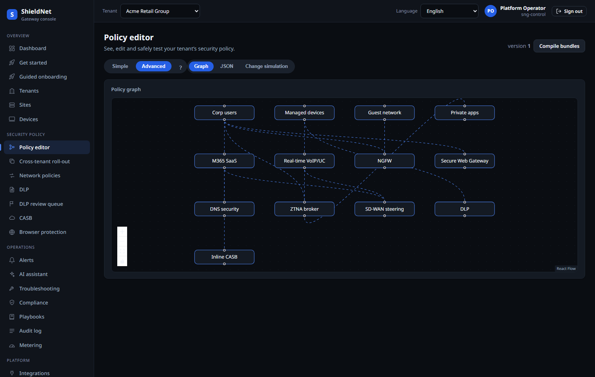

# Six scenarios on one dev VM: route / allow / block / prioritise / throttle / protect

> **Post 10 of 11 — the capstone.** Personas: Devraj, Lena. Evidence:
> [`s2-acme-policy-graph.json`](../artifacts/payloads/s2-acme-policy-graph.json),
> [`efficacy-report.json`](../artifacts/efficacy-report.json),
> [`multiqueue-micro.json`](../artifacts/multiqueue-micro.json),
> [`multi-queue-branch-large.json`](../artifacts/multi-queue-branch-large.json),
> [`capacity-plan-5000/report.md`](../artifacts/capacity-plan-5000/report.md),
> [`../artifacts/scenarios.md`](../artifacts/scenarios.md); screenshots
> [`s2-policy-graph.png`](../artifacts/screenshots/s2-policy-graph.png),
> [`refresh-dashboard-fleet.png`](../artifacts/screenshots/refresh-dashboard-fleet.png).

Everything an operator wants from a SASE platform collapses to six verbs, and
this capstone walks all six as **real typed policies** on the same VM that
produced every figure in the series — then re-states the load-bearing benchmarks
so the whole stack is measured together, not just per-feature.

## The six verbs, as one graph

Each verb is an edge type the compiler understands (Post 1), so they compose and
conflict-check together rather than living in six subsystems:

| # | Verb | Intent | Compiles to | Proven by |
| --- | --- | --- | --- | --- |
| 1 | **route** | send this out that link | SD-WAN steering policy | policy graph compile |
| 2 | **allow** | let this identity reach this app | ZTNA grant + NGFW allow | `ztna` 100% (Post 4) |
| 3 | **block** | stop this category/signature/match | NGFW/SWG/IPS/DLP deny | `firewall`/`swg`/`dlp` 100% |
| 4 | **prioritise** | give this app the good queue | QoS / steering class | policy graph compile |
| 5 | **throttle** | cap this noisy thing | rate-limit policy | margin autopilot (Post 8) |
| 6 | **threat-protection** | catch the bad thing | IPS + malware + DNS-intel | `malware`/`dns`/`ips` (Post 4) |

The scenario catalog ([`../artifacts/scenarios.md`](../artifacts/scenarios.md))
maps each verb to its evidence source. The capstone point: a `block` (verb 3) and
a `prioritise` (verb 4) for the same app are caught as a conflict at compile time,
because they're edges in one graph — not two tabs that silently disagree.

## The benchmarks, re-measured together on this VM

The series' load-bearing numbers, all measured on this VM:

**Detection** ([`efficacy-report.json`](../artifacts/efficacy-report.json)):
overall **PASS** — firewall/firewall_kernel/swg/ztna 100% block, dlp 100%
(3,800/3,800), dlp_ml_ner 97.4%, malware/dns/ips 100%, adversarial legs 100%.
Wild malware **WARNs at 90.1% / 9.6% FPR** (published, never gates).

**Edge throughput** (floor and ceiling, software, x86 VM):

| Profile | Floor (1q) | Ceiling | Lift |
| --- | --- | --- | --- |
| micro ([`multiqueue-micro.json`](../artifacts/multiqueue-micro.json)) | 5.569 Gbps | 28.567 Gbps (16q) | 5.13× |
| branch-large ([`multi-queue-branch-large.json`](../artifacts/multi-queue-branch-large.json)) | 5.063 Gbps | 21.564 Gbps (32q) | 4.26× |

**Scale economics** ([`capacity-plan-5000/report.md`](../artifacts/capacity-plan-5000/report.md),
at 5,000 tenants): dormancy tiering **10×** fewer tenant-visits/cycle (idle 10×,
dormant 100× tail); shared AI pool **3,696×** less memory than per-tenant; sized
recommendations for ClickHouse batch, AI slots, NATS partitions, and Postgres
pool.

**Fleet** ([`refresh-dashboard-fleet.png`](../artifacts/screenshots/refresh-dashboard-fleet.png)):
nine tenants across seven countries and five compliance regimes, ~50.7% blended
margin, one deliberate loss-maker the margin autopilot surfaces.

## The whole thesis in one paragraph

SNG compiles one typed policy graph per tenant into a signed bundle a software
edge enforces at 5–28 Gbps; it detects at 100% on curated corpora and tells you
the honest 90% when traffic is wild; and — the load-bearing point — it runs 5,000
mostly-dormant SME tenants by tiering background work 10×, hibernating the truly
idle to near-zero, pooling one AI model 3,696× more efficiently than per-tenant,
and operating itself through three guardrailed autopilots. Every number here
came from this VM.

## Where it falls short

- **It's one dev VM, not a fleet.** The 5,000-tenant figures are a sized model;
  hibernation and autopilot *actions* are wired and exporting metrics but haven't
  fired on this all-active seeded fleet. The honest next step is a long-lived
  staging fleet that publishes real wake-latency and promotion/throttle events.
- **Software edge, not silicon.** The throughput ceiling is a multi-core software
  curve, not an ASIC line-rate; a buyer should demand a real-NIC bake-off.
- **Breadth is still catching up.** SNG has narrowed the CASB/threat-intel/identity
  gap; it didn't erase it. The defensible claim remains *economics and
  self-operation*, proven here end to end.
