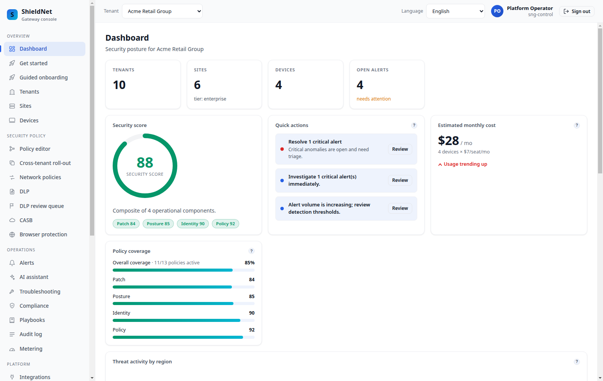

# The NoOps trial that costs almost nothing

> **Business series, Post 1 of 5.** Buyer: **Mara**, who runs a 30-person MSP and
> hands out free SNG trials to win deals. Job-to-be-done: *"trials shouldn't
> bleed money or eat my engineers' time."* Capability: universal dormancy tiering
> (WS-1) + hibernation/scale-to-zero (WS-3). Evidence:
> [`capacity-plan-5000/report.md`](../../artifacts/capacity-plan-5000/report.md),
> [`noops-metrics-snapshot.txt`](../../artifacts/noops-metrics-snapshot.txt);
> screenshot [`refresh-dashboard-fleet.png`](../../artifacts/screenshots/refresh-dashboard-fleet.png).

Mara's growth motion depends on trials. But every cloud security product she's
used charges her — in dollars or in engineer-hours — for *every* tenant, busy or
not. Hand out 200 trials, pay for 200 tenants, even though 160 of them logged in
once and vanished. That math kills the trial-led motion. SNG's answer: a dormant
trial should cost almost nothing and require zero operations.

## The fleet she sees

One pane, every tenant, isolated from each other by database-level row security.
Standing one up is a single wizard; the cost question is what happens *after* the
trial goes quiet.

## Cost that follows engagement, not headcount

SNG tiers every background job by how active a tenant is. The platform runs
periodic per-tenant work — directory sync, shadow-IT scans, compliance checks,
metering — and instead of visiting all 5,000 tenants every cycle, it visits:

- **active** tenants every cycle,
- **idle** tenants 10× less often,
- **dormant** tenants 100× less often.

The [5,000-tenant capacity model](../../artifacts/capacity-plan-5000/report.md)
puts numbers on it. With a realistic mix (400 active / 600 idle / 4,000 dormant),
the background work drops **10× — from 5,000 to 500 tenant-visits per cycle, per
job.** Mara isn't paying for work on trials nobody is using.

## Truly dormant? It hibernates to near-zero

Below "dormant" is **hibernation** (WS-3): a trial nobody has touched in weeks
pauses its telemetry ingest, ages out its hot storage, and drops its live
subscriptions — its running cost collapses toward zero. The tenant's
configuration is never lost (it's safe in the database the whole time), so when a
prospect finally logs back in, it **wakes in under five seconds** and behaves as
if it had never slept. The controller is live on the platform today
([`noops-metrics-snapshot.txt`](../../artifacts/noops-metrics-snapshot.txt)
exports its gauges).

## What this means for Mara's P&L

She can leave trials running indefinitely. There's no "clean up old trials"
chore, no per-tenant baseline cost bleeding out of dormant accounts, and no
operations work to manage any of it — the tiering and hibernation are automatic.
The marginal cost of a trial that doesn't convert rounds to zero, which is
exactly the property a trial-led MSP needs.

## Where it falls short

- **The 10× number assumes a mostly-idle fleet.** A fleet that's mostly *active*
  sees a smaller dividend — correctly, because there's less idle work to skip.
  The mechanism scales cost with engagement; it doesn't manufacture savings.
- **Dormant data is intentionally stale.** A hibernated trial's dashboards aren't
  live-fresh until it wakes (which is instant on login). That's the right trade
  for an unused trial, but it is a trade.
- **The fleet-scale savings are modelled, not yet observed on a live 5,000-tenant
  fleet.** The mechanism is shipped and running; the headline dividend comes from
  the capacity model, and the honest next step is publishing it from a long-lived
  production fleet.
