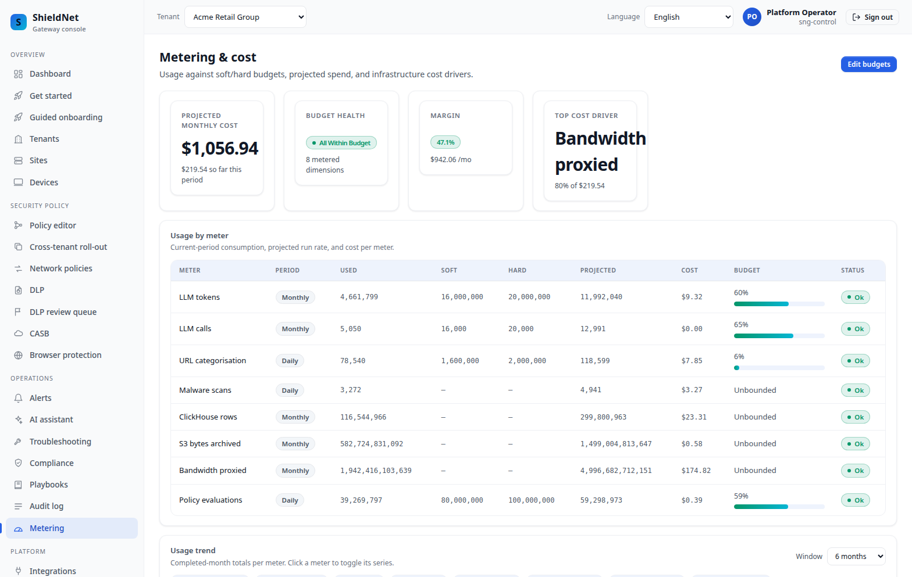
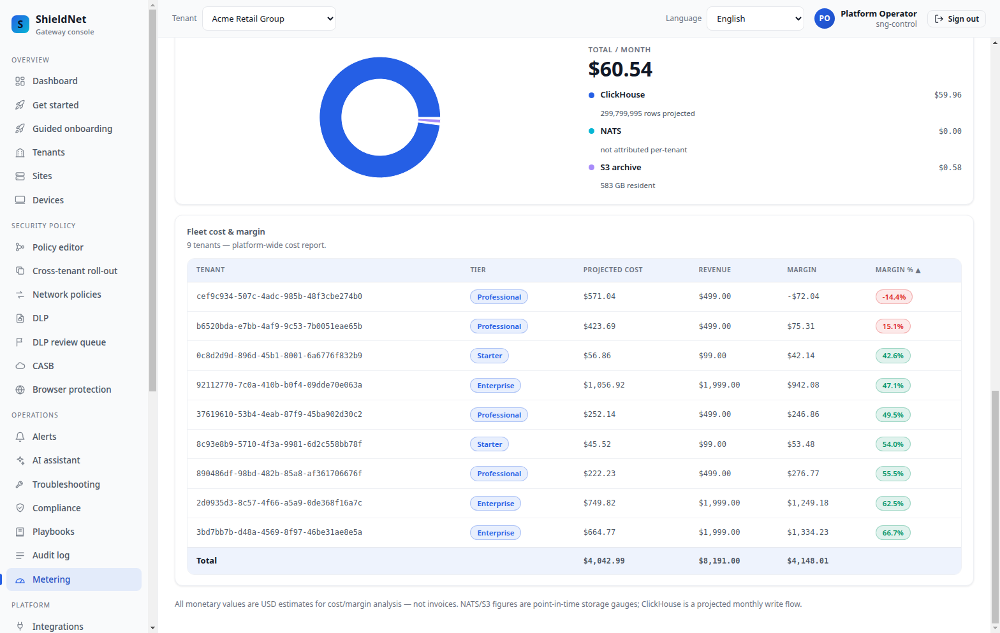

# The NoOps trial that costs almost nothing (until it's used)

> **Business series, Post 1 of 5.** Persona: **Mara**, MSP owner running
> security for 80+ SMEs. Job-to-be-done: *"Let me offer a free trial to every
> prospect without my infrastructure bill scaling with the number of tenants
> who signed up and then forgot about us."*

## The problem with "5,000 tenants"

Mara's growth model is simple: offer a frictionless free trial, let the product
sell itself, convert the ones who stick. The catch is that most trials go
dormant. Of 5,000 trial tenants, a few hundred are active on any given day; the
rest signed up, clicked around once, and went quiet.

The naïve SASE backend treats all 5,000 the same. Every periodic job — identity
sync, posture sweep, policy recompile, metering rollup — fans out across *every*
tenant on a fixed cadence. A dormant trial that hasn't had a login in three
weeks gets swept exactly as often as Mara's busiest enterprise. That's O(5,000)
work per cycle, most of it spent on tenants doing nothing. It's the single
biggest reason "just offer everyone a trial" quietly becomes unaffordable.

## What we shipped: activity-tiered cadence

SNG now records a first-class activity signal on every tenant
(`tenants.last_active_at`) and classifies each into one of three tiers:

| Tier | Definition | Sweep frequency |
| --- | --- | --- |
| **Active** | seen in the last 24h | every cycle (1×) |
| **Idle** | 24h – 14d | ~1/10th as often |
| **Dormant** | > 14d | ~1/100th as often |

A reusable `SweepPlanner` gates each periodic job by tier. The first consumer is
identity sync ([PR #154](https://github.com/kennguy3n/visible-fishbone/pull/154)),
so a dormant trial's directory is reconciled roughly **once for every hundred**
times an active tenant's is. The work the fleet does now tracks *activity*, not
*tenant count* — which is exactly the curve an MSP needs to offer trials at scale.

This is the "NoOps" part: Mara doesn't tune anything. There's no "archive
inactive tenants" cron she has to write, no manual suspend/resume. A tenant that
goes quiet automatically costs less; a tenant that comes back is automatically
swept on the active cadence again on its next login.

## The cost story, on a real page

The Metering page makes the fleet economics legible. Here's Acme (the busy
enterprise) — projected ≈$1,060/mo, every meter inside budget, top cost driver
called out:

And the **Fleet cost & margin** table — the full **nine-tenant** fleet, cost vs.
revenue vs. margin per tenant, sorted worst-margin-first:

Two things matter to Mara here:

- **Cost is per-tenant and activity-shaped.** Umbrella (Starter, low activity)
  projects **≈$57/mo** of infra; Acme (Enterprise, busy) projects **≈$1,060**.
  The ~19× spread is driven by usage, not a flat per-tenant tax. A dormant trial
  sits near the bottom of that curve.
- **The margin column is the trial-economics column.** Because dormant tenants
  consume a fraction of the sweep work, their cost line stays near zero until
  they convert and get busy — at which point revenue arrives too.

## Where we fall short (honest)

- **One consumer wired so far.** The `SweepPlanner` is integrated into identity
  sync today. The other periodic jobs (posture sweeps, metering rollups) still
  run on fixed cadence until they adopt the planner — that's follow-up work, not
  a finished story. We're not going to claim the whole fleet is activity-tiered
  when one job is.
- **`last_active_at` is as good as its writers.** A tenant only looks "active"
  when something calls the activity-touch path. Coverage across every
  console/API entry point is still being expanded; a tenant active only through
  an un-instrumented path could be misclassified as idle. The classification is
  conservative (it errs toward sweeping *more*, not less), but it's not yet
  wired to every signal.
- **The cost figures are estimates, not invoices.** The Metering page says so
  explicitly: NATS/S3 are point-in-time gauges and ClickHouse is a projected
  write flow. They're the right *shape* for capacity and margin planning; they
  are not a billing system.

## The takeaway for Mara

She can offer a trial to everyone, because a trial that goes dormant
automatically stops costing her real money — no archiving cron, no manual
lifecycle management, no per-tenant babysitting. The platform's work follows
activity, and the Metering page lets her prove it tenant by tenant.

Next: [Post 2 — shadow-IT discovery without the noise](09-shadow-it-noops.md),
where Sam finds out which SaaS and AI apps his staff are actually using.
