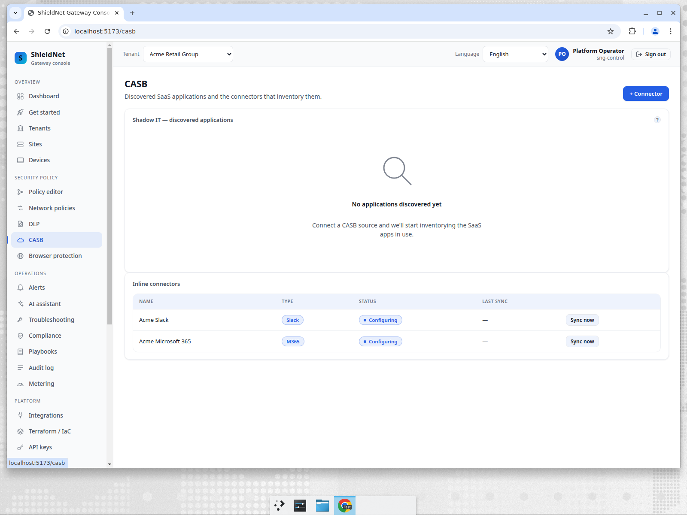
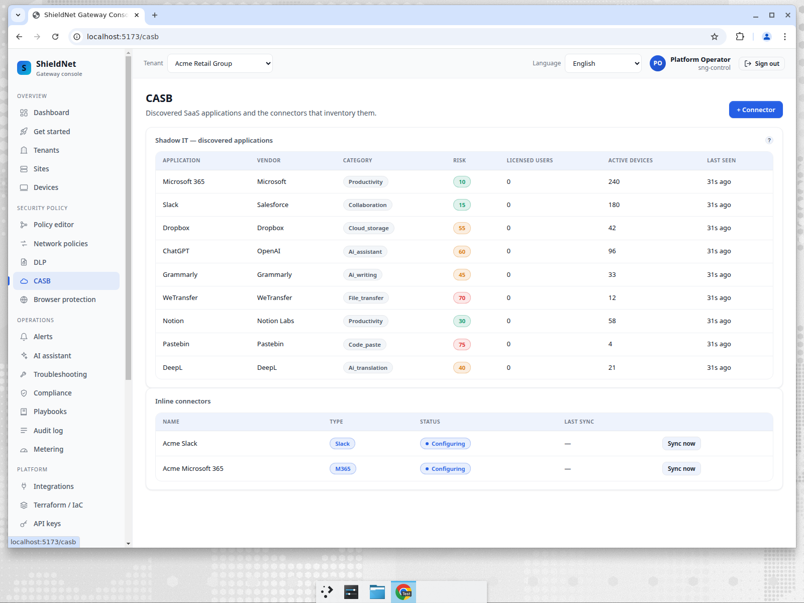
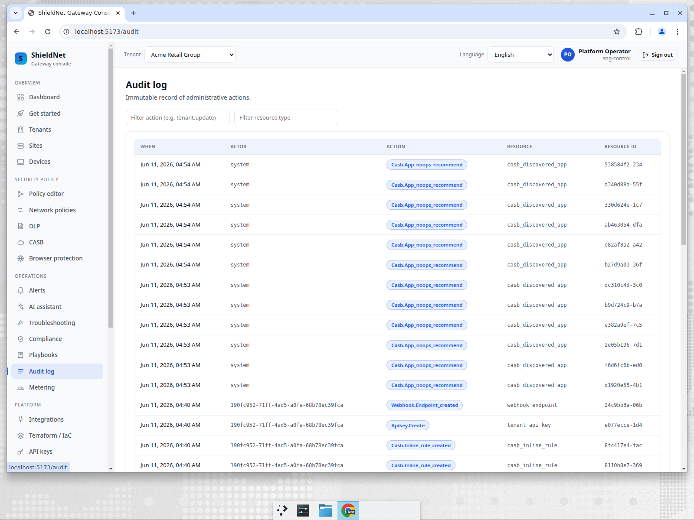

# Shadow-IT discovery without the noise

> **Business series, Post 2 of 5.** Persona: **Sam**, IT lead at a 200-person
> retailer with no SOC. Job-to-be-done: *"Tell me which SaaS and AI apps my
> staff are actually using, how risky each one is, and what I should do about
> it — without hiring an analyst to read logs all day."*

## Sam's reality

Sam knows his sanctioned stack — Microsoft 365, Slack. What keeps him up is the
*unsanctioned* long tail: the file-transfer site someone used to send a customer
list, the AI assistant the marketing team pasted a roadmap into, the random
paste site in a support macro. Traditional CASB tools surface this as a firehose
of "discovered apps" with a risk number and zero guidance. Sam doesn't have time
to triage a list of 200 domains.

## The NoOps pipeline: discover → classify → recommend → audit

SNG's CASB shadow-IT pipeline turns the firehose into a short, decided list. For
each app it discovers from gateway telemetry, it runs a single loop:

1. **Discover** — build a per-tenant inventory of apps in use (with an active
   device count as the shadow-IT signal).
2. **Classify** — deterministically assign a category, a 0–100 risk score, a
   sanction recommendation (`sanctioned` / `tolerated` / `unsanctioned`), and a
   confidence, with a human-readable rationale.
3. **Recommend** — emit a concrete action (throttle / protect / route / enforce)
   — but in **recommend mode by default**, never silently mutating traffic.
4. **Audit** — append every verdict to an immutable, tenant-scoped audit trail,
   and roll it into a periodic digest.

It's NoOps because steps 1–4 happen on their own, per tenant, with no analyst in
the loop — and it's *safe* because the default posture is to recommend, not act.

## Before: an empty CASB page

A fresh tenant has connectors configuring but nothing discovered yet:

## After: a decided inventory

After the discovery + classification run, Sam sees a ranked inventory with
color-coded risk — sanctioned suites at the bottom, risky long-tail apps at the
top:

> **This is real classifier output, not a mockup.** The harness in
> [`../../harness/casb`](../../harness/casb) seeds the inventory and then runs
> the production `AppNoOpsEngine.Reconcile()` over it. The verdicts below are
> what the engine actually wrote to the database — captured verbatim in
> [`casb-classifications-acme.json`](../../artifacts/payloads/casb-classifications-acme.json)
> and [`casb-noops-actions-acme.json`](../../artifacts/payloads/casb-noops-actions-acme.json).

## The recommendations the engine produced (Acme)

| App | Category | Risk | Sanction | Recommended action | Applied? |
| --- | --- | ---: | --- | --- | --- |
| Pastebin | code_paste | 75 | tolerated | **enforce → block** | No — withheld |
| WeTransfer | file_transfer | 70 | unsanctioned | **enforce → block** | No — withheld |
| ChatGPT | ai_assistant | 60 | tolerated | **protect → inspect_full** | No |
| Grammarly | ai_writing | 47 | tolerated | throttle → inspect_lite | No |
| DeepL | ai_translation | 44 | tolerated | throttle → inspect_lite | No |
| Notion | productivity | 36 | tolerated | throttle → inspect_lite | No |
| Dropbox | cloud_storage | 55 | **sanctioned** (conf 100) | none | — |
| Microsoft 365 | productivity | 24 | **sanctioned** (conf 100) | none | — |
| Slack | collaboration | 23 | **sanctioned** (conf 100) | none | — |

> **A note on the two risk numbers.** The console's **Risk** column above shows
> the *discovered-inventory baseline* risk (e.g. Microsoft 365 = 10). The table
> here shows the *classifier's computed* risk after heuristic scoring (M365 = 24),
> which is what drives the sanction and recommendation. They're related but not
> identical — the inventory shows what was observed, the classifier shows what it
> decided. Both are captured verbatim in the payload files linked above.

Two behaviors are worth calling out, because they're the whole point:

- **High-risk apps get a *recommendation to block*, not a block.** The verbatim
  reason on the Pastebin and WeTransfer rows is:
  *"high-risk … app (risk 75): recommend blocking — auto-block withheld as
  destructive."* The engine knows blocking is the right call, and it refuses to
  do it automatically because blocking is destructive. Sam decides.
- **Sanctioned suites are recognised and left alone.** M365, Slack, and Dropbox
  are classified `sanctioned` at confidence 100 and get *no* action — no noise,
  no busywork.

## The audit trail proves it

Every one of those verdicts is in the immutable audit log as a
`casb.app_noops_recommend` action by `system` — so Sam (or his auditor) can see
exactly what the pipeline decided and when:

## Auto-enforce is opt-in, and narrow

Sam *can* let the engine act on its own — but only for the cases where doing
nothing is itself the risk. Auto-enforce is gated off by default, and even when
enabled it only fires for **high-confidence + high-risk + unsanctioned** apps via
a non-blocking Protect path. Everything else stays a recommendation. The safe
default (recommend-only) is what ships; the automation is something Sam turns on
deliberately, per tenant.

## Where we fall short (honest)

- **The classifier is heuristic, not omniscient.** The captured rationales say so
  — e.g. Pastebin is *"category=code_paste (unrecognised; treated as
  medium-high)"* at **confidence 30**. For apps the catalog doesn't know, the
  engine makes a conservative guess and tells you it's a guess. Optional
  AI-refinement (Post 5's self-hosted model) can raise confidence, but the
  baseline is deterministic heuristics.
- **The recommendation is now inline in the console — closed.** The previous
  draft said the recommended action lived only in the API/audit log and that
  surfacing it inline was follow-up work. That's done: the CASB page now carries
  a **Recommendation** column (`VerdictCell` in `ui/src/routes/Casb.tsx`) showing
  the enforcement verb, the confidence, and whether it was recommended vs.
  auto-applied — visible in the screenshot above.
- **Discovery quality depends on telemetry.** The pipeline can only classify what
  the gateway sees. Apps reached entirely off-network are invisible to it, same
  as any CASB.

## The takeaway for Sam

He opens one page and sees a short, ranked, *decided* list: sanctioned apps left
alone, risky apps flagged with a concrete recommendation and a plain-English
reason — and nothing was blocked behind his back. The triage work a CASB
normally dumps on an analyst is already done.

Next: [Post 3 — PII at the AI edge: coach, don't block](10-ai-dlp-coaching.md).
