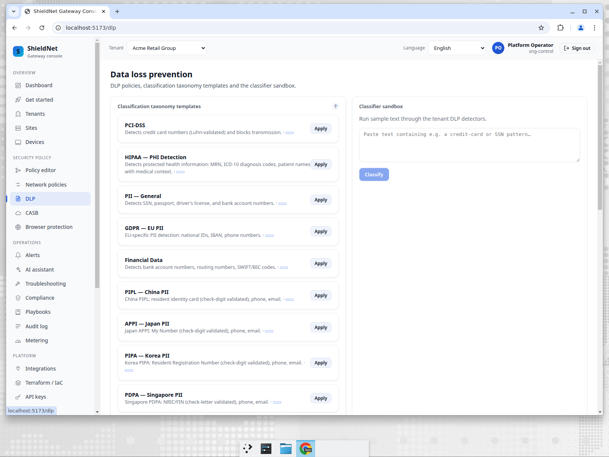

# PII at the AI edge: coach, don't block

> **Business series, Post 3 of 5.** Persona: **Lena**, the security analyst at
> one of the larger SMEs in Mara's book. Job-to-be-done: *"Stop staff pasting
> customer data, contracts, and API keys into AI tools — without my helpdesk
> drowning in false-positive tickets and the whole control getting switched off
> within a week."*

## The control that gets turned off

Lena has seen this movie. Security buys a DLP product, turns on blocking, and
within days legitimate work breaks: a contract upload to a "summarise this" tool
gets blocked, a developer can't use their AI code assistant, marketing can't run
copy through a writing aid. The tickets pile up, an exec overrides it, and the
control is quietly disabled. A DLP tool that blocks aggressively is a DLP tool
that ends up off.

Meanwhile the actual risk has moved. It's no longer one or two well-known
vendors — it's the **long tail** of AI apps: hundreds of niche wrappers, browser
extensions, and self-hosted front-ends. A deny-list of two domains catches none
of them.

## What we shipped: a coach-first AI-app DLP signal

SNG adds an AI-app exfiltration detector
([PR #158](https://github.com/kennguy3n/visible-fishbone/pull/158)) built *on top
of* the existing detection stack, not beside it:

- **PII** reuses the full classifier catalog — every jurisdiction's national-ID
  detector, the generic builtins, and the ML-NER head. A detector added for the
  web gateway immediately protects the AI-upload path too, with no duplicated
  regexes.
- **Secrets** — cloud keys, VCS/CI tokens, private keys — each gated by a
  prefix/shape match *plus* a Shannon-entropy floor, so a literal example string
  in a doc doesn't masquerade as a live credential.
- **Company-confidential markers** — the "CONFIDENTIAL", "INTERNAL USE ONLY",
  "attorney-client privileged" banners real internal documents carry.

The taxonomy behind it is broad and already in the product — here's the DLP
classification surface, with PCI/HIPAA/GDPR plus the APAC/LATAM regimes
(PIPL, APPI, PIPA, PDPA, LGPD) and a live classifier sandbox:

## The important part: it defaults to *not blocking*

This is the design decision that keeps the control switched on. Quoting the
detector's own module contract:

> *"False positives are the fastest way to get a DLP control switched off. The
> detector therefore defaults to a non-blocking posture: every flagged upload is
> either silently recorded (`Monitor`) or surfaced as a coaching nudge the user
> can dismiss (`Coach`). It escalates to `Block` only when the operator has
> explicitly opted in **and** the signal clears a high-confidence bar **and** the
> destination is a known AI app (never a heuristic 'suspected' one). The default
> policy never blocks."*

So the out-of-the-box behavior is: **coach the employee, record the event, never
break their work.** Blocking is a deliberate, narrow opt-in for the cases Lena is
certain about. That's the difference between a control that survives contact with
real users and one that doesn't.

## Human-in-the-loop, with redacted evidence only

The flagged events flow into a review queue (the `dlpreview` service, migration
060) with a clean lifecycle: **pending → approved / blocked / dismissed**. Lena
triages real signals instead of guessing. Critically, the queue is built on a
**redaction invariant**:

> *"Nothing here ever retains or serialises the matched bytes. A signal carries
> only the detector identity and the offset/length of the hit, aggregated to
> per-class counts — enough to triage and to author policy, never enough to
> reconstruct the credential or record that produced it."*

So Lena reviews "`Pci ×8`, `Phi ×5`, `Pii ×12`, destination = known AI assistant"
— never the actual card number or key. The evidence she needs to decide, and
nothing she shouldn't be storing.

And it's a live console surface now, not an API-only story — the backlog digest
(total / pending / by-severity / by-destination) over a real review window, with
the redacted findings as per-class counts:

## Where we fall short (honest)

- **The HITL queue is now reachable from the console — closed.** The previous
  draft said the `dlpreview` operator API wasn't wired into the router and there
  was no live screenshot. Both shipped: the operator API (list / approve / block
  / digest,
  [#176](https://github.com/kennguy3n/visible-fishbone/pull/176)) and the console
  page ([#179](https://github.com/kennguy3n/visible-fishbone/pull/179)) are live
  — the screenshot above is that page against seeded, redaction-invariant rows.
- **Detection is as good as the catalog + entropy floors.** The long-tail
  *destination* detection is heuristic (known-app vs. suspected-app), and the
  block path deliberately refuses to fire on a merely "suspected" AI app. That's
  a safety choice, but it does mean a brand-new AI front-end is monitored/coached,
  not blocked, until it's known.
- **Coaching needs an enforcement point to deliver the nudge.** The signal and
  the policy are in place; surfacing the coaching message to the end user depends
  on the edge enforcement wiring, which is integration work beyond this PR.

## The takeaway for Lena

She gets a DLP control she can actually leave on: it watches every AI-app upload
across the long tail, coaches employees instead of blocking them, escalates to a
block only where she's explicitly opted in and the engine is highly confident,
and gives her a review queue that shows redacted evidence — never the raw
sensitive data. It's designed to survive the helpdesk.

Next: [Post 4 — compliance baselines in minutes](11-compliance-templates.md).
