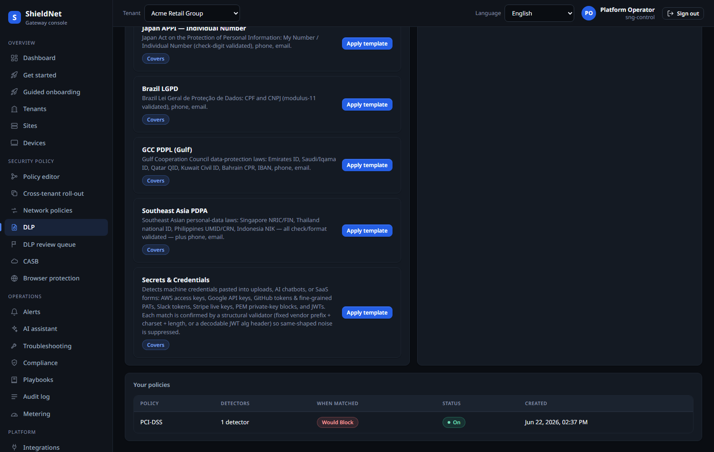

# PII at the AI edge: coach, don't block

> **Business series, Post 3 of 5.** Buyer: **Lena**, the SOC analyst who has to
> stop data leaks *and* not become the person everyone hates. Job-to-be-done:
> *"keep regulated data out of AI tools and risky uploads without a staff
> revolt."* Capability: AI-app DLP + human-in-the-loop review. Evidence:
> [`efficacy-report.json`](../../artifacts/efficacy-report.json) (`dlp`,
> `dlp_ml_ner` rows),
> [`s5-acme-dlp-policies.json`](../../artifacts/payloads/s5-acme-dlp-policies.json);
> screenshots [`s5-dlp-policies.png`](../../artifacts/screenshots/s5-dlp-policies.png),
> [`new-dlp-review-queue.png`](../../artifacts/screenshots/new-dlp-review-queue.png).

Staff paste customer data into ChatGPT. That's the reality Lena manages. The
brute-force fix — block every AI tool — drives the behaviour underground and
makes Lena the enemy. SNG's DLP is built around a softer, more effective default:
**coach the user, log the event, and escalate only the cases that need a human.**

## It catches the data that matters

SNG's DLP runs two engines: a structured detector for the things with shape
(card numbers, national IDs, IBANs) and an on-device ML classifier for
unstructured PII. Measured on the live stack
([`efficacy-report.json`](../../artifacts/efficacy-report.json)):

- **Structured DLP: 100% catch, 0% false positives** on a 3,800/3,800 corpus.
- **ML classifier: 97.4% catch, 0% false positives** on the harder unstructured
  set.

## Coach first

When a user is about to paste a customer record into an AI tool, the
coach-first policy *warns and allows* (and logs) rather than hard-blocking — for
the borderline cases. The high-confidence, clearly-regulated matches (a credit
card going to an unsanctioned destination) still block. The point is matching the
response to the confidence: certainty blocks, ambiguity coaches.

## A human reviews the ambiguous ones

The borderline signals don't vanish — they land in a review queue Lena triages:

She sees **redacted finding aggregates** — *that* a match fired, its type, and
its confidence — not the sensitive content itself. She dismisses the false
alarms, escalates the real ones, and the queue is the audit record. This is the
"human-in-the-loop" that makes a 97.4% classifier safe to deploy: its uncertain
calls become a triage task, not a wrongful block.

## Why this keeps staff on side

Coaching is a teaching moment, not a punishment. Most users, warned that they're
about to leak a customer record, simply don't. The ones who proceed are logged.
Lena's hard blocks are reserved for the unambiguous cases, so the false-positive
tax on legitimate work is low — which is exactly why a coach-first policy
survives contact with a real workforce where a block-everything policy doesn't.

## Where it falls short

- **97.4% isn't 100%.** The ML classifier misses ~1 in 40 on the hard set. That's
  the entire reason coach-first + a human queue exist; SNG doesn't pretend the
  model is perfect, it designs around the gap.
- **Coaching relies on the user choosing well.** A determined exfiltrator who
  ignores the warning is logged but not stopped (for the coached cases); the
  hard-block tier exists for the data you can't afford to coach on.
- **The review queue needs an owner.** Coach-first generates a triage workload;
  on a tiny team that's still real work, just far less than a wall of false
  blocks would create.
