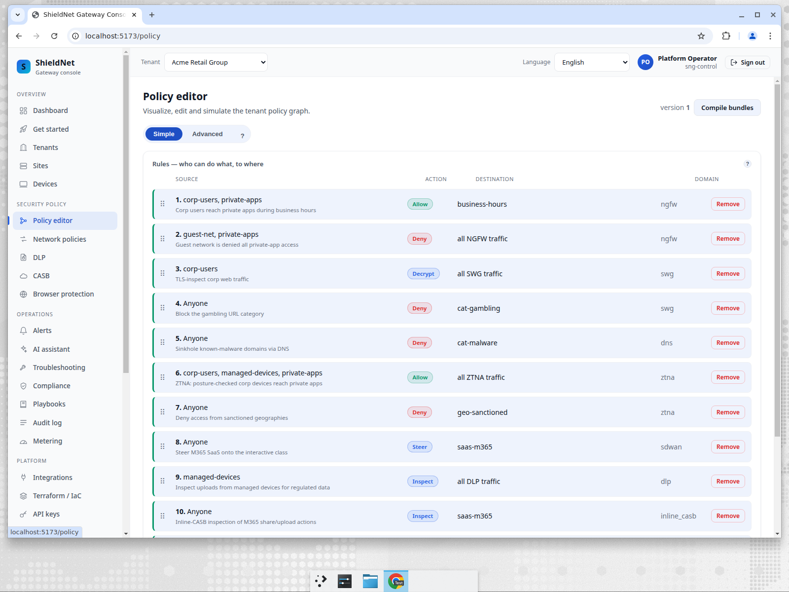
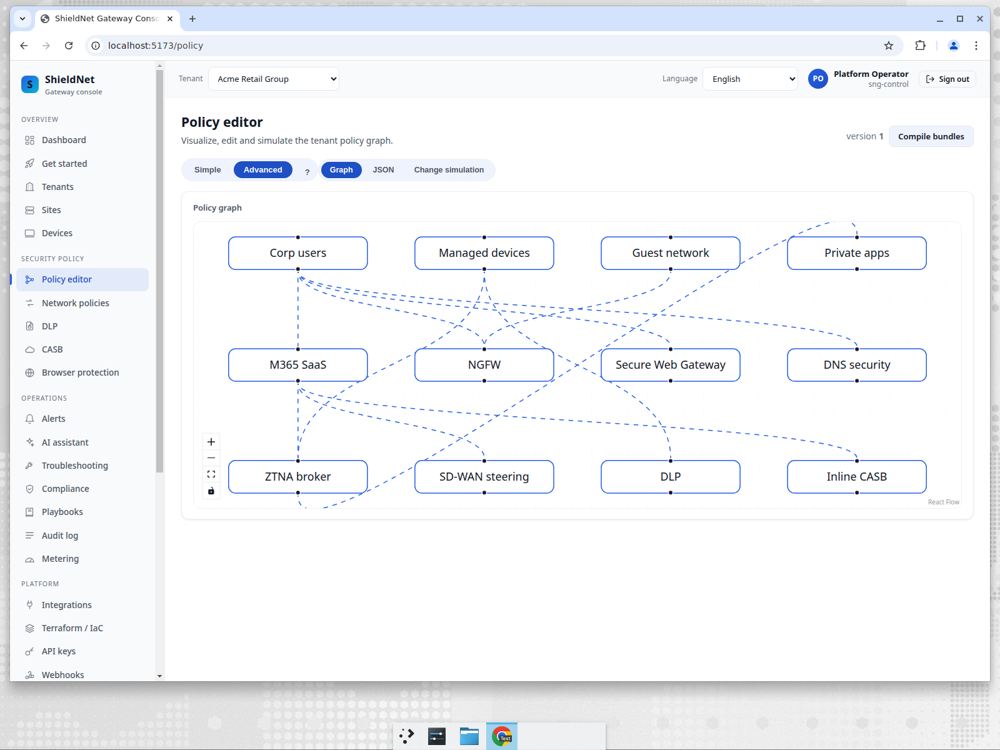
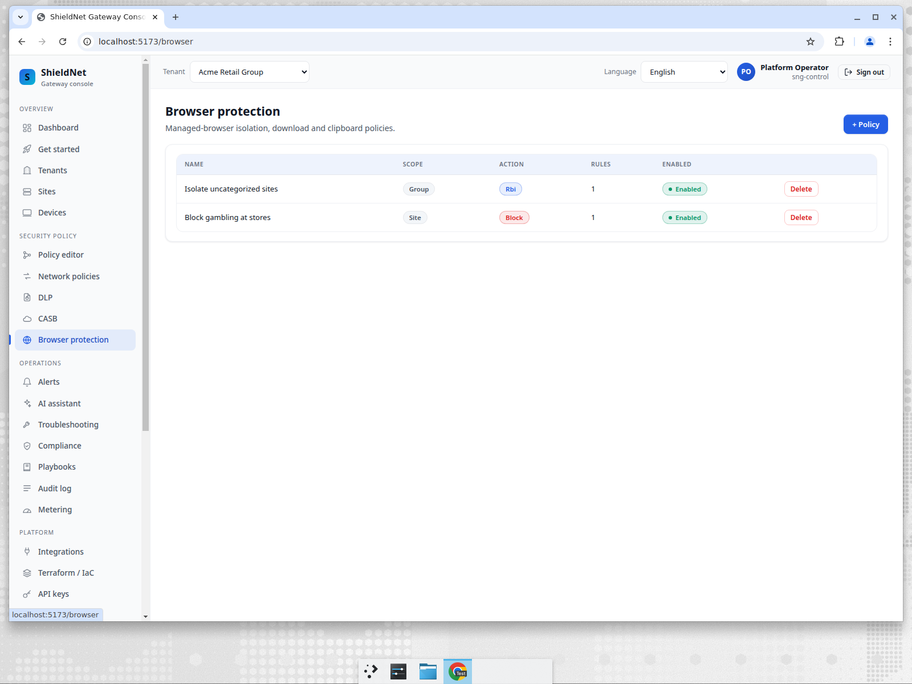

# Compliance baselines in minutes, not weeks

> **Business series, Post 4 of 5.** Persona: **Mara**, onboarding a new SME.
> Job-to-be-done: *"Get a brand-new customer to a sensible, compliant,
> deny-by-default posture before the kickoff call ends — without hand-authoring
> a policy graph for every vertical and every jurisdiction."*

## The onboarding tax

Every new SME means a policy from scratch. A healthcare client needs HIPAA-shaped
DLP and the right acceptable-use posture; a retailer needs PCI; a law firm needs
attorney-client confidentiality controls; an EU customer needs GDPR detectors a
US one doesn't. Hand-building that per tenant is slow, error-prone, and the main
reason "secure by default" so often means "secure once someone gets around to
configuring it." For an MSP onboarding dozens of SMEs, that tax doesn't scale.

## What we shipped: a smart-default template catalog

SNG ships a built-in, fleet-wide catalog of policy templates
([PR #157](https://github.com/kennguy3n/visible-fishbone/pull/157)). Mara picks an
**industry** and a **compliance regime**; the template resolves into a working,
deny-by-default `policy.Graph` baseline — safe-browsing categories at the DNS and
SWG planes, per-regime DLP detectors, and an NGFW posture — that the edge enforces
immediately.

The catalog is real and live. Captured verbatim from the control plane
(`GET /api/v1/policy-templates`,
[`policy-templates-catalog.json`](../../artifacts/payloads/policy-templates-catalog.json)):
**14 templates** — 1 universal baseline + 8 industries + 5 compliance regimes:

| Kind | Templates |
| --- | --- |
| **Baseline** (1) | Universal security baseline — blocks malware, phishing, hacking-tool, and anonymiser categories at DNS + SWG for *every* tenant |
| **Industry** (8) | Retail & E-commerce · Healthcare · Finance & Banking · Legal · Education · Technology · Professional Services · General Business |
| **Compliance** (5) | EU GDPR · UK GDPR / DPA 2018 · US Baseline (PII/PCI) · Canada PIPEDA · Australia Privacy Act |

Each compliance template maps to concrete, jurisdiction-correct DLP detectors —
not a vague "enable GDPR mode." Straight from the captured catalog:

- **EU GDPR** → `iban` (high), `eu_vat` (medium), `phone` (medium), `email` (low)
- **Canada PIPEDA** → `canada_sin` (high), `phone` (medium), `email` (low)
- **Australia Privacy Act** → `tfn_au` (high), `australia_medicare` (high),
  `phone` (medium), `email` (low)

The universal baseline applies to everyone regardless of choice, so even a tenant
that picks nothing else is *not* wide open — it's already blocking threats,
phishing, hacking tools, and anonymisers at the DNS and web layers.

## The posture it produces, on real pages

Pick a baseline and the result is a typed, deny-by-default policy — here's the
policy editor for Acme, showing intent rules across NGFW / SWG / DNS / ZTNA / DLP
/ inline-CASB:

…compiled into one unified policy graph the edge enforces:

And the safe-browsing/category controls that the baseline turns on out of the
box:

## Why "deny-by-default" matters for an SME

The template doesn't hand Mara a permissive starting point she has to lock down.
It hands her a *closed* one she selectively opens — the correct security posture,
and the one that actually satisfies an auditor. An SME with no security staff
gets enterprise-shaped defaults on day one, and Mara gets them there in the time
it takes to choose two dropdowns.

## Where we fall short (honest)

- **The catalog is the same fleet-wide; it's a starting point, not bespoke
  policy.** A template gets a tenant to a strong, compliant default fast — it
  does not replace a real policy review for a complex customer. The compliance
  templates cover the regimes listed above; a customer under a regime not yet in
  the catalog still needs hand-authoring.
- **The cross-tenant template *roll-out* UI shipped — closed.** The previous
  draft said the MSP "curate and push a template to a cohort" console page was
  still being built. It landed in
  [#207](https://github.com/kennguy3n/visible-fishbone/pull/207): a cross-tenant
  roll-out surface (`ui/src/routes/PolicyRollout.tsx`) that previews a per-tenant
  **diff**, executes the apply across the selected cohort, and supports
  **rollback** — captured at `new-msp-cross-tenant-templates.png`.
- **Detectors are only as current as the jurisdiction list.** The DLP detector
  set is broad (and Post 3 covers the AI-edge reuse), but new national-ID formats
  and regulatory regimes are an ongoing maintenance commitment, not a solved
  problem.

## The takeaway for Mara

Two dropdowns — industry + regime — and a new SME is at a deny-by-default,
jurisdiction-correct posture the edge is already enforcing, with a universal
threat baseline underneath it that applies no matter what. The onboarding tax
that used to eat the first week of every engagement is now a step in the kickoff
call.

Next: [Post 5 — prove the spend, prove the posture, and the honest competitive
critique](12-cost-and-competition.md).
